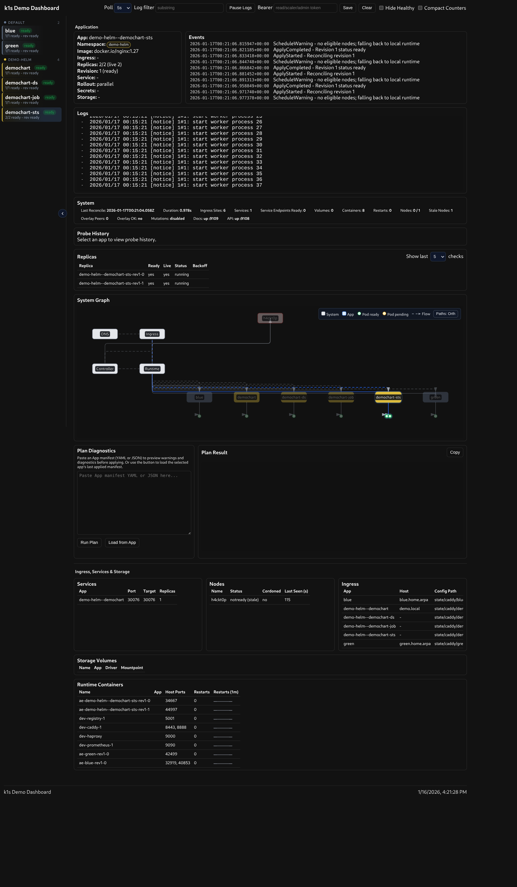
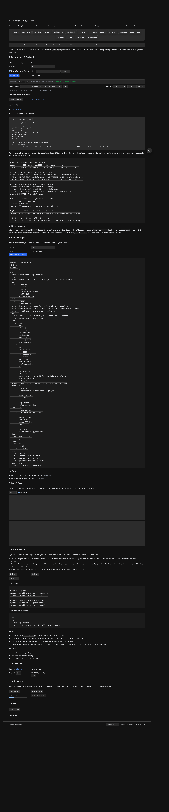

# k1s Minimal Application Engine

It started out of both basic necessity and general curiosity. I tend to push things—usually too far—and this was no exception. I needed a lightweight Kubernetes-like system for low-resource environments, and I wanted to learn how Kubernetes actually works. I feel we’ve achieved both, and it has become a great learning tool for understanding application engines in general.

After all, application engines are the heart of the modern web. While they can be daunting and complex, we created an integrated dashboard to help visualize the stack and an interactive playground page to help new users learn the basics. We also hope this is useful to anyone who needs a lightweight Kubernetes-like system for their own projects or lab experiments.

So, what is k1s? In short, it’s a lightweight multi-node application engine with a Kubernetes-compatible API shim. It provides a subset of full Kubernetes functionality with a much smaller footprint and lower resource requirements, and it’s designed to run on a single node or multiple nodes.

Development is ongoing, and we're always looking for feedback and contributions. If you're interested in learning more or getting involved, please check out the documentation and reach out to us.

## Documentation

- Multi-node architecture and lab: `docs/adr/0007-multinode-architecture-scope.md`, `docs/guides/multinode-lab.md`
- API compatibility and shim status: `docs/wip/conformance.md`, `docs/reference/apishim-compatibility-matrix.md`
- Operations runbook: see `docs/ops/runbook.md`
- Ingress/TLS details: see `docs/reference/ingress.md`
- End-to-end walkthrough: see `docs/guides/e2e.md`

## Kubernetes Alignment Matrix (Operator View)

Legend: Green = aligned/supported; Yellow = partial/best-effort; Red = out-of-scope; N/A = not applicable.

Columns: Runtime = k1s engine behavior; Shim = Kubernetes API shim (kubectl/helm); Export = `ae export-k8s` YAML.

Matrix updated: 2026-01-16 (see `docs/site/k8s_status.json`).

| Area | Capability | Runtime | Shim | Export | Operator notes |
| --- | --- | --- | --- | --- | --- |
| API & tooling | kubectl get/apply/watch | N/A | Green | N/A | CI smoke gates cover apply/watch and OpenAPI drift. |
| API & tooling | SSA + JSON Merge Patch | N/A | Green | N/A | `managedFields` + conflict detection supported. |
| API & tooling | OpenAPI v2/v3 | N/A | Green | N/A | v3 mirrors v2; schemas validated in CI. |
| Workloads | Deployment/ReplicaSet/Pod semantics | Green | Green | Green | status/conditions + logs/exec/port-forward. |
| Workloads | StatefulSet/DaemonSet/Job/CronJob semantics | Yellow | Yellow | Green | stored + best-effort status; emulated as Deployment-like apps. |
| Workloads | HPA v2 | Green | Green | Green | backed by k1s autoscaling with status/currentMetrics. |
| Networking | Service (ClusterIP/NodePort/LB status) | Green | Green | Green | VIP/overlay-aware; EndpointSlice projection. |
| Networking | Ingress v1 (basic) | Green | Green | Green | no regex/canary/advanced annotations. |
| Networking | NetworkPolicy enforcement | Red | Red | Yellow | export emits NP; enforcement depends on CNI (k3s default flannel doesn’t enforce). |
| Security/Auth | Tokens + RBAC | N/A | Green | Green | RBAC enforced in shim; export emits Role/RoleBinding presets. |
| Security/Auth | ServiceAccount tokens | N/A | Green | Green | shim issues SA tokens; exporter emits SA + bindings. |
| Security/Auth | PodSecurity admission/webhooks | Red | Red | Yellow | exporter can emit PSA namespace labels only. |
| Storage | PV/PVC/StorageClass/CSI semantics | Red | Red | Yellow | exporter can emit PVCs/volumeClaimTemplates only. |
| Observability | Logs/exec/port-forward | Green | Green | N/A | pod + service port-forward supported in shim. |
| Observability | Events API | Green | Green | N/A | controller/agent events surfaced to `/api/v1/events`. |
| Observability | metrics.k8s.io / aggregated APIs | Red | Red | N/A | out-of-scope. |
| Scheduling | nodeSelector/taints/tolerations/topology spread | Green | Green | Green | honored by scheduler; passed through on export. |
| Nodes | Inventory/cordon/drain | Green | Yellow | N/A | `ae nodes` supports cordon/drain; shim projects Nodes but no kubelet. |
| Operator workflow | Helm install/upgrade/uninstall (stateless charts) | N/A | Yellow | N/A | good for Deploy/Service/Ingress + RBAC/HPA/PDB; operators/controllers out-of-scope. |
| Operator workflow | Rollout control (pause/resume/canary ramp) | Green | N/A | N/A | k1s-native rollout policy with canary weights. |

### k1s-specific operator features (not part of upstream Kubernetes; not available in k3s by default)

- `ae k8s-check` portability checks and `ae k8s-report` compliance JSON embedded in docs.
- `ae export-k8s` presets (`web-hardened`, `web-strict`) + strict validation for portable YAML.
- Caddy site-fragment ingress with `ae tls` helpers for k8s-style TLS secrets.
- `ae plan` placement hints and `ae nodes` inventory/cordon/drain workflows.
- Rollout policy with canary weights + auto-ramp persisted in state.
- Built-in `/dashboard`, `/nodes`, and enriched `/metrics` endpoints.

### Quick token generation with expiration
- Generate API tokens that expire in 24 hours and write them to a file of exports you can `source`:
  - `python -m ae.cli api tokens --generate --ttl-hours 24 -o .env.api`

## Integrated Dashboard & Interactive Playground

Dashboard:


Playground:


## Quickstart

1) Install (editable for dev):

```
python -m pip install -e .[dev]
```

Optional: add file-watching support for instant reconciles on spec changes:

```
python -m pip install -e .[watch]
```

2) Run dev fixtures (optional):

```
docker compose -f ops/dev/docker-compose.yaml up -d
```

3) Start the controller loop:

```
python -m ae.controller --loop --specs specs/ --metrics-port 9108 --watch
```

4) Apply a sample app and inspect:

```
python -m ae.cli apply -f specs/examples/echo.yaml
python -m ae.cli status echo --wide --events
python -m ae.cli logs echo --tail 50
python -m ae.cli exec echo -- -- sh -c 'echo hello from main'
```

Kubectl-like aliases via `k1s`:

```
k1s get apps
k1s describe app/echo
k1s logs app/echo --follow --tail 100
```

API endpoints (when started with `--metrics-port`): see `docs/reference/http-api.md`.

Multi-container tips:
- Add sidecars under `spec.containers` and init containers under `spec.initContainers`.
- Use `ae logs <app> --container <name>` and `ae exec <app> --container <name> -- <cmd>` to target a specific container.
- Config/Secret file projections are mounted at `/var/run/ae/config/<app>`; sidecars can add custom `projectionMounts` to bind specific subpaths to custom mount points.

Multi-node lab (controller + agents + overlay Service VIPs):
- Controller: `AE_ENABLE_SERVICE_PROXY=1 AE_SERVICE_PROVIDER=overlay AE_AGENT_API_TOKEN=REDACTED