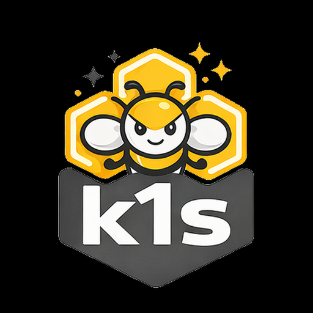

<p align="center">
  
</p>

# k1s Minimal Application Engine

k1s is a small, readable, Kubernetes-like orchestration engine built for distributed compute across messy reality: NAT/CGNAT, roaming nodes, intermittent links, heterogeneous sites, and federated clouds.

The goal is to make private, self-hosted, federated compute feasible without surrendering control to a single vendor or central authority. k1s is privacy-first, consent-first, and secure-by-default while staying understandable end-to-end (`spec -> reconcile -> runtime -> networking`).

k1s borrows Kubernetes mental models and API shapes where useful, but it is not a full Kubernetes clone. The focus is a compact surface area with a lightweight control plane and lower resource requirements.

Project principles and non-goals: `TENETS.md`. Cognitive-substrate philosophy and safeguards: `docs/design/project-philosophy.md`, `docs/design/cognitive-welfare-and-continuity.md`.

## Status & Production Use

k1s is pre-1.0 and still evolving. v0.1.3 expands validation coverage and operational testing, but this is still an actively changing release line.

Production guidance:
- Recommended now: labs, staging, and controlled production pilots with explicit operator ownership.
- Not yet recommended: broad multi-tenant or compliance-critical environments that require full Kubernetes semantics.
- Always run environment-specific security review, failure drills, and rollout validation before promotion.

## v0.1.3 Release Highlights

- Expanded ingress validation lanes, including deep+perf and strict edge-local proof: `docs/guides/ingress-capability-test-sequence.md`
- Repeatability and fault-injection gates for operational patterns: `docs/guides/ingress-capability-test-sequence.md`
- Security baseline and active auth probes in the lane flow: `docs/guides/ingress-capability-test-sequence.md`, `docs/ops/runbook.md`
- Deep+perf parity benchmark process for k1s vs k3s: `docs/ops/perf-parity-k1s-vs-k3s.md`
- Release-time live OpenAPI gating: `.github/workflows/release.yml`, `docs/ops/branch-protection.md`

## Documentation

- Start here onboarding: `docs/getting-started/start-here.md`
- High-level overview and getting started: `docs/getting-started/overview.md`
- Technical architecture and reference: `docs/reference/architecture.md`
- Project philosophy and cognitive safeguards: `docs/design/project-philosophy.md`, `docs/design/cognitive-welfare-and-continuity.md`
- Current inference-fabric behavior: `docs/reference/inference-fabric.md`
- Distributed compute fabric roadmap: `docs/roadmap/distributed-compute-fabric.md`, `docs/roadmap/status.md`
- Fabric deployment and control-plane design: `docs/design/fabric-deployment-topology.md`, `docs/design/fabric-control-plane.md`
- Multi-node architecture and lab: `docs/adr/0007-multinode-architecture-scope.md`, `docs/guides/multinode-lab.md`
- Runtime profile targets (including strict CRI aliases): `docs/guides/runtime-profiles.md`
- CRI/containerd workflows and registry-first image prep: `docs/reference/cri-containerd.md`
- API compatibility and shim status: `docs/reference/apishim-compatibility-matrix.md`, `docs/reference/apishim-roadmap.md`
- HTTP API reference and UI docs: `docs/reference/http-api.md`
- Configs & Secrets: `docs/reference/configs-secrets.md`
- Ingress and TLS reference: `docs/reference/ingress.md`
- Ingress deep validation lanes: `docs/guides/ingress-capability-test-sequence.md`
- Operations runbook: `docs/ops/runbook.md`
- Demo modes and examples: `docs/guides/demos-examples.md`
- End-to-end walkthrough: `docs/guides/e2e.md`
- CI examples: `docs/ops/ci-gh-actions.md`

## Integrated Dashboard & Interactive Playground

Dashboard:


Playground:


## Quickstart

1) Install (editable for dev):

```
python -m pip install -e .[dev]
```

Optional: add file-watching support for instant reconciles on spec changes:

```
python -m pip install -e .[watch]
```

Optional NixOS/dev-shell path (additive; Debian/Ubuntu flow above is unchanged):

```
direnv allow
# or:
nix develop

python -m venv .venv
. .venv/bin/activate
python -m pip install -e .[dev]
make env-doctor
```

Use `nix develop .#cri` when you want the CRI/containerd-oriented shell. The flake
fills in userland tooling such as `podman-compose`. Host runtimes still remain
host-managed (`podman`/`docker`, `containerd`), but `make dev-local` can now
manage local demo DNS/TLS state directly on Debian/RHEL and through the NixOS
bridge helper on NixOS. Run `make env-doctor` to check whether the bridge is
installed/imported and whether `docs/api/dash/blue/green.home.arpa` resolve
where the demo expects.

One-time NixOS bridge bootstrap:

```bash
sudo install -D -m 0644 ops/nixos/k1s-local-dev-bridge.nix /etc/nixos/nixos/modules/k1s-local-dev-bridge.nix
# import ./nixos/modules/k1s-local-dev-bridge.nix from your host config
sudo nixos-rebuild switch --impure --flake /etc/nixos#$(hostname -s)
```

2) Run dev fixtures (optional):

```
docker compose -f ops/dev/docker-compose.yaml up -d
```

Podman registry cache note (demo helpers): if you use Podman with the local pull‑through cache, add an insecure registry entry for `localhost:5001`/`localhost:5002` (or set `AE_USE_REGISTRY_CACHE=0`) to avoid HTTPS pull errors and Docker Hub rate‑limit stalls.

3) Start the controller loop:

```
python -m ae.controller --loop --specs specs/ --metrics-port 9108 --watch
```

Strict CRI quickstart (recommended for containerd lanes):

```
make k1s-core-cri
# optional pairings:
make k1s-edge-cri
make k1s-edge-core-cri
```

4) Apply a sample app and inspect:

```
python -m ae.cli apply -f specs/examples/echo.yaml
python -m ae.cli status echo --wide --events
python -m ae.cli logs echo --tail 50
python -m ae.cli shell echo
python -m ae.cli exec echo -- -- sh -c 'echo hello from main'
```

Namespace targeting:
```
ae apply -n demo -f specs/examples/echo.yaml
ae apply -n demo --force-namespace -f specs/examples/echo.yaml
AE_NAMESPACE=demo ae status echo
ae shell demo/echo
```
Note: `ae shell` defaults to `sh`; use `-- bash` only when the image includes it.

Kubectl-like aliases via `k1s`:

```
k1s get apps
k1s describe app/echo
k1s logs app/echo --follow --tail 100
```

API endpoints (when started with `--metrics-port`): see `docs/reference/http-api.md`.

Multi-container tips:
- Add sidecars under `spec.containers` and init containers under `spec.initContainers`.
- Use `ae logs <app> --container <name>` and `ae exec <app> --container <name> -- <cmd>` to target a specific container.
- Config/Secret file projections are mounted at `/var/run/ae/config/<app>`; sidecars can add custom `projectionMounts` to bind specific subpaths to custom mount points.
- Namespace targeting: add `-n <ns>`/`--namespace` or use `ns/app` (or `ns--app`) when apps live outside `default`.

Multi-node lab (controller + agents + overlay Service VIPs):
- Controller: `AE_ENABLE_SERVICE_PROXY=1 AE_SERVICE_PROVIDER=overlay AE_AGENT_API_TOKEN=changeme python -m ae.controller --loop --specs specs/ --metrics-port 9108`
- Worker agent on another host: `AE_CONTROLLER_URL=http://<controller>:9110 AE_AGENT_TOKEN=$AE_AGENT_API_TOKEN python -m ae.node --runtime-backend podman --port 9109 --ensure-pod-net`
- Apply the multi-node sample: `python -m ae.cli apply -f specs/examples/echo-multinode.yaml`
- Inspect nodes/placement: `ae nodes list`, `ae status echo-mn --wide --events`
- Full walkthrough: `docs/guides/multinode-lab.md`

Kubernetes API shim (kubectl/helm):
- Start shim (Postgres or SQLite): `AE_APISHIM_TOKEN=devtoken python -m ae.apishim serve --host 127.0.0.1 --port 8445`
- Point kubectl: `kubectl --server=http://127.0.0.1:8445 --token $AE_APISHIM_TOKEN get pods`
- Port-forward and apply work for Deployments/Services/Ingress/HPA/StatefulSet/DaemonSet/Job/CronJob.
- Compatibility matrix and open gaps: `docs/reference/apishim-compatibility-matrix.md`, `docs/reference/apishim-roadmap.md`.

Inference fabric (experimental):
- Apply a cell manifest: `ae cell apply -f specs/examples/inference/cell-bc-pp2-ray.yaml`
- Inspect cell state: `ae cell status cell-bc-pp2-ray --json`
- Inspect fabric sessions: `ae fabric sessions --json`
- Current behavior and limits: `docs/reference/inference-fabric.md`
- Hardware baseline and cluster prep: `docs/reference/ai-max-395-hardware-baseline.md`, `docs/ops/ai-max-395-cluster-prep.md`
- Formal design and roadmap: `docs/design/fabric-deployment-topology.md`, `docs/design/fabric-control-plane.md`, `docs/roadmap/distributed-compute-fabric.md`
- Formal target shape: AI Max+ 395-first execution cells behind a provider-facing HA edge, with an exact public node baseline today and Hyperon entering later as an advisory planning layer

## Kubernetes Alignment Matrix (Operator View)

Legend: Green = aligned/supported; Yellow = partial/best-effort; Red = out-of-scope; N/A = not applicable.

Columns: Runtime = k1s engine behavior; Shim = Kubernetes API shim (kubectl/helm); Export = `ae export-k8s` YAML.

Matrix source: `docs/site/k8s_status.json`.

| Area | Capability | Runtime | Shim | Export | Operator notes |
| --- | --- | --- | --- | --- | --- |
| API & tooling | kubectl get/apply/watch | N/A | Green | N/A | CI smoke gates cover apply/watch and OpenAPI drift. |
| API & tooling | SSA + JSON Merge Patch | N/A | Green | N/A | `managedFields` + conflict detection supported. |
| API & tooling | OpenAPI v2/v3 | N/A | Green | N/A | v3 mirrors v2; schemas validated in CI. |
| Workloads | Deployment/ReplicaSet/Pod semantics | Green | Green | Green | status/conditions + logs/exec/port-forward. |
| Workloads | StatefulSet/DaemonSet/Job/CronJob semantics | Yellow | Yellow | Green | stored + best-effort status; emulated as Deployment-like apps. |
| Workloads | HPA v2 | Green | Green | Green | backed by k1s autoscaling with status/currentMetrics. |
| Networking | Service (ClusterIP/NodePort/LB status) | Green | Green | Green | VIP/overlay-aware; EndpointSlice projection. |
| Networking | Ingress v1 (basic) | Green | Green | Green | no regex/canary/advanced annotations. |
| Networking | NetworkPolicy enforcement | Red | Red | Yellow | export emits NP; enforcement depends on CNI (k3s default flannel doesn't enforce). |
| Security/Auth | Tokens + RBAC | N/A | Green | Green | RBAC enforced in shim; export emits Role/RoleBinding presets. |
| Security/Auth | ServiceAccount tokens | N/A | Green | Green | shim issues SA tokens; exporter emits SA + bindings. |
| Security/Auth | PodSecurity admission/webhooks | Red | Red | Yellow | exporter can emit PSA namespace labels only. |
| Storage | PV/PVC/StorageClass/CSI semantics | Red | Red | Yellow | exporter can emit PVCs/volumeClaimTemplates only. |
| Observability | Logs/exec/port-forward | Green | Green | N/A | pod + service port-forward supported in shim. |
| Observability | Events API | Green | Green | N/A | controller/agent events surfaced to `/api/v1/events`. |
| Observability | metrics.k8s.io / aggregated APIs | Red | Red | N/A | out-of-scope. |
| Scheduling | nodeSelector/taints/tolerations/topology spread | Green | Green | Green | honored by scheduler; passed through on export. |
| Nodes | Inventory/cordon/drain | Green | Yellow | N/A | `ae nodes` supports cordon/drain; shim projects Nodes but no kubelet. |
| Operator workflow | Helm install/upgrade/uninstall (stateless charts) | N/A | Yellow | N/A | good for Deploy/Service/Ingress + RBAC/HPA/PDB; operators/controllers out-of-scope. |
| Operator workflow | Rollout control (pause/resume/canary ramp) | Green | N/A | N/A | k1s-native rollout policy with canary weights. |

### k1s-specific operator features (not part of upstream Kubernetes; not available in k3s by default)

- `ae k8s-check` portability checks and `ae k8s-report` compliance JSON embedded in docs.
- `ae export-k8s` presets (`web-hardened`, `web-strict`) + strict validation for portable YAML.
- Caddy site-fragment ingress with `ae tls` helpers for k8s-style TLS secrets.
- `ae plan` placement hints and `ae nodes` inventory/cordon/drain workflows.
- Rollout policy with canary weights + auto-ramp persisted in state.
- Built-in `/dashboard`, `/nodes`, and enriched `/metrics` endpoints.

### Quick token generation with expiration
- Generate API tokens that expire in 24 hours and write them to a file of exports you can `source`:
  - `python -m ae.cli api tokens --generate --ttl-hours 24 -o .env.api`

## Makefile Helper Commands

Run with `make <target>`. You can override defaults via `VAR=value make <target>`.

Setup and quality:
- `make install`: install dev dependencies (`pip -e .[dev]`).
- `make watch`: install file-watching extras (`pip -e .[watch]`).
- `make test`: run unit tests (`pytest -q`).
- `make lint`: run `ruff check` + `mypy src/ae`.
- `make env-doctor`: report shell-provided tools, compose availability, host sockets/services, and local DNS/TLS bridge status.
- `make dev-local-clean`: remove helper-managed local DNS/TLS state.
- `make wheel`: build a wheel into `dist/`.

Local dev and samples:
- `make dev-up` / `make dev-down`: start/stop dev Docker Compose stack.
- `make down`: stop all dev/demo stacks (best-effort).
- `make loop`: controller reconcile loop (watch mode).
- `make run`: single reconcile pass.
- `make dev-min` / `make dev-etcd` / `make k1s-core` / `make k1s-edge`: runtime profiles with empty specs.
- `make k1s-core-cri` / `make k1s-edge-cri` / `make k1s-core-edge-cri` / `make k1s-edge-core-cri`: strict CRI profile aliases.
- `make edge-site-cri SITE_ID=<site> EDGE_PORT=<port> EDGE_HTTP_PORT=<port>`: strict CRI multi-site edge helper.
- `make apply-sample`: apply `specs/examples/echo.yaml`.
- `make status-sample`: status for `echo`.
- `make logs-sample`: logs for `echo`.
- `make k8s-smoke`: export + validate sample Kubernetes YAML (no cluster required).
- `make start-here`: build docs and open `docs/site/start-here.html`.
- `make haproxy-update`: regenerate HAProxy config from controller API.
- `make haproxy-watch`: watch/reload HAProxy config from controller API.
- `make install-systemd` / `make uninstall-systemd`: install/remove systemd units.
- `make install-docs-service` / `make uninstall-docs-service`: install/remove docs service.
- `make secrets-seal-demo`: run the sealed-secret demo helper.

Docs, labs, and playground:
- `make docs`: combine snapshots (if present), regenerate charts, build docs.
- `make docs-export`: build non-interactive HTML into `docs/export` (`DOCS_OUT_DIR=` override).
- `make docs-wiki-export`: export wiki-friendly HTML into `docs/wiki` (`WIKI_OUT=` override).
- `make docs-watch`: rebuild docs when `combined/combined.csv` changes.
- `make docs-local-ignore`: locally hide `docs/site` changes from git status.
- `make docs-local-track`: re-enable tracking for `docs/site` updates before committing.
- `make labs-up` / `make labs-down`: dev labs stack (docs + controller via compose).
- `make labs-aio-up` / `make labs-aio-down`: all-in-one labs stack.
- `make labs-k3d-up` / `make labs-k3d-down`: bring up/down local k3d cluster for labs.
- `make labs-apishim-env`: print apishim tokens from `state/profiles/dev-etcd/apishim.env`.
- `make apishim-smoke`: quick API shim health check on port 8445.
- `make shim-helm-demo`: run the helm shim demo helper.

Demo workflows:
- `make demo`: run the playground labs demo (`--labs --labs-token`; podman backend, plaintext secrets allowed).
- `make demo-help`: show demo script help.
- `make demo-down`: tear down demo stacks.
- `make reg-cache-reset`: clear local registry cache used by demos.
- `make demo-hardened`: run hardened demo flow.
- `make demo-reset`: reset demo/labs state and prune volumes.
- `make dashboard-reload`: reload controller under the dashboard supervisor.
- `make dashboard-restart`: restart the supervisor and reload.

Integration and e2e:
- `make integ-test`: integration tests (`pytest -q tests/integration/`).
- `make e2e` / `make e2e-multiport`: run the multiport e2e script.

Benchmarks (memory + runtime tooling):
- `make bench-mem-k1s`: snapshot k1s memory.
- `make bench-mem-k3s`: snapshot k3s memory.
- `make bench-mem-debug`: quick debug benchmark pass.
- `make bench-mem-agg`: aggregate latest snapshot under a label.
- `make bench-mem-matrix-k1s`: run k1s replica matrix snapshots.
- `make bench-mem-combine`: combine snapshots into `combined/*`.
- `make bench-mem-verify`: verify a snapshot and print per-container split.
- `make bench-k3s-up` / `make bench-k3s-down`: manage a k3s bench cluster.
- `make bench-mem-matrix-k3s`: run k3s replica matrix snapshots.
- `make bench-mem-rollout-k1s`: run k1s rollout snapshots.
- `make bench-mem-rollout-k3s`: run k3s rollout snapshots.
- `make bench-mem-plot`: render benchmark charts.
- `make bench-mem-e2e-k3s-sudo`: full k3s e2e (matrix + rollout + charts) with sudo.
- `make bench-mem-e2e-k1s`: full k1s e2e (matrix + rollout + charts).
- `make bench-mem-e2e-k1s-sudo`: k1s e2e with sudo snapshots.
- `make bench-mem-e2e-k1nd`: k1nd (k1s-in-Docker) e2e.
- `make bench-mem-e2e-k1nd-sudo`: k1nd e2e with sudo snapshots.
- `make bench-mem-e2e-k1nd-quick`: fast k1nd profile.
- `make bench-mem-e2e-k1nd-resume-rollout`: resume only the rollout phase.
- `make bench-mem-e2e-k1nd-down`: k1nd e2e then tear down compose.
- `make bench-mem-e2e-all`: run all baseline suites.
- `make bench-mem-e2e-minimal`: minimal baseline suite.
- `make bench-watch-runtime`: live runtime debug snapshotter.
- `make bench-mem-e2e-baselines`: run baseline suite matrix.
- `make bench-mem-e2e-baselines-sudo`: baseline suite with sudo.
- `make bench-mem-docs`: combine + plot + rebuild docs.
- `make bench-fix-perms`: normalize artifact permissions.
- `make bench-mem-backfill`: backfill missing summary.json + rebuild docs.
- `make bench-engines-clear`: stop/remove all containers (dangerous).
- `make bench-state-clean`: remove benchmark-only state (`state/bench-*`).
- `make dev-state-clean`: wipe full `state/` (requires `CONFIRM=1`).
- `make bench-mem-backfill-oci`: add OCI runtime metadata and recompute charts.
- `make bench-mem-backfill-oci-latest`: backfill OCI metadata for latest label only.
- `make bench-mem-finalize-sudo`: finalize benchmarks and normalize perms (sudo).
- `make bench-mem-e2e-k3s`: full k3s e2e (matrix + rollout + charts).
- `make bench-mem-idle-k1s`: idle baseline snapshot for k1s.
- `make bench-mem-idle-k3s`: idle baseline snapshot for k3s.

Images and containers:
- `make image-docker`: build controller image with Dockerfile.
- `make image-podman`: build controller image with Containerfile.
- `make push-docker` / `make push-podman`: push controller image.
- `make docker-build-controller`: build controller image (ops/images/controller.Dockerfile).
- `make docker-run-controller`: run controller container with specs/state mounts.

## Kubernetes Export Quickstart

- Render the echo example to Kubernetes YAML and validate:
  - `python -m ae.cli export-k8s -f specs/examples/echo.yaml --namespace demo --ingress-class traefik --validate > k8s.yaml`
- Include ConfigMap/Secret objects, envFrom, and file projections (mounted at `/var/run/ae/config`):
  - `python -m ae.cli export-k8s -f specs/examples/envfrom-and-projection.yaml --namespace demo --emit-configs --emit-secrets --validate > k8s.yaml`
- Harden NetworkPolicy quickly:
  - `python -m ae.cli export-k8s -f specs/examples/echo.yaml --namespace demo --np-preset web --validate > k8s.yaml`
  - `python -m ae.cli export-k8s -f specs/examples/echo.yaml --namespace demo --np-preset backend --validate > k8s.yaml`
- See `docs/reference/k8s-export.md` for supported fields: startupProbe, image pull options, env/envFrom, projected volumes, PDB/HPA, pod-level security, and more.

## Remote CLI (over LAN)

You can point the CLI at a controller running on another machine.

Controller (on the host):

```
export AE_API_MUTATIONS=1
export AE_API_READ_TOKEN=readtoken
export AE_API_SCALER_TOKEN=scaletoken
export AE_API_ADMIN_TOKEN=admintoken
python -m ae.controller --loop --specs specs/ --metrics-port 9108 --watch
```

Client (from another machine):

```
# Reads
ae --server http://<controller-ip>:9108 --token readtoken status
ae --server http://<controller-ip>:9108 --token readtoken events echo --limit 20

# Mutations
ae --server http://<controller-ip>:9108 --token scaletoken scale echo --replicas 2
ae --server http://<controller-ip>:9108 --token admintoken delete echo --purge
```

See `docs/ops/runbook.md` → “Remote CLI over LAN” for details and curl examples.

## License

This project is licensed under the Apache License, Version 2.0. See `LICENSE` for full terms, including the patent grant and redistribution requirements.
