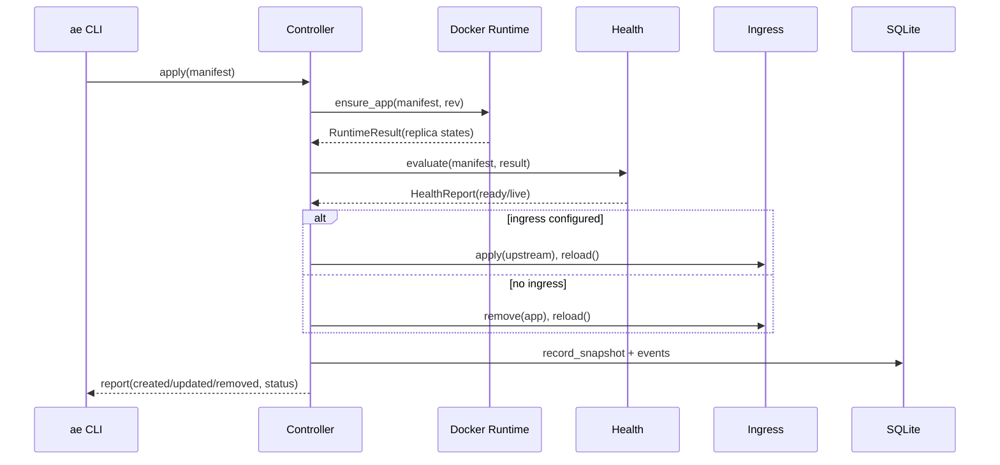

# k1s Architecture and Technical Reference

This document describes k1s in depth: components, data model, reconcile algorithms, interfaces, and operational behavior. It is intentionally verbose.

## Scope and Principles

- Single node. All containers run on one host via Podman (OCI) or Docker.
- Declarative spec → idempotent reconcile. The controller continuously applies desired state and converges.
- Small surface. Prefer composition over features; leave seams to extend later.
- Fail well. A crash restarts cleanly; reconcile rebuilds reality from Docker + SQLite.

## Components

- Controller (src/ae/controller): orchestrates reconcile, writes state, emits events.
- Runtime (src/ae/runtime): pluggable adapters; Podman/OCI is primary, Docker optional.
- Ingress (src/ae/ingress): writes Caddy site fragments and triggers reloads.
- Health (src/ae/controller/health.py): readiness/liveness evaluation.
- State store (src/ae/controller/state.py): SQLite schema and queries.
- Secrets (src/ae/secrets): SOPS/age integration, env projection.
- Observability (src/ae/observability): metrics snapshot, HTTP API, logging helpers.
- CLI (src/ae/cli) + kubectl‑like wrapper (src/ae/kctl).

## Reconcile Loop

Triggers
- Periodic polling (`--interval` seconds)
- Optional file watching (`--watch`) via watchdog; changes are debounced (`--debounce-ms`).
- Manual apply (`ae apply -f ...`), which directly runs a reconcile for the manifest.

Ordering
- Load manifests (YAML → Pydantic models).
- Compute revision: hash the spec; reuse the latest revision if hash unchanged; otherwise increment.
- Runtime ensure: create/update/remove containers to match replicas.
- Health gate: evaluate readiness/liveness; decide revision status ready/progressing/degraded.
- Ingress: pick a healthy upstream (if any) and write/reload Caddy; remove ingress when omitted.
- Persist: write app status, replicas, probe history, and revision record; emit events.

Idempotency & Diff
- Spec hash drives revisions; reconciler tracks created/updated/removed per pass.
- Docker containers are labeled with app/replica/revision; runtime lists by labels.
- Old revision containers are removed when the new revision becomes live.

Pseudocode (as implemented in src/ae/controller/reconciler.py)
```
for manifest in manifests:
  rev = store.prepare_revision(spec_hash)
  result = runtime.ensure_app(manifest, rev)
  health = health.evaluate(manifest, result)
  ingress.apply/remove based on health/spec
  store.record_snapshot(manifest, result, health, rev, status)
  events.emit(ApplyCompleted)
```

Sequence Diagram



## Spec (ae.dev/v1alpha1)

Top‑level
- `apiVersion: ae.dev/v1alpha1`
- `kind: App`
- `metadata: { name }`
- `spec`: see below

Spec fields (src/ae/controller/spec.py)
- `image: str`
- `command: [str]?`
- `env: [{name, value}]` (merged with secrets)
- `replicas: int>=1`
- `ports: [{name, containerPort}]`
- `health.readiness|liveness` HTTP probes with `initialDelaySeconds`, `timeoutSeconds` etc.
- `ingress: { host, path: '/', tls: bool }`
- `secretRefs: [{ name, path, env: [{name, key}] }]` (SOPS‑decrypted)
- `registryAuthRef: str?` (reserved, not yet used directly)
- `resources: { requests?, limits?: { cpu: float cores, memory: str (e.g., 256Mi) } }`
- `volumes: [{ hostPath, mountPath, readOnly? }]`

Notes
- CPU limits map to Docker `nano_cpus`; memory to `mem_limit` (K/M/G, KiB/MiB/GiB supported).
- Volumes map to bind mounts with ro/rw.

Example
```yaml
apiVersion: ae.dev/v1alpha1
kind: App
metadata: { name: echo }
spec:
  image: alpine:3.20
  replicas: 1
  ports: [{ name: http, containerPort: 8080 }]
  health:
    readiness: { httpGet: { path: /, port: 8080 }, initialDelaySeconds: 5 }
  ingress: { host: echo.localtest.me, path: /, tls: false }
  resources: { limits: { cpu: 0.25, memory: 256Mi } }
  volumes: [{ hostPath: /tmp, mountPath: /host-tmp, readOnly: false }]
```

## State Model (SQLite)

Tables (created in src/ae/controller/state.py)
- app_status(app_name PK, desired_replicas, ready_replicas, live_replicas, revision, revision_status, image, created, updated, removed, ingress_host, ingress_path)
- replica_status(app_name, replica_id, ready, live, status, readiness_message, liveness_message)
- probe_history(id, app_name, replica_id, check_time, ready, live, readiness_message, liveness_message) [kept to 50 per replica]
- app_revisions(app_name, revision, spec_hash, spec_json, image, created_at, status)
- app_events(id, app_name, revision, event_type, message, created_at)

Query surfaces
- `list_status()`, `get_status(app)`
- `list_replicas(app)`, `get_probe_history(app, N)`
- `list_revisions(app)`, `get_revision_manifest(app, rev)`
- `list_events(app, limit)`

## Runtime: Docker

Labels
- `ae.app=<name>`
- `ae.replica_id=<name>-rev<rev>-<index>`
- `ae.revision=<rev>`

Ensure flow (src/ae/runtime/docker_runtime.py)
- List existing containers by `ae.app` label.
- Partition by current revision vs old.
- Pull image only when a new replica is needed and image is missing.
- Create missing replicas with labels, env, ports, restart policy; then reload and start as needed.
- Remove old revision containers.
- Build `ReplicaState` by reloading container attributes (status, startedAt) and mapping published ports to endpoints.

Resources/Volumes
- `limits.cpu` → `nano_cpus=int(cpu*1e9)`, `limits.memory` → bytes (K/M/G, KiB/MiB/GiB).
- Volumes: `{ hostPath: { bind: mountPath, mode: ro|rw } }` in container run call.

Logs
- `read_logs(replica_id, follow, tail, since)` adapts to Docker SDK parameters.

Auth
- `RegistryAuthProvider` reads `~/.config/ae/registries.yaml` and calls `client.login(...)` before pulls.

## Ingress: Caddy

- Each app with `spec.ingress` gets a small site block written to `ops/dev/caddy/sites/<app>.caddy` (or configured root).
- Reloads via `caddy reload --config <file|dir>`, optionally inside a container via `docker exec`.
- When Caddy runs in a container, upstreams with 127.0.0.1 are rewritten to `host.docker.internal`.

## Health

- HTTP probe: GET `http://<replica.endpoint><path>`; success is 2xx.
- Initial delay honored using container `StartedAt`.
- Liveness defaults to true when unspecified; readiness defaults to container state when unspecified.
- `HealthReport` aggregates per‑replica `ready/live` and messages.

Revision status
- ready: `ready_replicas >= desired`
- progressing: `live_replicas >= desired` but not all ready
- degraded: otherwise

## Rollouts and Rollback

- spec hash (SHA‑256 of normalized JSON) creates a new revision when changed.
- Rolling replace with `maxUnavailable=0, maxSurge=1` semantics at single‑app scale.
- `ae rollback <app> [--to <rev>]` fetches stored manifest and reconciles.

## Events

- Types: ApplyStarted, ApplyCompleted, IngressConfigured, IngressRemoved, plus future failure types.
- Indexed by app and descending id; surfaced in CLI and HTTP API.

## Metrics and API

- CLI snapshot: aggregated counts (apps ready/progressing/degraded, replicas).
- HTTP `/metrics`: includes app/replica gauges, last reconcile timestamp/duration, per‑app reconcile sum/count, rollout operation counters.
- HTTP `/status`, `/status/<app>`, `/events/<app>` return JSON; `/openapi.json` documents the surface; `/docs` lists endpoints.

## Secrets

- Decrypts via `sops --decrypt` (external process); falls back to plaintext when `AE_ALLOW_PLAINTEXT_SECRETS=1`.
- Merges referenced keys into env map with stable ordering.
- Errors on missing secret keys referenced by `env` mappings.

## File Watch

- Uses watchdog when `--watch` is set; falls back to interval polling when watchdog is unavailable.
- Debounce controlled by `--debounce-ms` (default 200 ms).

## Backup and Restore

- `ae backup create --output backup.tar.gz` writes `state/controller.db` and `specs/`.
- `ae backup list|verify|restore` list entries, check presence/integrity, and extract safely (guards against absolute paths and `..`).

## Security & Ops Notes

- Local admin tool; not multi‑tenant.
- Store SOPS keys outside the repo; never commit plaintext secrets.
- Prefer TLS via Caddy/ACME for public hosts; development can use `localtest.me` and plain HTTP.
- Keep Docker resource limits conservative to protect the node.

## Extensibility Seams

- RuntimeAdapter protocol: implement `ensure_app` and `read_logs` for alternate engines.
- IngressManager: implement `apply/remove/reload` for nginx or other proxies.
- SecretManager: swap SOPS shell calls with a native decryptor if desired.
- Store: SQLite is default; could be swapped for another lightweight store with the same interface.

## Environment Variables

- AE_STATE_DB, AE_SPECS_DIR
- AE_CADDY_SITES, AE_CADDY_BIN, AE_CADDY_FILE, AE_CADDY_CONTAINER
- AE_REGISTRY_CONFIG
- AE_SOPS_BIN, AE_ALLOW_PLAINTEXT_SECRETS
- AE_RUNTIME_BACKEND ("docker"|"stub")
- AE_LOG_LEVEL

## Testing Strategy

- Unit tests for CLI surface, state store, Docker runtime (via fakes), reconciler health decisions.
- Integration tests can run against a local Docker daemon for end‑to‑end validation.

## Performance & Footprint

- Controller + API + metrics: ~40–80 MiB resident in Python.
- Caddy: ~20–40 MiB.
- Docker daemon: ~100–150 MiB.
- Suitable for 1–3 small services with sane limits on a 2 GB VPS.

## Future Work

- TCP/exec probes; richer rollout strategies (pause/canary).
- Resource requests and automatic cgroups beyond Docker flags.
- More ingress features (headers, multiple paths, TLS config surface).
- Multi‑node scheduling (out of scope for now).


### Configs and Secrets → Environment

Apps can project values from config files and sealed secrets into environment variables.
The merge order is: configRefs < secretRefs < spec.env (manifest wins last).

Example:

```
spec:
  configRefs:
    - name: app-config
      path: configs/app-config.yaml   # YAML or JSON
      env:
        - { name: APP_MODE,  key: mode }
        - { name: APP_COLOR, key: color }
  secretRefs:
    - name: demo-secret
      path: specs/demo-secret.sops.yaml
      env:
        - { name: API_TOKEN, key: token }
  env:
    - { name: APP_MODE, value: demo-override }  # overrides config/secret
```
