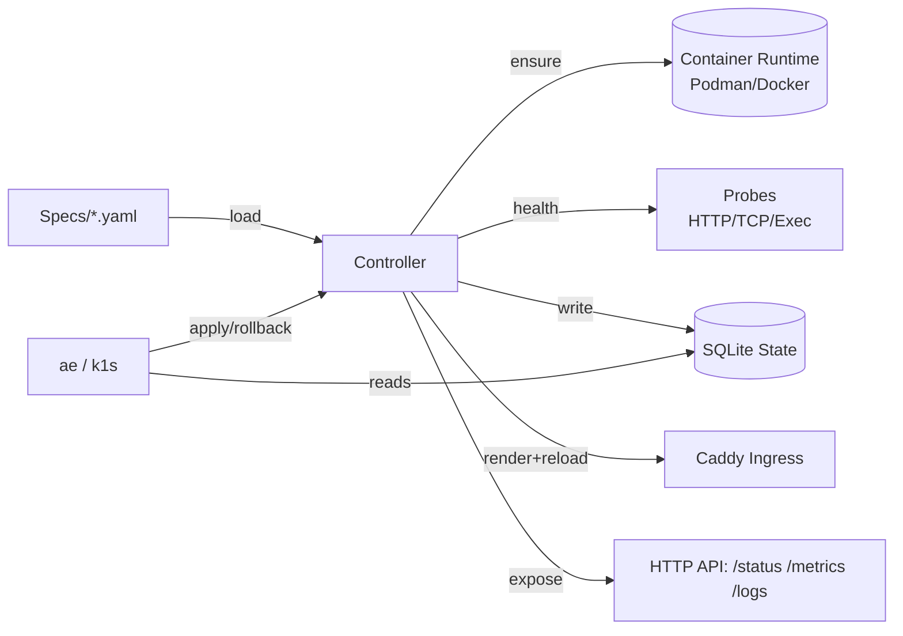
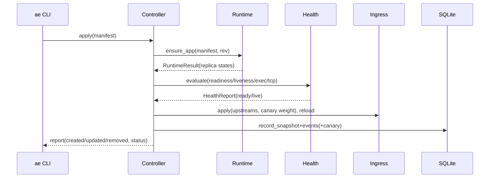

# k1s: A Tiny Single‑Node Application Engine — Deep Dive

What if you could keep the ergonomics of everyday Kubernetes workflows — declarative specs, health‑gated rollouts, events, metrics — but run everything on a single host with minimal moving parts? k1s is our answer: a compact controller + CLI that reconciles YAML manifests into running containers via Podman (default) or Docker, fronted by Caddy for ingress, with SQLite for state.

This post covers the full system: the spec, reconcile loop, ingress/TLS, rollout strategies (including canary), observability, storage, secrets/configs, and the Kubernetes parity toolkit.


## Why k1s

- Single host, tiny footprint, predictable rollouts for 1–3 services
- Declarative spec, idempotent reconcile
- First‑class observability: metrics, events, dashboard, logs endpoint
- Podman‑first runtime to avoid daemon overhead; Docker fallback when needed
- Seamless ingress via Caddy with TLS helpers and canary routing bias

## Architecture at a Glance



### Sequence



## The Spec (ae.dev/v1alpha1)

Core fields (see src/ae/controller/spec.py):

- `image`, `command?`, `env[]`
- `replicas >= 1`, `ports[]`
- `service`: stable host port when `replicas == 1`
- `health`: HTTP/TCP/Exec probes with delays/timeouts/thresholds
- `ingress`: `{ host, path or paths[], tls?, tlsSecretName?|tlsCertPath?|tlsKeyPath? }`
- `rollout`: `{ strategy: ordered|parallel|canary, maxSurge, maxUnavailable, pause?, weight?, auto{} }`
- `configRefs` and `secretRefs`: project keys into env and files
- `security`: `runAsUser`, `runAsGroup`, `readOnlyRootFilesystem`, `dropCapabilities[]`
- `resources`: requests/limits (`cpu` in cores; `memory` as quantity)
- `volumes`: bind mounts; `storage`: named volumes with `retention`

### Example: Hardened web app with TLS, configs/secrets, storage, and canary

```yaml
apiVersion: ae.dev/v1alpha1
kind: App
metadata: { name: web }
spec:
  image: ghcr.io/example/web:1.2.3
  replicas: 2
  command: ["/bin/web", "--port", "8080"]
  ports: [{ name: http, containerPort: 8080 }]
  service: { port: 8080 }   # stable host port (works best with replicas=1)
  health:
    readiness: { httpGet: { path: /healthz, port: 8080 }, initialDelaySeconds: 5, timeoutSeconds: 2 }
    liveness:  { tcpSocket: { port: 8080 }, periodSeconds: 10 }
  ingress:
    host: web.home.arpa
    path: /
    tls: true
    tlsSecretName: mycert  # controller resolves to PEMs at runtime
  rollout:
    strategy: canary
    weight: 3
    auto: { start: 3, step: 2, intervalSeconds: 60, max: 9 }
  security:
    runAsUser: 10001
    runAsGroup: 10001
    readOnlyRootFilesystem: true
    dropCapabilities: ["ALL"]
  resources:
    limits: { cpu: 0.5, memory: 256Mi }
  configRefs:
    - name: app-config
      path: configs/app-config.yaml
      env:
        - { name: APP_MODE,  key: mode }
        - { name: APP_COLOR, key: color }
      files:
        - { key: mode,  file: config/mode.txt }
  secretRefs:
    - name: web-secret
      path: specs/examples/demo-secret.sops.yaml
      env:   [ { name: API_TOKEN, key: token } ]
      files: [ { key: token, file: secret/token } ]
  storage:
    - { name: data, mountPath: /var/lib/web, retention: Retain }
```

## Reconcile Loop Highlights

- Merge configs/secrets → env, prepare file projections → mount read‑only at `/var/run/ae/config/<app>`
- Compute `spec_hash` → create/increment revision
- Runtime ensure: create/update/remove containers (respect rollout policy)
- Health gates: HTTP/TCP/Exec probes aggregate to ready/live
- Ingress: write Caddy site with prefer‑first policy; canary duplicates first upstream by `weight`; optional auto ramp persisted in SQLite
- Persist: app status, replicas, probe history, revision, events, canary state

Pseudocode:

```python
for manifest in manifests:
  rev = store.prepare_revision(spec_hash)
  manifest = apply_configs_and_secrets(manifest)
  project_files(manifest, rev)
  result = runtime.ensure_app(manifest, rev, keep_old=True, limit_create=...)
  health = health.evaluate(manifest, result)
  ingress.apply(manifest, upstreams, canary_weight)
  store.record_snapshot(manifest, result, health, rev, status)
  events.emit("ApplyCompleted")
```

## Runtime: Podman (default) and Docker

- Podman preferred; falls back to Docker when Podman is unavailable
- Ports: explicit host mappings honored; otherwise publish exposed ports on ephemeral host ports
- Volumes: bind mounts from `spec.volumes`; PV‑lite via `spec.storage` creates engine‑named volumes `ae-<app>-<name>`
- Security: `--user`, `--read-only`, `--cap-drop` mapped
- Registry: `~/.config/ae/registries.yaml` for login before pulls

## Ingress: Caddy with TLS Helpers

- One site per app rendered under `ops/dev/caddy/sites/`
- TLS options:
  - BYO: set `tlsCertPath`/`tlsKeyPath`
  - K8s‑style: set only `tlsSecretName` and sync PEMs with `ae tls sync --name <name>`
- Host alias inside Caddy container: `host.docker.internal` (Docker) or `host.containers.internal` (Podman)
- Optional active health checks via `AE_CADDY_ACTIVE_HEALTH=1`

## Rollouts: ordered, parallel, canary

- `ordered`: create one replica per pass until desired; keep old until ready threshold
- `parallel`: create all missing replicas; keep old until ready threshold
- `canary`: bias ingress toward first upstream (`weight`), with optional `auto` schedule persisted in SQLite
- Pause/resume without touching runtime: `ae rollout pause|resume <app>`

## Health: HTTP/TCP/Exec

- HTTP: 2xx implies ready
- TCP: socket connect success
- Exec: command exit code 0
- Probes support `initialDelaySeconds`, `timeoutSeconds`, `periodSeconds`, thresholds

## Configs & Secrets

- Config files (YAML/JSON) and SOPS‑sealed secrets projected into env and files
- Merge order: `configRefs < secretRefs < spec.env`
- File projections mounted read‑only under `/var/run/ae/config/<app>`
- Dev escape hatch: `AE_ALLOW_PLAINTEXT_SECRETS=1` (do not use in CI)

## Storage (PV‑lite)

- `spec.storage[]` creates container‑engine named volumes; mount with `mountPath`
- Retention: `Retain` (default) keeps data on app deletion; `Delete` removes on `ae delete --purge`

## Observability & API

- Metrics: Prometheus text at `/metrics` with app/replica gauges and controller timings
- Status & events: `/status`, `/status/<app>`, `/events/<app>` (pagination supported)
- Logs: `/logs/<app>?tail=100&follow=1` (read token required when RBAC configured)
- Health: `/health`; OpenAPI: `/openapi.json`; Docs: `/docs`; Dashboard: `/dashboard`
- RBAC (optional): `AE_API_READ_TOKEN`, `AE_API_SCALER_TOKEN`, `AE_API_ADMIN_TOKEN` with `AE_API_MUTATIONS=1` for mutations

## Kubernetes Parity & Tooling

- `ae export-k8s`: render K8s YAML from an App manifest (presets for security); optional validation and extras (HPA, PDB, SA)
- `ae k8s-check`: static portability checklist; `--policy strict` for CI‑style gates
- `ae k8s-report`: produce a compliance JSON; docs embed it on the k8s‑compliance page

## Quickstart

```bash
# 1) Install
python -m pip install -e .[dev]

# 2) Start controller
python -m ae.controller --loop --watch --specs specs/ --metrics-port 9108

# 3) Apply sample
python -m ae.cli apply -f specs/examples/echo.yaml

# 4) Inspect
ae status echo --wide --events
ae logs echo --tail 100

# 5) Ingress (optional Caddy running)
open http://echo.home.arpa/

# 6) Rollout controls
ae rollout pause echo && ae rollout resume echo

# 7) Export to K8s
ae export-k8s -f specs/examples/echo.yaml --namespace demo --preset web-hardened --ingress-class traefik --service-port 80 --validate -o specs/examples/echo-k8s.yaml
```

## Demos

```bash
# Standard blue/green
./scripts/init_demo.sh --demo-standard -y -d

# Configs & Secrets projection
./scripts/init_demo.sh --demo-configs -y

# Multi-replica echo
./scripts/init_demo.sh --demo-echo-mr -y -d

# Ordered rollout (prefer-first routing) and canary
./scripts/init_demo.sh --demo-rollout -y -d
```

## Benchmarks & Idle Baselines

- Memory footprints for control plane and per‑pod overhead with Podman vs Docker and k3s
- See `docs/benchmarks.md`, `docs/benchmark-k3s.md`, and `docs/testing-memory-k1s.md`

## Closing Thoughts

k1s aims to be “just enough orchestration” for a single host: familiar, observable, and safe by default. It won’t replace Kubernetes at scale — but it can replace ad‑hoc shell scripts and fragile Compose stacks where you want health checks, rollouts, and a small, understandable control plane.

Explore the docs, run a demo, and tell us what you build with it.

