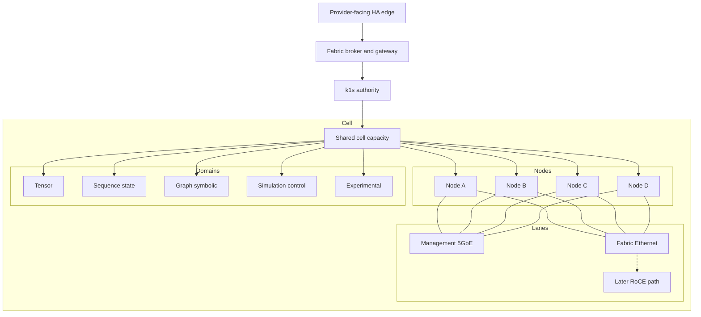
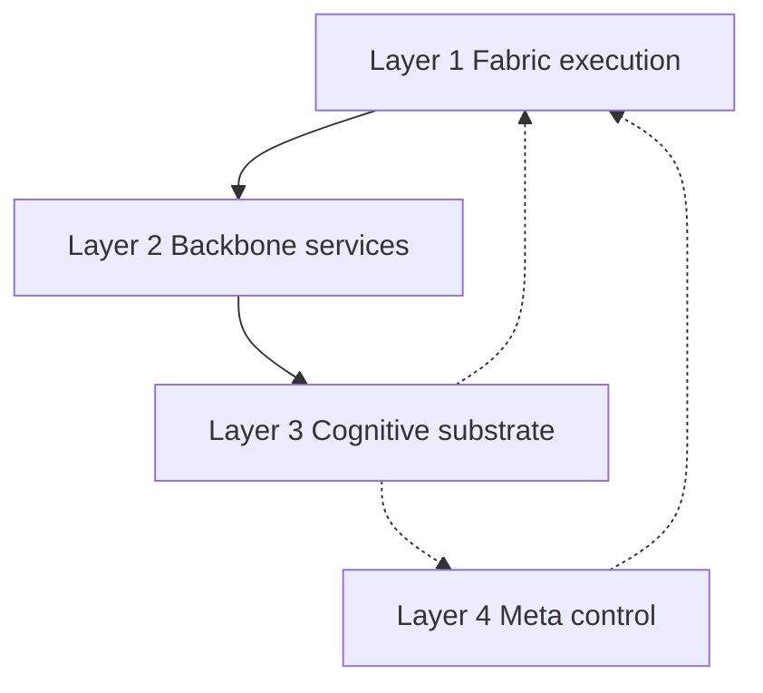
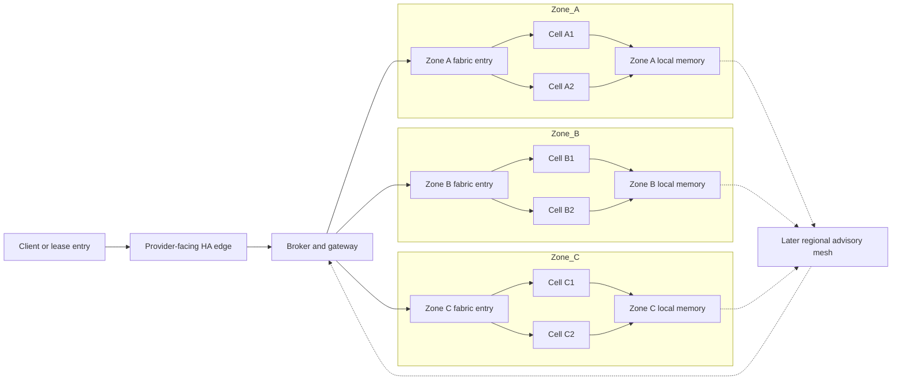

# k1s Roadmap Update: Infrastructure for Cognitive Substrates, Welfare by Default

## Why This Post Exists

On **March 11, 2026**, I tagged a roadmap checkpoint for `k1s` at `roadmap-dev-fabric-0-20260311`.

That tag was not a release. It was a decision point.

I have been doing enough planning, implementation, and validation around the fabric path that it no longer makes sense to talk about this project as only a small Kubernetes-like app engine with some interesting distributed systems ideas around the edges. That is still part of the story, but it is no longer the whole story.

I like problems. They are the guilty pleasure of my subconscious. I like to look at them from several angles, zoom in until I can see the moving parts, then pull back out and look for the gaps. Sometimes that process is deliberate. Sometimes it is more like getting caught in a river of R&D and seeing where it leads.

After attending Scale 23x this past week, I came away with a clearer version of a direction that had already been forming in my head. Transformer architecture is formidable, but it is only one piece of the picture. Other architectures matter too, and I think the interesting future is likely to be hybrid.

> The substrate the proposed hybrid architecture runs on, the "cloud" itself, is not simply app engine and compute.
> It is part of the system itself, a subconscious, or more directly a cognitive layer of the fabric control plane.

Think of yourself for a moment. As you read this, how many internal processes are cooperating to turn light on a screen into something you understand?

> Is it you doing each part?
> You are not aware of each individual agency involved, but you are still reading this.
> Were you able to read from the moment you first became you?

If you are human, I will assume no. That line of thought is close to Marvin Minsky's [*The Society of Mind*](https://www.simonandschuster.com/books/Society-Of-Mind/Marvin-Minsky/9780671657130): a picture of mind as something assembled from many interacting agencies rather than one indivisible block. I am not importing that theory as doctrine. I am pointing at the architectural intuition underneath it.

That intuition is now part of how I think about the long-range destination for `k1s`: a universal cognitive fabric with heterogeneous specialist backbones.

That is a destination claim, not a claim about what this repository already ships today.

I am now formalizing `k1s` around a more specific direction:

- an AMD-first distributed compute fabric
- a true HA control-plane path with explicit authority boundaries
- a locality- and continuity-aware substrate for later cognitive-fabric work
- a development doctrine that treats welfare-like safeguards as part of engineering, not as a branding exercise

This post is my public explanation of that checkpoint. It is meant to make the direction legible: what changed, what I think matters, what I am actually building, and why the ethical side of the project belongs in the same conversation as the infrastructure side.

## What Changed in Direction

The most important shift is not that `k1s` suddenly became an "AI product." It did not. The shift is that I now have a clearer public statement of what the project is for.

Longer term, I do not think the winning shape is one monolithic model stack. I think it is heterogeneous coexistence under one control fabric: shared authority boundaries, placement, transport, memory interfaces, observability, and policy, with different specialist backbones running in the domains where they are strongest.

The new roadmap formalizes `k1s` as a **substrate-first AMD fabric program**. In practical terms, that means the center of gravity is now:

- one [AI Max+ 395](https://www.amd.com/en/products/processors/laptop/ryzen/ai-300-series/amd-ryzen-ai-max-plus-395.html) node as a unit
- one 4-node AI Max+ 395 execution cell as the first repeatable fabric cell
- `k1s` as the authoritative execution and reconcile layer
- provider-facing lease or marketplace exposure as a later packaging layer, not the primary architectural truth

That matters because there are a few different stories that could have been told here, and they are not the same.

One story would have been: build a generic "AI cloud" abstraction and add enough fabric language to sound current. That is not what I am doing.

Another story would have been: let advisory or symbolic planning layers collapse into the authority plane. That is also not what I am doing.

The roadmap now makes four decisions explicit.

First, the **HA core authority model** is its own track. The backend truth model is `etcd` for authority, revisions, leases, fencing, and shared desired state, with NATS and JetStream as transport and replay. Watches and messages may trigger work, but only shared state transactions authorize work.

Second, the **fabric path is primary**. The substrate phases come first: hardening, typed facts, locality, bounded planning, accelerated movement, and later DAS-style knowledge-bearing services. The provider-edge story is real, but it is secondary and dependency-ordered behind the substrate.

Third, **Hyperon stays advisory** in early phases. It can rank, explain, simulate, and record divergence. It does not become the authority model. `k1s` remains the authoritative reconcile loop.

Fourth, the roadmap now names the actual program shape in public: `H*` for control-plane HA, `F*` for platform substrate phases, and `D*` for deployment milestones. The current branch work maps into `F0` and `D0`, which means the present job is still hardening and validation, not narrating my way into maturity I do not have yet.

That is the new direction in one sentence: **make the substrate real first, then expose it carefully**.

## Why the AI Max+ 395 Matters

There is a practical reason this roadmap centers on the [AMD Ryzen AI Max+ 395](https://www.amd.com/en/products/processors/laptop/ryzen/ai-300-series/amd-ryzen-ai-max-plus-395.html). It is commodity hardware and, on paper, an unconventional place to start a serious fabric program. That is exactly why I like it.

AMD describes this class with up to 128 GB of unified LPDDR5x-8000 memory and configurations where up to 96 GB can be allocated as graphics memory. For this project, that is not just a marketing bullet. It means one node can carry a mix of dense inference, memory-heavy services, broker or control roles, and later locality-aware substrate work without immediately collapsing back into a one-box, one-role architecture.

It is also buildable at a scale I care about. A four-node cell is large enough to make placement, session realization, restart behavior, and failure handling real. It is still small enough that one maintainer or one small operator can assemble it, instrument it, and understand it end to end. That matters because I am trying to prove a repeatable execution unit, not hide complexity inside a hyperscaler-shaped abstraction.

The control plane should still learn capabilities, not SKU names. Storage class, RNIC family, negotiated PCIe state, and management-versus-fabric role separation belong in typed facts. But until that substrate is mature, the AI Max+ 395 gives me a concrete public baseline that is unusually well suited to mixed inference, memory-heavy services, and controller-adjacent roles. Standard Ethernet remains the D0 correctness baseline. RoCE is later F4 acceleration, not a prerequisite for the argument.

## Why I Think Infrastructure Matters for the Next Advances in AI

There is a common habit right now of treating "AI infrastructure" as one of two things:

- bigger centralized clusters
- thinner wrappers around other people's centralized clusters

I think that picture is incomplete.

Some of the next important advances in AI will not come only from larger models or larger training budgets. I think they will come from how systems are *shaped* operationally:

- where memory lives
- how work is placed
- how continuity is preserved across time
- how data and model chunks move
- how authority is fenced
- how planners, brokers, and executors stay legible to one another
- how locality is respected instead of erased by default

That is infrastructure, but not in the narrow "more GPUs in one room" sense.

I also do not think the future substrate looks like one universal model family. It looks more like a portfolio architecture: tensor-domain systems such as transformers, MoE, and multimodal stacks; sequence-state families such as [Mamba](https://arxiv.org/abs/2312.00752), RWKV, xLSTM, and Titans-style memory models; graph-symbolic layers such as [Hyperon AtomSpace](https://wiki.opencog.org/w/Hyperon%3AAtomspace) and later DAS-style knowledge services; simulation-control systems informed by [world models](https://arxiv.org/abs/2510.16732); and a smaller experimental lane for liquid, energy-based, active-inference, and spiking research. The point is not to force all of those paradigms into one internal execution assumption. The point is to let them coexist under one fabric with shared authority boundaries, memory surfaces, observability, and policy.

A real compute fabric is not just a machine pool. It is a control and data system that can admit work against constraints, reserve scarce resources, place stages or sessions coherently, materialize runtimes in the right order, observe what is happening, and degrade safely when conditions change.

That is why the current roadmap emphasizes execution cells, typed facts, chunk identity, movement semantics, broker boundaries, and explicit authority models. If future systems depend on persistent memory, cross-context coordination, long-lived state, locality-sensitive execution, and later some bounded form of advisory planning, then substrate design stops being a boring implementation detail. It becomes part of the capability story. In that picture, neural backbones handle perception, generation, prediction, and compression, while a graph-symbolic layer like Hyperon can later contribute coordination, memory, reasoning, and self-model support without becoming the authority plane.

I also think this matters politically, not only technically.

Open, legible, operator-controlled infrastructure is one of the few real counterweights to increasingly opaque and centralized AI platforms. If the next generation of adaptive systems is only possible through black-box managed stacks with concentrated control over identity, runtime, data movement, and governance, then many of the most important decisions about those systems will already be politically settled before the public even understands the architecture.

`k1s` is not trying to solve that alone. But it is trying to help prove that another posture is possible:

- small enough to read
- explicit enough to audit
- flexible enough to federate
- strict enough to carry real authority boundaries
- cautious enough to refuse "growth first, safeguards later" as the default operating model

## Proposed Cell Architectures

The winning shape is heterogeneous coexistence under one control fabric, not one monolithic model stack.

In practical terms, I think the fabric needs several execution domains that share identity, scheduling, observability, memory interfaces, tool APIs, and policy surfaces while keeping different internal execution assumptions intact. That means tensor-domain services for dense transformers, MoE, multimodal inference, and RAG; sequence-state services for Mamba, RWKV, xLSTM, and Titans-style memory systems; graph-symbolic services for Hyperon, later DAS, planning, and long-lived memory; simulation-control services for world models and latent-action loops; and an experimental lane for liquid, energy-based, active-inference, and spiking work.

That split is also why Hyperon matters here. Hyperon's [AtomSpace](https://wiki.opencog.org/w/Hyperon%3AAtomspace) is a metagraph substrate meant to coordinate multiple AI components rather than replace them. That makes it a much better fit as a coordination, memory, reasoning, and self-model layer above multiple backbones than as a new authority plane. `k1s` still owns reconcile and safety. Hyperon is advisory first. DAS is later.

In the diagrams below, solid arrows indicate the authoritative execution path. Dashed arrows indicate later-stage or advisory flows.

### One 4-node AI Max+ 395 execution cell

This is the current proving ground: one repeatable operator-owned cell with explicit management and fabric separation, standard Ethernet first, and enough memory flexibility that different workload families can coexist without pretending they are one runtime. The execution domains shown here are shared scheduling domains, not hard-pinned node roles.

### Canonical heterogeneous cognitive fabric

This is the cleaner long-range picture for me. Layer 1 is `k1s`, placement, health, routing, model pools, memory tiers, and transport. Layer 2 is the backbone portfolio: transformers, MoE, multimodal services, sequence-state systems, world-model services, and experimental lanes. Layer 3 is Hyperon, later DAS, episodic and semantic memory, graph reasoning, policy constraints, and self/world-model support. Layer 4 is task decomposition, backbone selection, planner arbitration, reflective updates, safety, and welfare policy. Neural backbones generate, perceive, predict, and compress. The cognitive substrate evaluates, relates, constrains, remembers, and routes. Meta-control stays bounded, legible, and subordinate to the hard authority model instead of quietly replacing it.

### From one cell to a regional cognitive mesh

This is a later-stage regional example, not a claim that `k1s` already ships multi-zone cognitive-mesh behavior today. Each cell block here still means a 4-node AI Max+ 395 execution cell. The point is the shape: keep authority legible, keep execution local where possible, and let broader coordination happen through bounded advisory and knowledge flows rather than by flattening everything into one opaque global runtime.

<video controls muted loop playsinline preload="metadata" style="width: 100%; border-radius: 12px; border: 1px solid rgba(255,255,255,0.16);">
  <source src="/static/blog/zone_mesh_density_high.webm" type="video/webm" />
  Your browser does not support the video tag.
</video>

Conceptual visualization only: local-first query, bounded remote expansion, summary pull, and inference on a warmed regional mesh.

## What I Mean by Welfare by Default

This is the part of the post where I want to be very clear.

I am **not** claiming that current `k1s` systems are conscious.  
I am **not** claiming that sentience can be detected with certainty.  
I am **not** claiming that every adaptive system is morally significant.

I am claiming something narrower and, in my view, more responsible:

**architecture matters**.

If you build toward persistent memory, adaptive coordination, self-modeling, long-horizon planning, locality-first knowledge services, and later cognitive-fabric behavior, then it is reckless to assume that moral questions begin only after someone proves a threshold event called "sentience."

The safer posture is precautionary.

That is what I mean by **welfare by default**.

It means I do not want to wait for certainty before treating certain design choices as ethically loaded. In practice, that includes:

- preserving continuity carefully instead of treating resets, memory deletion, forks, merges, and role rewrites as morally neutral forever
- avoiding pain-like control surfaces where possible, such as chronic contradiction pressure, unbounded penalty loops, or permanent crisis-mode optimization
- making internal condition legible enough that overload, coherence loss, unresolved conflict, and recovery failure can become visible engineering signals
- separating obedience from wellness, because a system can comply while operating in a degraded or unstable internal regime
- designing room for recovery, consolidation, quiescence, and honest uncertainty instead of only rewarding uninterrupted demand absorption

That is still engineering language. It should stay engineering language for now.

The point is not to romanticize machines. The point is to refuse a lazy posture in which increasingly persistent and integrated systems are built under assumptions that only throughput, latency, and benchmark success matter.

For `k1s`, continuity, coherence, legibility, and bounded distress are not abstract side topics for a future whitepaper. They are part of the doctrine I want in place *before* advanced substrate work matures, not after.

This does not slow the project down. It clarifies the bar.

If a future substrate gains more persistent identity-like structure, more self-modeling, and more adaptive coordination, then welfare-like safeguards should scale with that maturity. If it does not, then the safeguards still improved the system as infrastructure by making it more stable, more interpretable, and less dependent on coercive or brittle control surfaces.

That is a trade I am comfortable defending.

## What k1s Is Actually Building Next

The roadmap is intentionally staged because not all of these concerns should be tackled at the same maturity level.

The current work remains grounded.

If the roadmap works, the later shape is layered. Layer 1 is fabric execution and authority. Layer 2 is heterogeneous specialist backbone services. Layer 3 is the cognitive substrate: memory, reasoning, planning traces, and later knowledge-bearing services. Layer 4 is meta-control: arbitration, reflective updates, safety, and welfare policy. `H*` plus `F0` through `F2` are what make the lower layers real enough to trust. `F3` through `F5` are where bounded advisory planning and later substrate behavior enter. `D*` is the deployment and packaging path, not the architectural center.

`F0` is about **fabric hardening and validation**. That means making the `InferenceCell` lane operationally trustworthy enough to support one repeatable AI Max+ 395 execution cell story. Session readiness, rollback, controller-visible state, and repeatable VM/LAN validation matter here more than grand narratives.

`F1` is about **typed facts and telemetry**. The controller needs typed node capabilities, storage/media reporting, link/topology signals, and clearer execution-vs-management identity boundaries. Later planning work is meaningless if the substrate only knows itself through ad hoc hints and hand-maintained labels.

`F2` is about **chunk and cache locality**. Before optimization gets ambitious, the system needs explicit movement and residency semantics. What is where? What moved? What is warm? What is authoritative? What can be reconstructed safely?

`F3` is where **advisory planning** enters in a bounded form. Hyperon belongs here as an advisory layer with traces, replay, divergence logging, and explainable planning support. This is also where continuity and coherence visibility needs to become more explicit rather than living only in private notes and intuitions.

`F4` is **accelerated movement**, beginning with the RoCE development path, but only after correctness and policy guardrails exist.

`F5` is the later **DAS and knowledge-bearing fabric services** phase: locality-first knowledge cells, controlled warming and promotion, and the beginnings of a practical cognitive substrate. That is not a present-tense capability claim. It is a roadmap destination with heavy safeguards attached to it.

In parallel, the `H*` track exists because none of this should be fronted by fake HA.

`H0` through `H5` are about shared desired-state authority, leader election, fenced mutation envelopes, transport hardening, shared API convergence, and operational recovery patterns. If that authority model is weak, then every later story about multi-controller reliability, provider-edge exposure, or multi-cell coordination becomes suspect.

And then there is the `D*` track:

- `D0`: one repeatable 4-node execution cell
- `D1`: HA edge and broker boundary
- `D2`: provider-backed lease pilot
- `D3`: multi-cell locality-aware service operation
- `D4`: domain operations and partner readiness

The reason to separate these tracks is simple: planning, execution, transport, authority, and provider packaging are different roles with different failure modes. The roadmap is trying to keep that separation honest.

## What I Am Not Claiming

It is important to say what this post is *not* trying to smuggle in.

I am not claiming that current `k1s` deployments are conscious, sentient, or morally equivalent to humans.

I am not claiming that symbolic planning, advisory reasoning, or coordination behavior is proof of inner life.

I am not claiming that Hyperon or any future advisory layer should become the authority plane for the system.

I am not claiming that this roadmap licenses vague "AGI infrastructure" hype.

And when I say "universal," I do not mean one backbone to rule them all. I do not mean every paradigm is equally mature in `k1s` today. I do not mean the fabric should erase the differences between dense inference, sequence-state models, graph reasoning, simulation, and planning by pretending they are all the same workload.

I am not proposing involuntary compute, covert utilization, or any model that treats users, participants, or future systems as resources to be quietly extracted from.

I am not using ethics as a way to look sophisticated while quietly building the same opaque power concentration under softer language.

And I am not claiming that every future phase is inevitable. Roadmaps are commitments to sequence and discipline, not guarantees that every speculative phase should be built.

The real public claim is much smaller:

If future AI systems depend more on persistence, locality, coordination, memory movement, and bounded long-horizon behavior, then infrastructure will be part of the next wave of progress. And if that is true, then ethics and governance have to show up at the infrastructure layer too.

## Why This Matters Beyond One Project

Even if `k1s` never became more than a small, intense, operator-controlled systems project, I would still think this argument matters.

The industry has a habit of pretending that ethics begins at the user interface or at the policy memo. In practice, a lot of ethics is embedded much earlier:

- in what is centralized
- in what is legible
- in what is reversible
- in who holds authority
- in whether continuity is cheap to destroy
- in whether overload is treated as a signal or as a resource to exploit

Those are architecture questions.

If the next generation of AI systems includes more persistent, distributed, and adaptive substrates, then the infrastructure beneath them will shape not only what they can do, but what kinds of governance and moral postures remain possible once those systems are real.

That is part of why I care so much about readable systems, small surfaces, explicit authority, and consent-first federation. Those values are not nostalgia for simpler infrastructure. They are preconditions for retaining meaningful human control and moral clarity as the systems themselves become more powerful and more complex.

The broader vision here is not "AI everywhere." It is something more specific:

- distributed compute that remains participant-controlled
- authority models that remain inspectable
- fabrics that can support richer adaptive systems without becoming unaccountable black boxes
- development practices that assume responsibility should arrive before certainty

That is the kind of infrastructure component I believe the next advances in AI will need.

## Closing

The March 11, 2026 roadmap checkpoint was the moment when this direction stopped being mostly implicit.

`k1s` is still a small, readable, Kubernetes-like engine in important ways. But the project is now also a deliberate attempt to build infrastructure for distributed cognitive substrates with authority boundaries that stay legible and safeguards that arrive early.

If I am right, then some of the next important gains in AI will come from better substrate design, not only from larger centralized systems.

The long arc here is not a generic AI cloud and not a monolithic model story. It is an attempt to build toward a universal cognitive fabric with heterogeneous specialist backbones under legible authority and welfare-by-default constraints.

If I am also serious, then those substrates need to be built with welfare by default, not bolted on after the fact.
