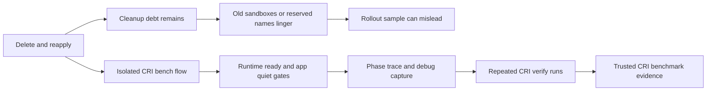
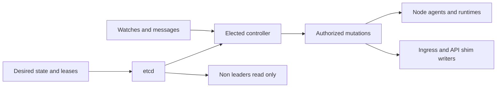
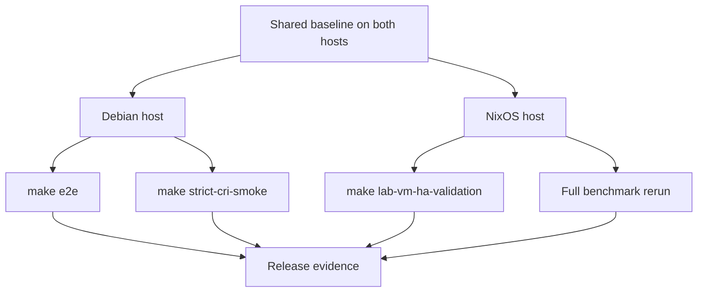

-----
## title: "k1s April Update: v0.1.4 HA, Validation, and Benchmark Hardening"  
date: 2026-04-22  
updatedAt: 2026-04-22  
slug: k1s-april-update-v0-1-4  
author: m4xx3d0ut  
tags: \[k1s, updates, release, v0.1.4, ha, cri, benchmarks, ci\]  
summary: "k1s v0.1.4 makes the HA control-plane path official with shared authority, stronger HA validation automation, stricter benchmark evidence, and hardened release workflows."  
cover_image: "../docs.home.arpa_8443_dashboard.png"

# k1s April Update: v0.1.4 HA, Validation, and Benchmark Hardening

## A few words

The past month has been busy. Other than several projects that have been occupying my time, I was able to carve out a week of family time and some much needed rest. Feeling refreshed and I realizing I had made some fairly wild claims about the future of AI cloud infrastructure a few weeks back, I decided to dive into roadmap items. First on the list, a strong High-Availability control plane implementation. This comes along with vastly improved bench harness instrumentation and a litany of CRI runtime fixes/ features/optimizations. As they say "once you start going down the rabbit hole"...

### But did you die?

You know what really helps surface condition X in your custom control plane? Run more of them, let them try to reconcile towards a unified state, then see what happens. Earlier k1s HA testing was rudimentary and the system had undergone too many steps of evolution to expect it to go cleanly, it did not. What it did do rather effectively was expose issues in state, SoT, and quorum logic that became the focus of development. To "help steamline the development and testing" of HA features, I decided to build a VM test and validation harness. Though it ended up being slightly more complicated than expected, it was super helpful in building out the base HA control plane logic and getting some baseline validation in place.

Once I started feeling good about that, I moved towards validation for the v0.1.4 tag. As I was running through benchmarks, updating the scripts, and checking the ops patterns I started noticing something that felt off in the CRI lane results. Everything "technically" worked and looked just fine, but the rollout stages looked off. I guess I have a point to make here. I use AI programming tools just like everyone else does, but I also understand the architecture of what I am building. You can build something that technically "works", but doesn't and you need to know when to dig in. I dug in.

What looked wrong was not a loud crash, it was "clean" data that was a little too clean. The steady-state CRI rows looked fine, but some of the rollout `during` stages did not line up with what the controller was actually doing. Once I started instrumenting the lane more aggressively, the issue became obvious: containerd cleanup debt was leaking across benchmark boundaries. Old pod sandboxes and reserved sandbox or container names could still be hanging around after a delete-and-recreate cycle, especially in the rollout path where the harness intentionally tears down desired state, reapplies it, and tries to sample the overlap window. That meant the CRI lane could technically complete while still giving you a misleading picture of when the old revision had really disappeared and whether the "during" snapshot had captured a real transition or just the tail end of cleanup.

The fix was not one thing, it was a stack of fixes. On the runtime side, CRI recovery is much more explicit now: stale sandboxes, reserved pod sandbox names, and reserved container names are treated as first-class recovery paths with bounded backoff, targeted cleanup, and name-release waits before retry. On the benchmark side, the CRI harness now does more than "clear and go". It brings up an isolated bench environment, waits for runtime-ready after cleanup, waits for the app to go quiet before the next scenario, captures debug state when quieting does not behave, and records rollout phase traces so the "during" samples can be checked against actual revision overlap instead of intuition. I also split the authoritative publish flow so the baseline suite and the CRI verify suite are treated separately, then added a dedicated `run_cri_verify.sh` pass that reruns the published CRI profile multiple times and checks the resulting row set before the artifacts are accepted.

That diagnosis and fix loop is easier to see in one picture:

That work changed my confidence in the CRI lane substantially. Before, it was possible to get a run that looked fine on paper while still being shaped by leftover runtime state. Now the lane is much stricter about proving that cleanup happened, that the runtime is genuinely ready again, and that the rollout samples correspond to a real transition window. So, that was a whole "thing"

## What is in v0.1.4

`v0.1.4` is now official as of **April 22, 2026**.

The official tag landed on April 22, but the validation posture behind it was built across the March HA closeout checkpoint and the April maintenance reruns and pre-tag verification work. In practical terms, this version is where the HA control-plane story stops living mostly as a roadmap and becomes a clearer operator contract: shared authority in `etcd`, leader-gated mutation with fencing/CAS, HA-safe API-shim behavior, repeatable VM validation, and a stricter benchmark evidence lane.

This reflects the release in `CHANGELOG.md` (`0.1.4 - 2026-04-22`) and the finalized release posture. Compared to `v0.1.3` (strict CRI orchestration, ingress proof, and trust-first registry behavior), `v0.1.4` goes far deeper on control-plane authority, operator validation, and release-grade evidence.

## TL;DR Highlights

- HA control-plane support is now official across controller authority, mutation fencing/CAS, HA-safe API-shim reads, and shared authority handling for workload-core, CRD, HPA, CronJob, and storage resources.
- HA operator tooling now includes public control-plane Envoy exposure, dashboard/system HA surfaces, authority freshness and build recovery metrics, and helper paths for snapshot, recovery, drills, and upgrades.
- `make lab-vm-ha-validation` is now the canonical VM/lab HA lane with attached-node, retained, drain, stage-2, `stage2-live`, and drill coverage.
- Benchmark automation is stricter about evidence: retained dataset rebuilding, rollout-overlap reporting, candidate summarization, and ordered CRI benchmark profile publishing are now part of the release-grade story.
- Local operator and developer ergonomics improved with `env-doctor`, controller env export helpers, Nix dev shell support, and workflow consolidation around core, docs, and nightly lanes.
- Reliability fixes land across VM image verification, strict-CRI smoke, benchmark reruns, demo/playground flows, and published docs sanitization.

## 1) HA Authority and Shared-Control-Plane Convergence

First and foremost, in `v0.1.4` is that the HA control-plane path is no longer split between design notes, partial implementation slices, and operator folklore. The authority model is much clearer now: `etcd` is the shared source of truth for desired state, revisions, leases, and fencing, and only the elected controller gets to authorize mutating work at a time.

The transport and replay are useful only if they cannot quietly become truth. In this version, watches and messages still trigger work, but `etcd` transactions remain the authorization boundary. Mutation envelopes now carry enough context for gateways, node agents, ingress writers, and related executors to reject stale epochs and absorb duplicates as no-ops instead of turning failover into correctness drift.

At a high level, the control-plane boundary now looks like this:

The shared-authority surface also reaches much further than it did before. HA mode now covers workload-core resources, CRDs and dynamic resources, HPA through shared metrics, CronJob and passive resource handling, and the storage path through shared controller authority. That was a lot of plumbing, but well worth it. The operator-facing result is simple, failover behavior is easier to reason about because the system is stricter about who is allowed to mutate state and where that state actually lives.

## 2) HA Operator Tooling, Envoy Exposure, and Dashboard Surfaces

I also wanted `v0.1.4` to make HA easier to operate, not just easier to describe in a roadmap. That shows up in the tooling and observability surface around the control plane.

This version includes public control-plane Envoy exposure, stronger HA dashboard and `/system` surfaces, and clearer authority freshness and build recovery metrics. The dashboard in particular is more informative now: the shared system graph can mark HA members directly, and the retained HA lane exposes the HA control-plane section in a way that aligns with the documented operator path.

On the operational side, the helper surface is much better than it was a release ago. Snapshot, recovery, bootstrap, drill, and upgrade helpers are all part of the repo now, and the docs increasingly treat them as the real first-line operator interface for HA maintenance rather than one-off lab scripts. The retained attached-node flow plus the stage-1 and stage-2 validation sequence are now the canonical path in the runbooks, which is the right move if the goal is to make HA validation reproducible instead of personal.

## 3) VM Validation and Release Verification Policy

The main evidence lane for this work is now `make lab-vm-ha-validation`. It covers attached-node, retained, drain, stage-2, `stage2-live`, and drill flows, backed by the checked-in HA lab variants and closeout helpers. The important change is not just that the command exists, but it's treated as the primary HA validation surface.

The other useful part is artifact shape. The one-shot and drill stages emit machine-readable `ha_summary.json` or `summary.json` evidence, while the retained and helper-oriented flows stay visible as wrapper-level checks. That boundary is worth preserving because it makes it clearer which lanes are milestone evidence and which ones are workstation-facing operator conveniences.

The date handling here deserves to be explicit. The official `v0.1.4` tag is **April 22, 2026**. The pooled Debian/NixOS verification policy referenced in the runbooks and validated procedures was documented earlier during the April pre-tag pass and carried into the final release posture for this version. For `v0.1.4`, both hosts ran the shared baseline with `AE_USE_REGISTRY_CACHE=0`, Debian owned `make e2e` plus `make strict-cri-smoke`, and NixOS owned `make lab-vm-ha-validation` plus the full benchmark rerun. That is intentionally not the same thing as saying each host independently passed the full matrix, and the docs call that out directly. Per-host full-matrix verification becomes the default starting with the next release.

The split for this tag is simple:

## 4) Benchmark Automation, Retained Datasets, and Ordered CRI Profiles

Benchmarking in `v0.1.4` is less about producing a few nicer charts and more about making the evidence lane harder to accidentally pollute. This version adds retained dataset rebuilding, rollout-overlap reporting, candidate summarization, and ordered CRI benchmark profile publishing for release-grade comparison runs.

That shows up in the surrounding procedures too. The docs now treat retained rebuilds, baseline and CRI split flows, and stronger rerun guidance as part of the authoritative path. Rootless, rootful, `k1nd`, `k3d`, and CRI reruns all got attention, and the published benchmark/site artifacts were refreshed against that stricter posture.

If you are trying to compare `k1s` against earlier baselines, or against `k3s`, or simply rerun the same lane after runtime changes, this is an important improvement.

## 5) Workflow Consolidation, Env Helpers, and Reliability Fixes

Some of the highest-value work in this version will largely go unseen since project's CI runs in a private Gitea deployment, before hitting Github. CI and release workflows were consolidated into core, docs, and nightly lanes, then hardened for Gitea-hosted execution. Local operator workflows also got stronger support through `env-doctor`, controller env export helpers, and Nix-based dev shell setup. That kind of work matters because it reduces the amount of invisible setup knowledge required to reproduce the documented paths.

The fix list is broad, but the operator impact is pretty concrete. VM golden-image verification now sizes verifier overlays from the backing qcow2 virtual size and rejects stale undersized overlays, which prevents a particularly annoying class of truncated initramfs and root-device failures during HA validation reruns. Demo and premerge smoke flows were stabilized across playground auth/reset cleanup, helm shim behavior, fixed-port rollouts, strict-CRI API-shim image builds, and simple dashboard recovery.

Runtime and benchmark reliability also improved in the less visible but still important places: Podman netns socket probing, Docker list races in `k1nd`, CRI env/bootstrap checks, reserved-name recovery, cleanup boundaries, steady-state attribution, snapshot timing, and comparison chart capture. On top of that, published procedures and generated site output now scrub local filesystem paths and stop embedding lab tokens. None of that is headline material by itself, but together it makes the repo easier to trust when you rerun what the docs say to rerun.

## Deployment readiness

`k1s` is still pre-`1.0` and actively evolving. I recommend `v0.1.4` for controlled staging, lab, and advanced operator validation, especially if you want to exercise the HA control-plane path, strict CRI lanes, or release-grade benchmark reruns. The responsibility is still to validate it under realistic conditions rather than pretend the hard parts are already solved.

## Call for validation

If you run small VM clusters, home labs, edge nodes, or strict CRI environments, `v0.1.4` is a good version to test under realistic failover and rerun conditions. I am especially interested in reports from operators who exercise `make lab-vm-ha-validation`, `make ha-closeout-e2e`, `make strict-cri-smoke`, and the refreshed benchmark paths with logs and reproduction notes.

- Repo: https://github.com/the-cm-collective/k1s
- Docs: https://chaosandmajesty.com/k1s/index.html
- Release: `0.1.4` (official, 2026-04-22)

## Closing

`v0.1.4` makes the HA control-plane path, the validation story, and the benchmark evidence more concrete. If the project is going to stay readable and operator-controlled, the contract around correctness and verification has to be as explicit as the code.
