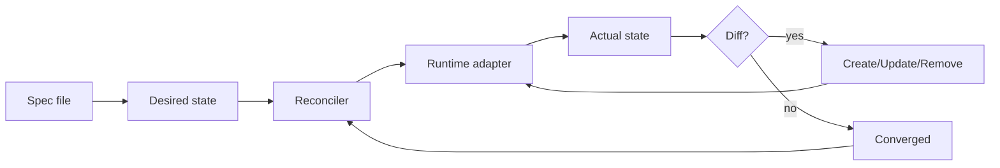
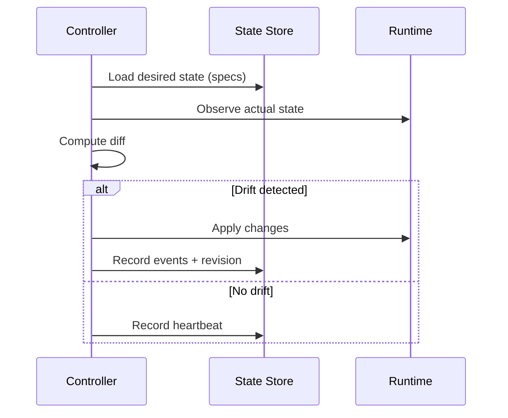
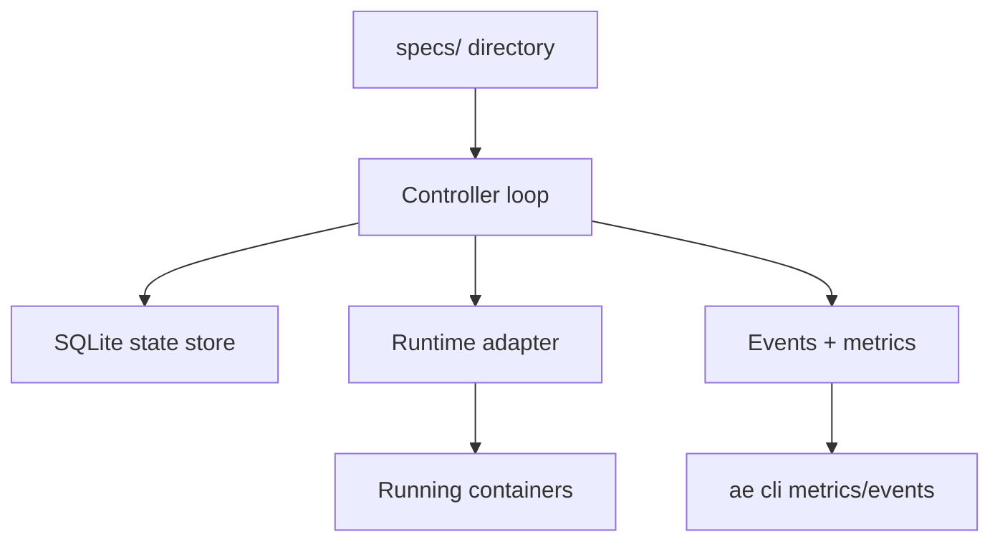
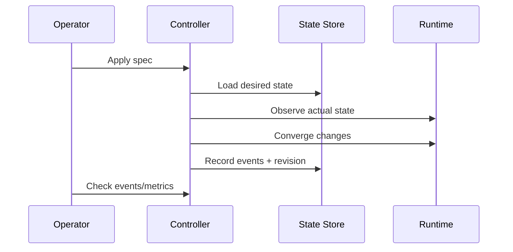

# Chapter 01 - Desired State and Reconciliation Loops

## Concept
A modern orchestration engine is a continuous control system. You declare a target (the desired state), and the controller repeatedly compares that target to reality, then applies corrective actions until the two match. This is reconciliation. The key property is idempotence: running the loop repeatedly should converge to the same result without causing unintended changes.



### Theory
Reconciliation is built on control-loop theory: observe, compare, act, repeat. The controller stores the desired state (from specs) and measures actual state (from runtime and health signals). When it detects drift, it issues the minimal set of actions needed to converge. The loop must tolerate partial failure, retries, and transient errors, so actions are designed to be safe if repeated.



### Design
In k1s, the controller imports specs, computes a spec hash to detect changes, creates a revision, and drives the runtime to match that revision. Events are emitted at each stage (ApplyStarted, ApplyCompleted) so operators can see the loop's decisions. This design separates the "what" (spec) from the "how" (runtime adapter), and makes the controller robust to restarts because revisions are persisted.



### Application
As a developer, you should treat specs as the single source of truth. To change behavior, update the spec and let the reconciler converge. If a manual change is overwritten, that is expected--the desired state wins. This mindset enables GitOps workflows and predictable rollouts.



## Key Terms and Acronyms
- Desired state - Spec-defined target configuration for an app.
- Actual state - Observed runtime containers, health, and endpoints.
- Reconciliation loop - Controller cycle that compares desired vs actual and issues actions.
- Idempotent - Safe to run repeatedly with the same end state.
- Revision - Immutable snapshot of a spec after change.
- Spec hash - Deterministic hash used to detect spec changes.
- Event - Structured record emitted during reconcile.
- k1s - The application orchestration engine used in these demos.
- k8s - Kubernetes.

## Commands (copy/paste)
```bash
python -m ae.controller --loop --watch --specs specs/ --metrics-port 9108
python -m ae.cli apply -f specs/examples/echo.yaml
python -m ae.cli events echo --limit 20
python -m ae.cli metrics
```

## Docs references (source + site)
- Source: `docs/getting-started/concepts.md` (reconcile, revisions, events)
- Source: `docs/reference/architecture.md`
- Site: `docs/site/concepts.html`
- Site: `docs/site/architecture.html`

## Code references (walkthrough anchors)
- Reconcile loop scheduling and spec import: `src/ae/controller/__main__.py:1511`
```py
    if args.once:
        try:
            _import_specs(specs_dir, store, source="specs")
        except Exception:
            pass
        ...
        _reconcile_all(reconciler, [entry.manifest for entry in entries])
        return 0

    # loop mode
    stop = False
    ...
    try:
        while not stop:
            now = time.time()
            do_full = changed or (now - last_full) >= max(1, int(args.interval))
            if do_full:
                t0 = time.time()
                try:
                    _import_specs(specs_dir, store, source="specs")
                except Exception:
                    pass
                ...
                _reconcile_all(reconciler, [entry.manifest for entry in entries])
                ...
```
- Reconciler entry point and ApplyStarted event: `src/ae/controller/reconciler.py:151`
```py
    def reconcile(self, manifest: AppManifest) -> ReconcileReport:
        """Reconcile the runtime to match the manifest."""

        spec_hash = self._compute_spec_hash(manifest)
        revision, _ = self._state_store.prepare_revision(manifest, spec_hash)
        app_name = app_key_for_manifest(manifest)

        self._state_store.record_event(
            app_name,
            revision,
            "ApplyStarted",
            f"Reconciling revision {revision}",
        )
```
- Revision creation + spec hashing: `src/ae/controller/state.py:777`
```py
    def prepare_revision(self, manifest: AppManifest, spec_hash: str) -> tuple[int, bool]:
        app_name = app_key_for_manifest(manifest)
        latest = self._get_latest_revision(app_name)
        if latest and latest.spec_hash == spec_hash:
            return latest.revision, False

        next_revision = (latest.revision if latest else 0) + 1 if latest else 1
        spec_json = json.dumps(manifest.model_dump(by_alias=True), sort_keys=True)
        created_at = datetime.now(timezone.utc).isoformat()

        with self._connect() as conn:
            conn.execute(
                """
                INSERT INTO app_revisions(app_name, revision, spec_hash, spec_json, image, created_at, status)
                VALUES(?,?,?,?,?,?,?)
                ON CONFLICT(app_name, revision) DO NOTHING
                """,
                (...)
            )
```
## Chapter navigation
- Next: [Chapter 02 - Declarative Specs and Apply Semantics](concepts-in-practice-02-declarative-apply.html)

