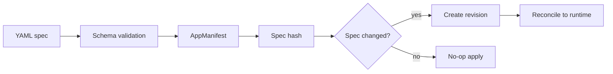
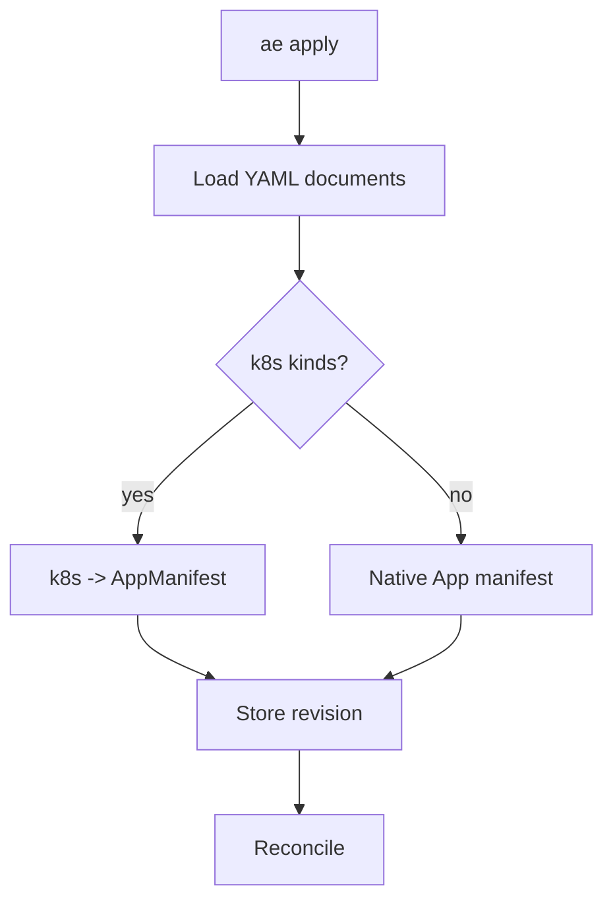
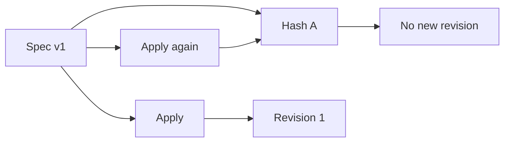
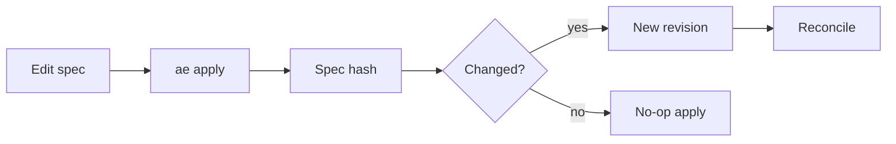

# Chapter 02 - Declarative Specs and Apply Semantics

## Concept
Declarative specs describe the desired outcome, not the step-by-step procedure. Applying a spec should be safe, repeatable, and converge the system to the same state regardless of prior actions. That is why apply is the primary interface: it merges intent into the system's source of truth.



### Theory
Declarative systems treat configuration as data. The "apply" operation is a reconciliation trigger: the controller compares the submitted desired state to the current desired state (stored in revisions) and decides whether a new revision is needed. This reduces hidden coupling and makes changes auditable.



### Design
k1s validates YAML into a strict schema, normalizes it, and computes a hash to detect change. If the hash differs, a new revision is created and reconciled. If not, the controller does nothing--repeat applies are effectively no-ops. This design produces deterministic behavior and makes rollback trivial by reusing stored revisions.



### Application
For developers, the spec is the API. Keep specs in version control, edit them for all changes, and apply them repeatedly without fear. When debugging, compare spec changes to revision events to see exactly what changed and why.



## Key Terms and Acronyms
- Declarative config - Describe the outcome, not the steps.
- Imperative command - Direct action without a desired-state model.
- Apply - Operation that submits desired state for reconciliation.
- Schema - Typed model that defines valid spec structure.
- Validation - Checking a spec against the schema.
- Spec hash - Change detector for creating new revisions.
- Revision - Stored snapshot of desired state.
- SSA - Server-side apply in Kubernetes (field ownership).
- GitOps - Version control as the source of truth for deployment.
- YAML - Human-readable configuration format.

## Commands (copy/paste)
```bash
python -m ae.cli apply -f specs/examples/echo.yaml
python -m ae.cli status echo --wide
python -m ae.cli events echo --limit 20
```

## Docs references (source + site)
- Source: `docs/getting-started/concepts.md` (specs, revisions)
- Source: `docs/guides/demos-examples.md`
- Source: `docs/reference/k8s-export.md`
- Site: `docs/site/examples.html`
- Site: `docs/site/concepts.html`

## Code references (walkthrough anchors)
- AppSpec schema (declarative fields): `src/ae/controller/spec.py:384`
```py
class AppSpec(BaseModel):
    """Workload specification."""

    image: str
    workload: Literal["service", "job"] = Field(default="service")
    command: Optional[List[str]] = None
    args: Optional[List[str]] = None
    env: List[dict[str, str]] = Field(default_factory=list)
    replicas: int = Field(default=1, ge=1)
    ports: List[PortSpec] = Field(default_factory=list)
    health: Optional[HealthSpec] = None
    ...
    rollout: Optional[dict] = Field(
        default_factory=lambda: {"strategy": "parallel", "maxSurge": 1, "maxUnavailable": 0}
    )
```
- Manifest load + validation: `src/ae/controller/spec.py:520`
```py
def load_manifest(path: Path) -> AppManifest:
    """Load a Deployment/App manifest from YAML."""

    try:
        data = yaml.safe_load(path.read_text())
    except FileNotFoundError as exc:
        raise ManifestError(f"Manifest {path} not found") from exc
    ...
    return AppManifest.model_validate(data)
```
- Apply command's YAML handling and k8s conversion gate: `src/ae/cli/__main__.py:1225`
```py
def handle_apply(...):
    import yaml as _yaml
    from ae.k8s import convert as k8s_convert

    def _load_yaml_documents(path: Path) -> list[dict]:
        docs = [d for d in _yaml.safe_load_all(path.read_text()) if d]
        if not docs:
            raise ValueError("no YAML documents found")
        return docs

    k8s_workload_kinds = {"Deployment", "StatefulSet", "DaemonSet", "Job"}
    k8s_network_kinds = {"Service", "Ingress"}
```
- Example manifest to highlight on screen: `specs/examples/echo.yaml:1`
```yaml
apiVersion: ae.dev/v1alpha1
kind: App
metadata:
  name: echo
spec:
  image: mendhak/http-https-echo:37
  replicas: 1
  env:
    - name: APP_NAME
      value: echo
  ports:
    - name: http
      containerPort: 8080
```
