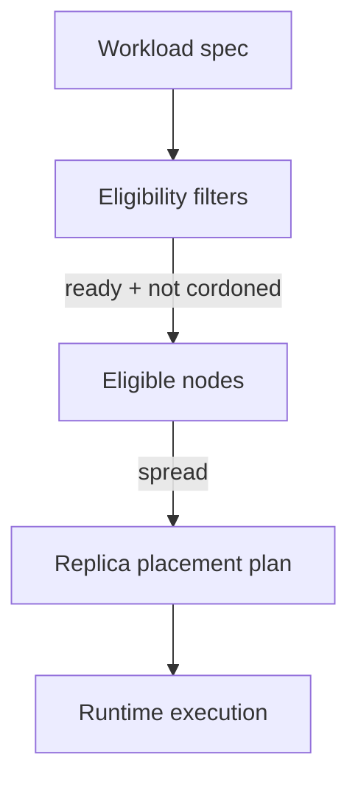
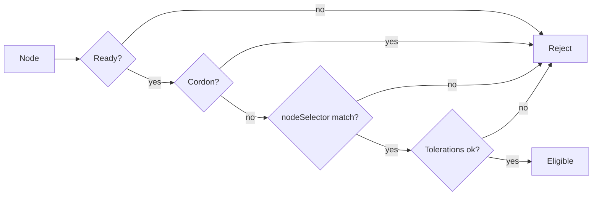
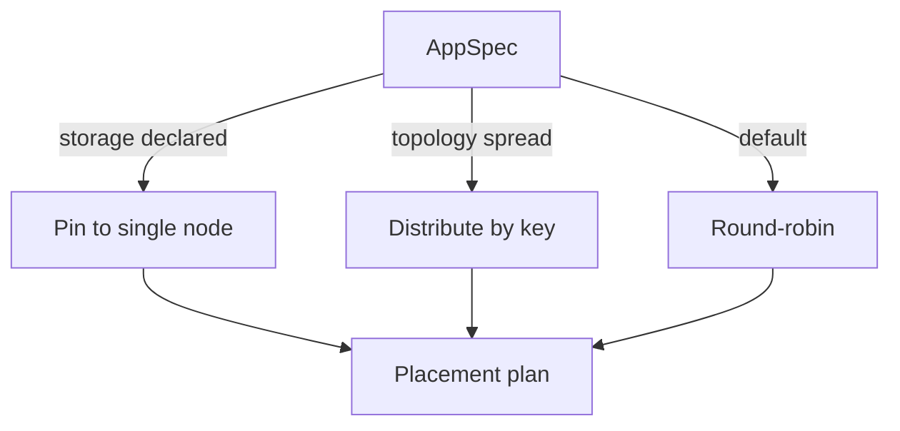
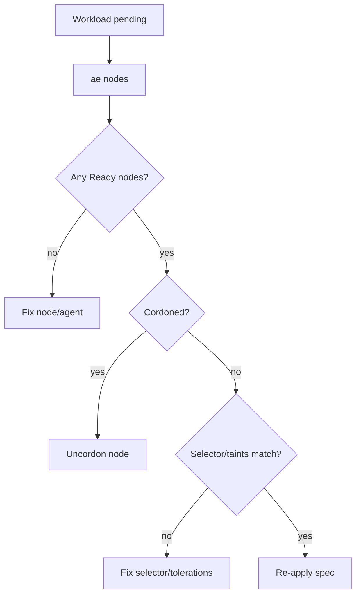

# Chapter 03 - Scheduling and Placement (Where Work Runs)

## Concept
Scheduling is the process of deciding where workloads run. It is not just "pick a node," but "pick a node that satisfies constraints." Placement becomes part of correctness when storage, network policy, or affinity rules are involved.



### Theory
Schedulers perform a filter-and-score pipeline. First, they filter out nodes that cannot run the workload (not ready, cordoned, selector mismatch, taints not tolerated). Then they score remaining nodes to balance load or satisfy topology constraints. This separates hard constraints from soft preferences.



### Design
k1s implements a lightweight scheduler that filters nodes by readiness, cordon status, nodeSelector, taints/tolerations, and then spreads replicas round-robin. If storage is declared, it pins placement to one node to avoid cross-node volume assumptions. When no nodes qualify, it falls back to the local runtime so single-node setups remain usable.



### Application
When a workload does not schedule, inspect selectors, taints, and node readiness first. For multi-node development, consider adding labels that enable explicit node selection and validating placement decisions with `ae nodes` and events. This aligns with how kube-scheduler behaves in production clusters.



## Key Terms and Acronyms
- Scheduler - Component that decides placement for replicas.
- Node - Execution target for workloads.
- Cordon - Mark a node unschedulable.
- Taint - Node attribute that repels workloads unless tolerated.
- Toleration - Workload exception allowing tainted nodes.
- nodeSelector - Label-based placement constraint.
- Topology spread - Rule to distribute replicas across domains.
- Placement - The chosen nodes for replicas.
- Replica - A single instance of a workload.

## Commands (copy/paste)
```bash
python -m ae.controller --loop --specs specs/ --metrics-port 9108
python -m ae.cli nodes
python -m ae.cli nodes <node-id> --cordon
python -m ae.cli nodes <node-id> --uncordon
python -m ae.cli apply -f specs/examples/echo.yaml
python -m ae.cli events echo --limit 20
```

## Docs references (source + site)
- Source: `docs/reference/scheduling.md`
- Source: `docs/getting-started/concepts.md` (nodes + scheduling)
- Site: `docs/site/scheduling.html`
- Site: `docs/site/concepts.html`

## Code references (walkthrough anchors)
- Scheduler placement logic: `src/ae/controller/scheduler.py:37`
```py
    def plan(self, manifest: AppManifest, revision: int) -> tuple[list[Placement], list[str]]:
        desired = int(manifest.spec.replicas)
        app_name = app_key_for_manifest(manifest)
        replica_ids = [f"{app_name}-rev{revision}-{i}" for i in range(desired)]
        ...
        for node, status in nodes:
            if bool(getattr(node, "cordoned", False)):
                continue
            if not self._is_ready(status, now, grace):
                ...
            if not self._matches_node_selector(node, manifest):
                continue
            if not self._tolerates_taints(node, manifest):
                continue
            eligible.append(node)

        if not eligible:
            warnings.append("no eligible nodes; falling back to local runtime")
            return [Placement(node=None, agent_url=None, replica_ids=replica_ids)], warnings
        ...
        # Round-robin placement across eligible nodes.
```
- Local node registration (single-node default): `src/ae/controller/__main__.py:78`
```py
    def _register_local_node(store: SQLiteStateStore, runtime_backend: str) -> None:
        """Best-effort local node registration for single-controller setups."""
        try:
            node_id = os.getenv("AE_NODE_ID", socket.gethostname())
            name = os.getenv("AE_NODE_NAME", node_id)
            store.upsert_node(
                node_id,
                name=name,
                labels={"role": "controller"},
                taints=[],
                backend=runtime_backend,
                endpoint=None,
                pod_cidr=None,
                wg_pubkey=None,
            )
            store.record_heartbeat(node_id, "Ready")
        except Exception:
            pass
```
- Spec fields that affect placement: `src/ae/controller/spec.py:489`
```py
    node_selector: dict[str, str] = Field(default_factory=dict, alias="nodeSelector")
    tolerations: List[dict] = Field(default_factory=list)
    topology_spread_constraints: List[dict] = Field(
        default_factory=list, alias="topologySpreadConstraints"
    )
```
## Chapter navigation
- Prev: [Chapter 02 - Declarative Specs and Apply Semantics](concepts-in-practice-02-declarative-apply.html)
- Next: [Chapter 04 - Runtime Adapters and Container Execution](concepts-in-practice-04-runtime-adapters.html)

