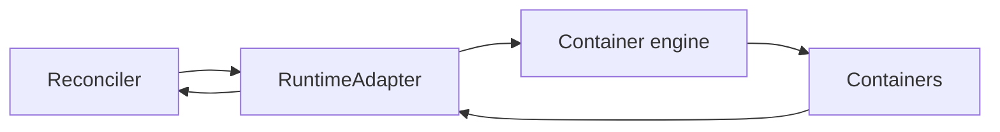
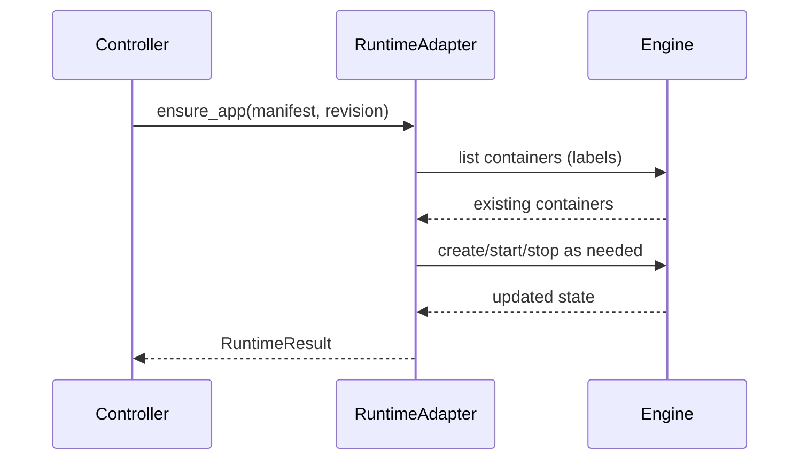
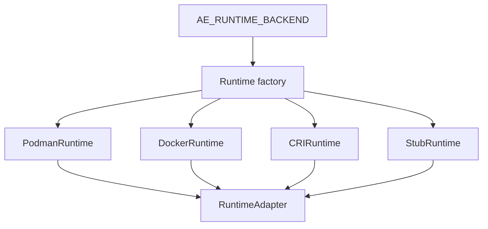
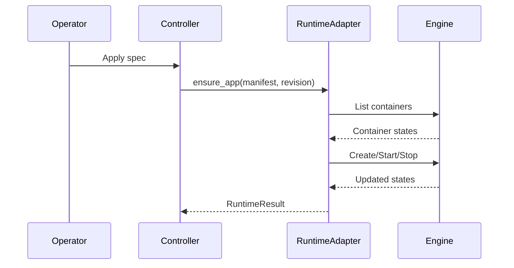

# Chapter 04 - Runtime Adapters and Container Execution

## Concept
The controller defines desired state, but runtime adapters execute it. The adapter layer abstracts the container engine so the orchestration logic can remain stable while runtimes vary (Podman, Docker, CRI/containerd, or remote agents).



### Theory
Abstraction boundaries reduce coupling. By defining a strict runtime interface (ensure_app, remove_app, read_logs), the orchestrator can operate independently of runtime details. This also enables testing via stub runtimes and supports multiple backends with minimal controller changes.



### Design
k1s defines a RuntimeAdapter protocol and provides concrete implementations for Podman, Docker, and CRI/containerd. The controller calls `ensure_app`, which creates or updates containers to match the desired replica set. Backend selection is environment-driven, and fallback logic ensures the system remains functional even if the preferred runtime is unavailable.



### Application
To extend k1s, implement the RuntimeAdapter contract for a new engine, then wire it into runtime selection. When debugging runtime issues, focus on adapter logs and verify container labels and lifecycle transitions. This mirrors how kubelet integrates CRI runtimes in Kubernetes.



## Key Terms and Acronyms
- Runtime adapter - Abstraction translating reconcile actions to runtime ops.
- Container runtime - Engine that runs containers (Podman, Docker, containerd).
- CRI - Kubernetes Container Runtime Interface.
- OCI - Open Container Initiative spec for images/runtimes.
- containerd - Common CRI implementation used by k3s/k8s.
- ensure_app - Adapter method that enforces desired replicas.
- Replica state - Runtime-reported status for a replica.
- Image pull - Fetching a container image from a registry.

## Commands (copy/paste)
```bash
AE_RUNTIME_BACKEND=podman python -m ae.controller --loop --specs specs/ --metrics-port 9108
python -m ae.cli apply -f specs/examples/echo.yaml
python -m ae.cli logs echo --tail 50
python -m ae.cli events echo --limit 20
```

## Docs references (source + site)
- Source: `docs/reference/architecture.md`
- Source: `docs/adr/0004-oci-runtime-adapter.md`
- Source: `docs/getting-started/concepts.md`
- Site: `docs/site/architecture.html`

## Code references (walkthrough anchors)
- Runtime adapter interface: `src/ae/runtime/base.py:12`
```py
class RuntimeAdapter(Protocol):
    """Adapter that drives container runtime operations."""

    def ensure_app(
        self,
        manifest: AppManifest,
        revision: int,
        *,
        keep_old: bool = False,
        limit_create: int | None = None,
        replica_ids: list[str] | None = None,
        node_id: str | None = None,
    ) -> RuntimeResult:
        """Ensure the runtime matches the manifest."""
```
- Docker adapter ensures replicas: `src/ae/runtime/docker_runtime.py:56`
```py
    def ensure_app(self, manifest: AppManifest, revision: int, *, ... ) -> RuntimeResult:
        app_name = app_key_for_manifest(manifest)
        desired_replica_ids = (
            list(replica_ids)
            if replica_ids is not None
            else self._desired_replica_ids(manifest, revision)
        )
        ...
        for replica_id in desired_replica_ids:
            container = containers_by_replica.get(replica_id)
            if container is None:
                container = self._create_container(
                    manifest, replica_id, revision, node_id=node_id, attempt=0
                )
                created += 1
            else:
                self._reload(container)
                if container.status != "running":
                    container.start()
                    updated += 1
```
- Runtime backend selection: `src/ae/cli/__main__.py:757`
```py
def runtime_factory(registry_auth: RegistryAuthProvider | None = None) -> RuntimeAdapter:
    backend = os.getenv("AE_RUNTIME_BACKEND", "podman").lower()
    if backend == "stub":
        return StubRuntime()
    if backend in {"cri", "containerd"}:
        return CRIRuntime()
    if backend in {"podman", "oci"}:
        try:
            if shutil.which(os.getenv("AE_PODMAN_BIN", "podman")) is None:
                raise RuntimeError("podman not found on PATH")
            return PodmanRuntime()
        except Exception:
            return DockerRuntime(registry_auth=registry_auth)
    return DockerRuntime(registry_auth=registry_auth)
```
## Chapter navigation
- Prev: [Chapter 03 - Scheduling and Placement (Where Work Runs)](concepts-in-practice-03-scheduling-placement.html)
- Next: [Chapter 05 - Ingress and Service Exposure](concepts-in-practice-05-ingress-service-exposure.html)
