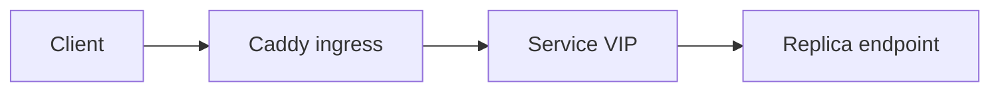
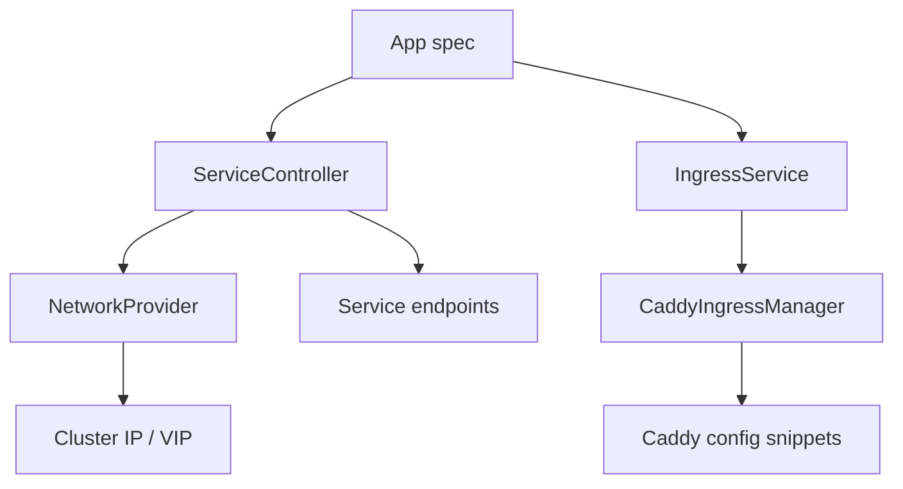
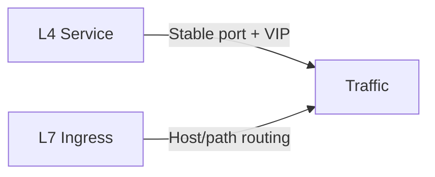
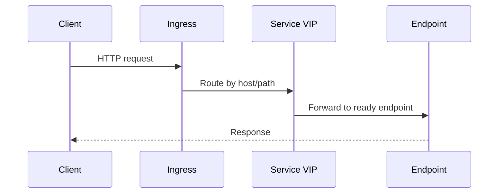

# Chapter 05 - Ingress and Service Exposure

## Concept
Service exposure is the boundary between internal workloads and external clients. L4 services provide stable networking, while L7 ingress handles routing, TLS, and hostname-based access. Both must be deterministic, declarative, and safe to update.



### Theory
Layered networking separates concerns: service discovery and stable endpoints at L4, routing and policy at L7. Health checks gate traffic so that only ready backends are exposed. Ingress controllers react to declarative config and converge proxy state to match.



### Design
k1s implements a Service VIP controller for L4 and Caddy-based ingress for L7. The controller computes upstreams from healthy replicas and writes ingress config snippets, then reloads Caddy. It also supports canary weighting during rollouts. This mirrors the Kubernetes pattern of Services + Ingress controllers.



### Application
For engineers, start with `spec.service` for stable ports and `spec.ingress` for HTTP routing. Verify readiness probes so that only healthy endpoints appear in services. Use events to confirm when ingress is configured and updated during rollouts.



## Key Terms and Acronyms
- Service - L4 abstraction that provides stable ports/endpoints.
- VIP - Virtual IP for a service.
- Ingress - L7 routing by host/path.
- Upstream - Backend endpoint targeted by a proxy.
- TLS - Transport Layer Security for HTTPS.
- Canary - Weighted routing between revisions.
- L4/L7 - Networking layers (transport/application).
- Gateway API - Kubernetes successor to Ingress.
- Endpoint - Concrete backend address for routing.

## Commands (copy/paste)
```bash
docker compose -f ops/dev/docker-compose.yaml up
python -m ae.controller --loop --specs specs/ --metrics-port 9108
python -m ae.cli apply -f specs/examples/echo.yaml
python -m ae.cli services
python -m ae.cli events echo --limit 20
docker compose -f ops/dev/docker-compose.yaml down
```

## Docs references (source + site)
- Source: `docs/reference/ingress.md`
- Source: `docs/guides/l4-services.md`
- Source: `docs/design/clusterip.md`
- Site: `docs/site/ingress.html`
- Site: `docs/site/rollouts.html`

## Code references (walkthrough anchors)
- Ingress orchestration (TLS + canary weights): `src/ae/ingress/service.py:35`
```py
    def apply(self, manifest: AppManifest, upstream) -> IngressResult:
        if manifest.spec.ingress is None:
            ...
        readiness_path = None
        if (
            manifest.spec.health
            and manifest.spec.health.readiness
            and manifest.spec.health.readiness.http_get
        ):
            readiness_path = manifest.spec.health.readiness.http_get.path or "/"
        ...
        rollout = getattr(manifest.spec, "rollout", {}) or {}
        strategy = str(rollout.get("strategy", "parallel")).lower()
        canary_weight = int(rollout.get("weight", 1)) if strategy == "canary" else 1
        ...
        site_path = self._manager.apply(
            manifest,
            upstream,
            readiness_path,
            prefer_first=prefer_first,
            first_weight=canary_weight,
        )
```
- Caddy site template + write path: `src/ae/ingress/caddy.py:18`
```py
SITE_TEMPLATE = Template(
    """https://$host {
    log {
        output stdout
        format console
    }
    # Ensure upstream HSTS does not stick during dev
    header -Strict-Transport-Security
    $tls_block
    $routes
}
"""
)
...
    site_config = self._render_site(
        ingress, upstream, readiness_path, prefer_first, first_weight
    )
    site_path = self._site_path(app_key_for_manifest(manifest))
    site_path.write_text(site_config)
```
- Service VIP reconciliation: `src/ae/network/service_controller.py:23`
```py
    def reconcile(...):
        svc_spec = getattr(manifest.spec, "service", None)
        app = app_key_for_manifest(manifest)
        if not svc_spec:
            self._cleanup(app)
            return None
        ...
        self._provider.ensure_network()
        cluster_ip = self._provider.ensure_service(app, ports)
        backends = self._build_backends(app, svc_spec, runtime_result, health_report)
        self._store.upsert_service(app, cluster_ip, ports)
        self._provider.update_service_endpoints(app, backends["by_port"])
```
## Chapter navigation
- Prev: [Chapter 04 - Runtime Adapters and Container Execution](concepts-in-practice-04-runtime-adapters.html)
- Next: [Chapter 06 - Observability: Logs, Metrics, Events](concepts-in-practice-06-observability.html)

