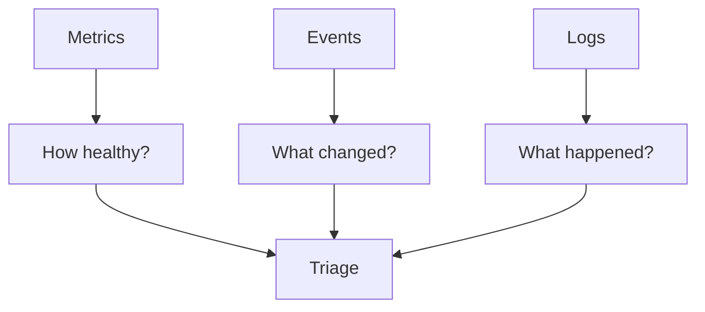
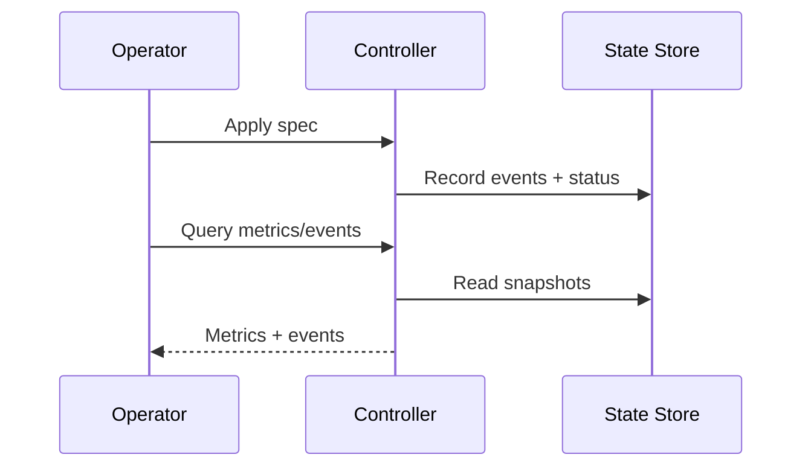
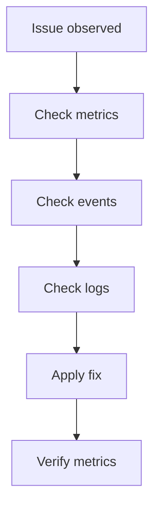

# Chapter 06 - Observability: Logs, Metrics, Events

## Concept
Observability is the ability to understand system behavior from the outside. Metrics quantify state, events explain transitions, and logs provide raw evidence. Together, they enable fast diagnosis and safe operations.



### Theory
The three pillars serve different purposes: metrics answer "how much" and "how many," events answer "what changed," and logs answer "what happened at a point in time." Effective systems emit all three, and operators should move between them methodically.

```mermaid
flowchart LR
  State[SQLite state] --> MetricsSvc[MetricsService]
  MetricsSvc --> CLI[ae cli metrics]
  MetricsSvc --> HTTP[/metrics HTTP]
  State --> Events[Events table]
  Events --> CLI2[ae cli events]
```

### Design
k1s stores reconciliation state in SQLite, derives aggregate metrics from that store, and emits structured events during every reconcile. A lightweight HTTP API exposes Prometheus metrics and event data. This design keeps observability local and reproducible while still compatible with external tooling.



### Application
When troubleshooting, start with metrics to see if the system is degraded, then use events to find the trigger. If you need detail, inspect logs for the specific runtime or controller. This approach scales to production k8s workflows with Prometheus and Events API.



## Key Terms and Acronyms
- Observability - Ability to understand system state from signals.
- Metrics - Numeric aggregates over time.
- Events - Discrete records of state transitions.
- Logs - Text output from components.
- Prometheus - Metrics format and scraping ecosystem.
- Snapshot - Point-in-time aggregate metrics view.
- HTTP API - Controller interface for metrics/events/status.
- Triage - Structured troubleshooting flow.

## Commands (copy/paste)
```bash
python -m ae.controller --loop --specs specs/ --metrics-port 9108
python -m ae.cli apply -f specs/examples/echo.yaml
python -m ae.cli metrics --json
python -m ae.cli events echo --limit 20
curl http://127.0.0.1:9108/metrics
```

## Docs references (source + site)
- Source: `docs/reference/observability.md`
- Source: `docs/ops/grafana.md`
- Source: `docs/ops/runbook.md`
- Site: `docs/site/observability.html`

## Code references (walkthrough anchors)
- Metrics snapshot aggregation: `src/ae/observability/metrics.py:25`
```py
class MetricsService:
    """Aggregates metrics from application status records."""

    def snapshot(self) -> MetricsSnapshot:
        statuses = self._store.list_status()
        total_apps = len(statuses)
        ready_apps = sum(1 for status in statuses if status.revision_status == "ready")
        progressing_apps = sum(1 for status in statuses if status.revision_status == "progressing")
        ...
        return MetricsSnapshot(...)
```
- CLI metrics/events output: `src/ae/cli/__main__.py:2854`
```py
def handle_metrics(args: argparse.Namespace, store: SQLiteStateStore) -> int:
    service = MetricsService(store)
    snapshot = service.snapshot()
    if args.json:
        print(json.dumps({...}, indent=2))
        return 0
    print(f"apps total={snapshot.total_apps} ...")


def handle_events(...):
    events = store.list_events(app_name, limit=args.limit)
    for event in events:
        timestamp = event.created_at.strftime("%Y-%m-%d %H:%M:%S")
        print(f"{timestamp} rev={event.revision} {event.event_type}: {event.message}")
```
