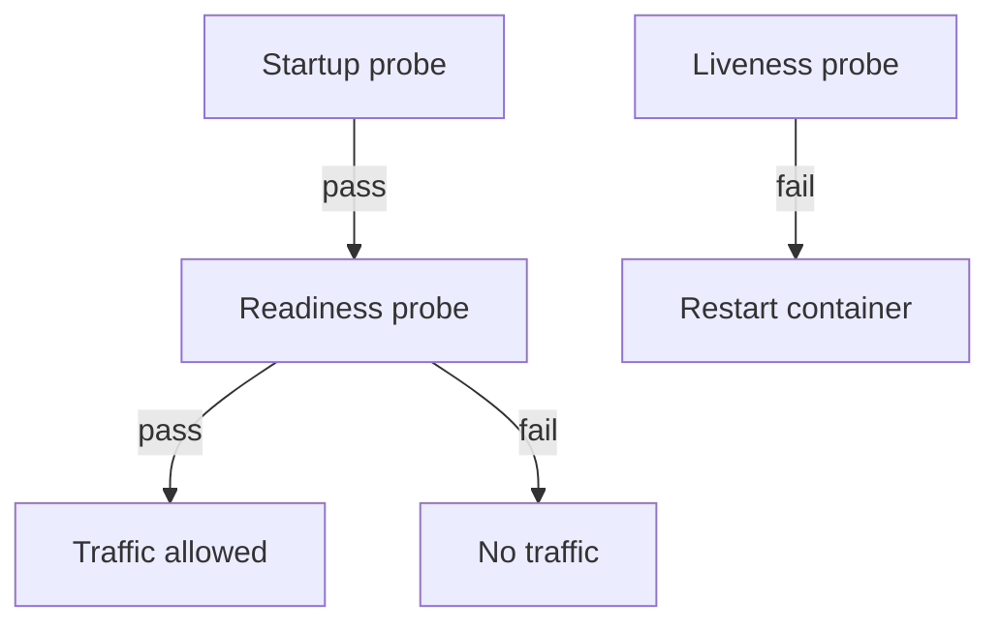
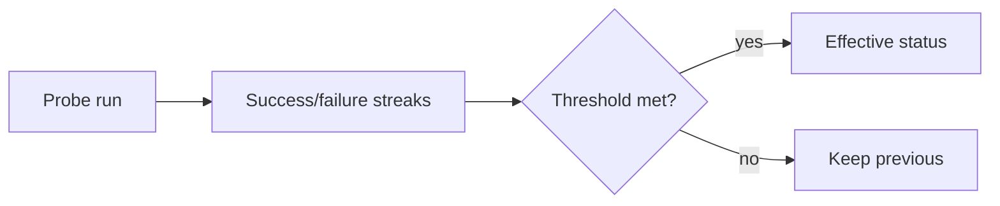
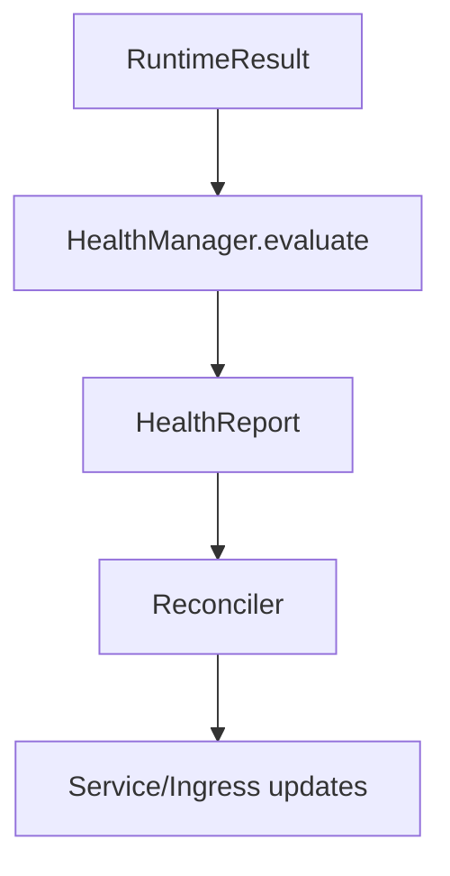
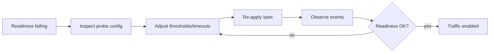

# Chapter 07 - Health Probes

## Concept
Health probes determine when a workload can receive traffic (readiness) and when it should be restarted (liveness). Startup probes protect slow-boot services. These signals are foundational to safe rollouts.



### Theory
Readiness and liveness represent orthogonal checks: readiness gates traffic, liveness gates restarts. Probe intervals, thresholds, and timeouts control sensitivity. Startup probes temporarily override readiness and liveness until an initial healthy state is established.



### Design
k1s evaluates probe outcomes per pod, tracks success/failure streaks, enforces probe periods, and applies backoff after failures. Results are aggregated into HealthReports, which feed rollout decisions and service endpoint selection. This aligns with Kubernetes probe semantics.



### Application
Define probes early for all production workloads. Tune thresholds to avoid flapping, and use startup probes for slow initializations. Monitor readiness events during rollouts to understand why traffic did or did not shift.



## Key Terms and Acronyms
- Readiness probe - Check that gates traffic eligibility.
- Liveness probe - Check that triggers restart when failing.
- Startup probe - Initial gate before readiness/liveness.
- Probe period - Interval between checks.
- failureThreshold/successThreshold - Streak counts that flip state.
- Backoff - Delay between retries after failure.
- Health report - Aggregate readiness/liveness results per reconcile.

## Commands (copy/paste)
```bash
python -m ae.controller --loop --specs specs/ --metrics-port 9108
python -m ae.cli apply -f specs/examples/echo.yaml
python -m ae.cli events echo --limit 50
python -m ae.cli history echo --limit 20
```

## Docs references (source + site)
- Source: `docs/getting-started/concepts.md` (Health section)
- Source: `docs/reference/rollouts.md`
- Site: `docs/site/concepts.html`
- Site: `docs/site/rollouts.html`

## Code references (walkthrough anchors)
- Health evaluation and probe gating: `src/ae/controller/health.py:71`
```py
    def evaluate(self, manifest: AppManifest, result: RuntimeResult) -> HealthReport:
        readiness_spec = manifest.spec.health.readiness if manifest.spec.health else None
        liveness_spec = manifest.spec.health.liveness if manifest.spec.health else None
        startup_spec = (
            getattr(manifest.spec.health, "startup", None) if manifest.spec.health else None
        )
        ...
        # If startupProbe is defined, gate readiness/liveness until it succeeds.
        if startup_spec is not None:
            startup = self._evaluate_probe(...)
            if not startup.success:
                pods.append(PodHealth(...))
                continue

        readiness = self._evaluate_probe(..., probe_type="readiness")
        liveness = self._evaluate_probe(..., probe_type="liveness")
```
- Probe configuration in example spec: `specs/examples/echo.yaml:25`
```yaml
health:
  readiness:
    httpGet:
      path: /healthz
      port: 8080
    initialDelaySeconds: 1
    periodSeconds: 5
  liveness:
    httpGet:
      path: /healthz
      port: 8080
    initialDelaySeconds: 3
    periodSeconds: 10
  startup:
    httpGet:
      path: /healthz
      port: 8080
    failureThreshold: 30
    periodSeconds: 5
```
## Chapter navigation
- Prev: [Chapter 06 - Ingress & Service Exposure](concepts-in-practice-06-ingress-service-exposure.html)
- Next: [Chapter 08 - Rollouts, Updates, & Rollbacks](concepts-in-practice-08-rollouts-updates.html)
