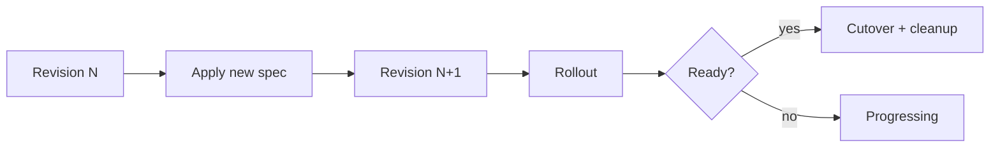
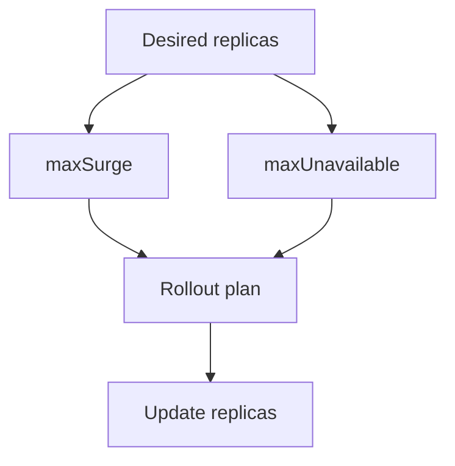
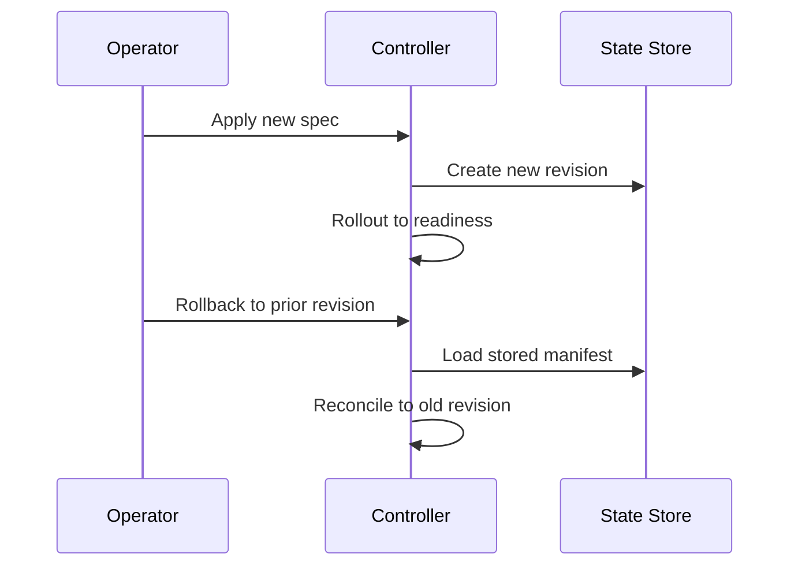
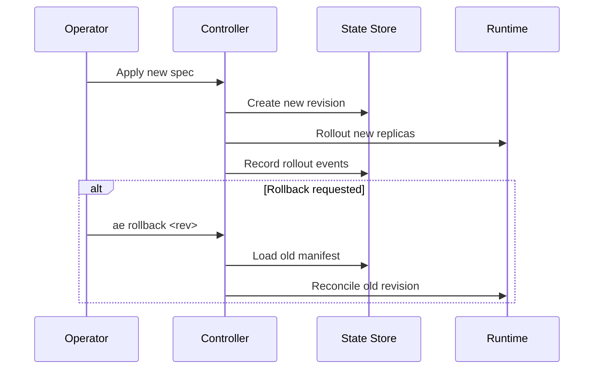

# Chapter 08 - Rollouts, Updates, & Rollbacks

## Concept
Rollouts are controlled transitions between revisions of a workload. They balance speed and safety by regulating how many replicas are updated at once, and they preserve the ability to revert.



### Theory
A rollout is an incremental convergence process. It constrains changes using maxSurge and maxUnavailable, and observes readiness before progressing. Rollbacks are possible because the system retains prior revision manifests.



### Design
k1s stores each spec revision and reconciles to the newest one. During a rollout, it updates replicas, observes readiness, and removes old revisions when safe. It emits detailed events for progress and canary states. Rollback replays a stored revision through the reconciler.



### Application
Engineers should treat revisions as immutable artifacts. When testing, make a spec change, observe events and readiness, and then practice rollback. This builds confidence and mirrors Deployment workflows in Kubernetes.



## Key Terms and Acronyms
- Rollout - Controlled transition between revisions.
- Revision - Immutable spec snapshot.
- maxSurge - Extra replicas allowed during rollout.
- maxUnavailable - Replicas allowed to be unavailable.
- Canary - Partial traffic to a new revision.
- Rollback - Revert to a prior revision.
- Rollout hook - Pre/post actions tied to rollout stages.
- Progressing - Status when not all replicas are ready.

## Commands (copy/paste)
```bash
python -m ae.controller --loop --specs specs/ --metrics-port 9108
python -m ae.cli apply -f specs/examples/echo-rollout.yaml
python -m ae.cli events echo-rollout --limit 50
python -m ae.cli revisions echo-rollout --limit 5
python -m ae.cli rollout pause echo-rollout
python -m ae.cli rollout resume echo-rollout
python -m ae.cli rollback echo-rollout --to <revision>
```

## Docs references (source + site)
- Source: `docs/reference/rollouts.md`
- Source: `docs/getting-started/concepts.md` (Rollouts section)
- Site: `docs/site/rollouts.html`

## Code references (walkthrough anchors)
- Rollout status + canary events: `src/ae/controller/reconciler.py:466`
```py
        # Remove old revisions if availability is satisfied, except while canary is active
        desired = manifest.spec.replicas
        ro_now = getattr(manifest.spec, "rollout", {}) or {}
        strat_now = str(ro_now.get("strategy", "parallel")).lower()
        ...
        canary_active = strat_now == "canary" and (w_now or 0) > 0 and (w_now or 0) < 100
        if (not canary_active) and health_report.ready_replicas >= max(0, desired - max_unavail):
            ...
            removed_old = self._remove_old_revisions_all(app_name, revision, runtimes_used)
            if removed_old > 0:
                self._state_store.record_event(..., "RolloutOldRemoved", ...)

        # Emit rollout change events (e.g., canary enabled/updated/disabled)
        ...
        if ev_type and msg:
            self._state_store.record_event(app_name, revision, ev_type, msg)
```
- Rollout spec example: `specs/examples/echo-rollout.yaml:17`
```yaml
apiVersion: ae.dev/v1alpha1
kind: Deployment
metadata:
  name: echo-rollout
spec:
  image: mendhak/http-https-echo:37
  replicas: 1
  ports:
    - { name: http, containerPort: 8080 }
  health:
    readiness: { httpGet: { path: /healthz, port: 8080 }, initialDelaySeconds: 1 }
  rollout: { strategy: ordered, maxSurge: 1, maxUnavailable: 0 }
```
- Rollback command path: `src/ae/cli/__main__.py:2810`
```py
def handle_rollback(...):
    if target_rev is None:
        revisions = store.list_revisions(app_name, limit=2)
        ...
        target_rev = revisions[1].revision
    manifest = store.get_revision_manifest(app_name, target_rev)
    report = reconciler.reconcile(manifest)
    print(f"Rolled back ... to revision {report.revision} ({report.revision_status})")
```
## Chapter navigation
- Prev: [Chapter 07 - Health Probes](concepts-in-practice-07-health-probes.html)
- Next: [Chapter 09 - Configs & Secrets](concepts-in-practice-09-configuration-secrets.html)
