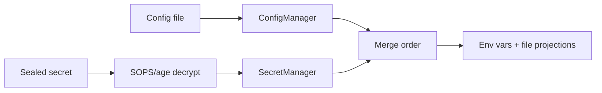
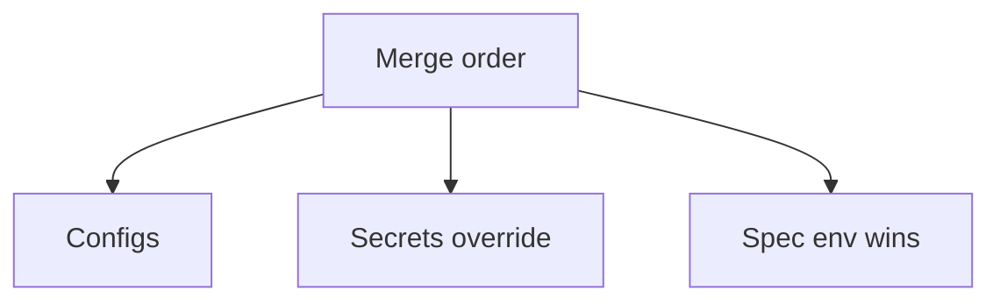
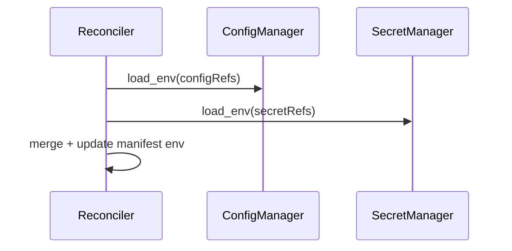
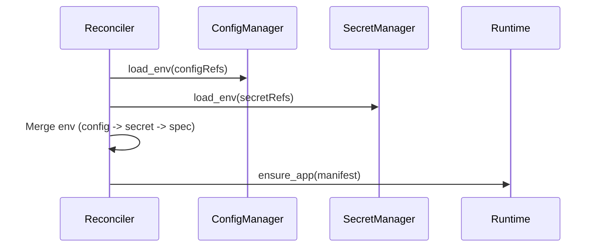

# Chapter 09 - Config & Secrets

## Concept
Configuration defines application behavior, while secrets protect sensitive values. Both must be controlled, audited, and projected into workloads safely.



### Theory
Configs are non-sensitive data and can be stored in plain YAML/JSON. Secrets must be encrypted at rest and decrypted only at deployment time. The system should merge config and secret values deterministically so the resulting environment is predictable.



### Design
k1s uses config refs and secret refs in the spec. Config files are parsed locally; sealed secrets are decrypted via SOPS/age. A deterministic merge order is applied (configs, then secrets, then explicit env), and values can be projected into environment variables or mounted files.



### Application
Store configs and sealed secrets alongside specs, keep decryption keys out of source control, and validate projection mappings early. In production, avoid plaintext secrets; in local demos, use AE_ALLOW_PLAINTEXT_SECRETS only as a temporary convenience.



## Key Terms and Acronyms
- Config - Non-sensitive application settings.
- Secret - Sensitive data (passwords, tokens).
- SOPS - Tool for encrypting/decrypting secrets.
- age - Encryption format used by SOPS.
- Projection - Mapping data into env vars or files.
- Env var - Environment variable injected into a container.
- Sealed secret - Encrypted secret file committed to repo.
- Merge order - Deterministic override rules (config -> secret -> env).

## Commands (copy/paste)
```bash
# Optional for local dev only (bypasses sops):
AE_ALLOW_PLAINTEXT_SECRETS=1 python -m ae.controller --loop --specs specs/ --metrics-port 9108

# Standard controller run:
python -m ae.controller --loop --specs specs/ --metrics-port 9108

sops --decrypt specs/examples/demo-secret.sops.yaml
cat configs/app-config.yaml
python -m ae.cli apply -f specs/examples/echo.yaml
python -m ae.cli events echo --limit 20
```

## Docs references (source + site)
- Source: `docs/reference/configs-secrets.md`
- Source: `docs/getting-started/concepts.md`
- Site: `docs/site/configs-secrets.html`

## Code references (walkthrough anchors)
- Secret decryption + projection: `src/ae/secrets/manager.py:17`
```py
class SecretManager:
    """Decrypts sealed secrets and projects them into environment variables."""

    def load_env(self, refs: Iterable[SecretRef]) -> dict[str, str]:
        env: dict[str, str] = {}
        for ref in refs:
            decrypted = self._decrypt(Path(ref.path))
            for mapping in ref.env:
                if mapping.key not in decrypted:
                    raise KeyError(...)
                env[mapping.name] = decrypted[mapping.key]
        return env
```
- Config loader: `src/ae/config/manager.py:14`
```py
class ConfigManager:
    """Loads config files and projects selected keys into environment variables."""

    def load_env(self, refs: Iterable[ConfigRef]) -> dict[str, str]:
        env: dict[str, str] = {}
        for ref in refs:
            data = self._load(Path(ref.path))
            for mapping in ref.env:
                if mapping.key not in data:
                    raise KeyError(...)
                env[mapping.name] = str(data[mapping.key])
        return env
```
- Merge order (configs -> secrets -> manifest env): `src/ae/controller/reconciler.py:989`
```py
    def _apply_configs_and_secrets(self, manifest: AppManifest) -> AppManifest:
        env_map: dict[str, str] = {}

        # Configs first
        if getattr(manifest.spec, "config_refs", None):
            cfg_env = self._config_manager.load_env(manifest.spec.config_refs)
            env_map.update(cfg_env)

        # Secrets override configs
        if manifest.spec.secret_refs:
            if self._secret_manager:
                sec_env = self._secret_manager.load_env(manifest.spec.secret_refs)
                env_map.update(sec_env)
        ...
        # Manifest env wins last
        for item in manifest.spec.env:
            if "name" in item and "value" in item:
                env_map[item["name"]] = item["value"]
```
- Example spec refs: `specs/examples/echo.yaml:52`
```yaml
secretRefs:
  - name: demo-secret
    path: specs/examples/demo-secret.sops.yaml
    env:
      - name: API_TOKEN
        key: token
    files:
      - key: token
        file: secret/token
configRefs:
  - name: app-config
    path: configs/app-config.yaml
    env:
      - name: APP_MODE
        key: mode
      - name: APP_COLOR
        key: color
    files:
      - key: mode
        file: config/app_mode.txt
```
## Chapter navigation
- Prev: [Chapter 08 - Rollouts, Updates, & Rollbacks](concepts-in-practice-08-rollouts-updates.html)
- Next: [Chapter 10 - Access & Policy](concepts-in-practice-10-access-policy.html)
