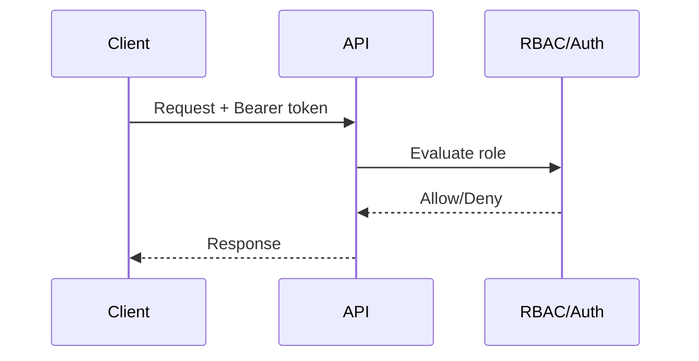
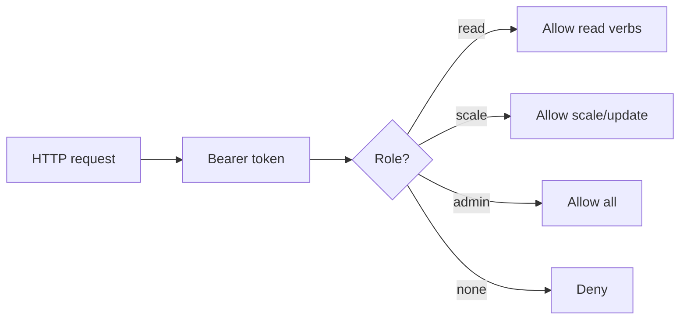
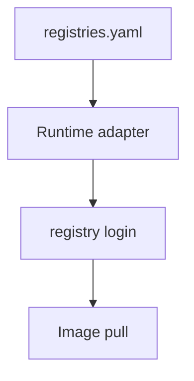
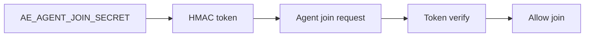

# Chapter 10 - Access and Policy Boundaries

## Concept
An orchestration engine must enforce who can read, modify, or deploy workloads. Access controls and policy boundaries prevent accidental or malicious changes.

### Theory
Access control is role-based: read, scale, and admin roles map to different verbs. Policy enforcement can be coarse (RBAC) or fine-grained (scoped patterns). Authentication and authorization must be consistent across API and CLI surfaces.

### Design
k1s provides API token roles (read/scale/admin) and optional RBAC enforcement for HTTP API requests. Registry credentials are stored in a local config and injected into runtime logins. Node join tokens use HMAC signatures to prevent unauthorized agents. This maps directly to Kubernetes RBAC, admission, and image pull secrets.

### Application
Enable RBAC in non-trivial environments, rotate tokens, and scope admin privileges. Keep registry credentials in the standard config path. Use join tokens for controlled node onboarding. These practices mirror production k8s policies and reduce operational risk.




### Visuals (Mermaid)







## Key Terms and Acronyms
- RBAC - Role-based access control.
- AuthN/AuthZ - Authentication/authorization.
- Token - Bearer credential for API access.
- Scope - Pattern limiting which apps a token can affect.
- Registry credentials - Username/password for image pulls.
- imagePullSecret - Kubernetes secret for registry auth.
- HMAC - Keyed hashing used for join tokens.
- Admission - Policy enforcement on create/update.
- Least privilege - Principle of minimal access.

## Commands (copy/paste)
```bash
# Start controller with RBAC tokens enabled
AE_API_RBAC=1 \
AE_API_READ_TOKEN=read-token \
AE_API_SCALER_TOKEN=scale-token \
AE_API_ADMIN_TOKEN=admin-token \
python -m ae.controller --loop --specs specs/ --metrics-port 9108

# Read-only request
curl -H "Authorization: Bearer read-token" http://127.0.0.1:9108/status

# Local CLI checks
python -m ae.cli status --verbose
python -m ae.cli registry list
```

## Docs references (source + site)
- Source: `docs/reference/api-auth.md`
- Source: `docs/reference/http-api.md`
- Source: `docs/ops/runbook.md`
- Site: `docs/site/api-auth.html`
- Site: `docs/site/http-api.html`

## Code references (walkthrough anchors)
- RBAC role enforcement in HTTP API: `src/ae/observability/http_api.py:608`
```py
    def _rbac_allows(self, verb: str, _app: str | None = None) -> bool:
        if os.getenv("AE_API_RBAC", "0") != "1":
            return True
        auth = self.headers.get("Authorization", "")
        token = auth.split(" ", 1)[1] if auth.startswith("Bearer ") else ""
        admin = os.getenv("AE_API_ADMIN_TOKEN")
        scaler = os.getenv("AE_API_SCALER_TOKEN")
        reader = os.getenv("AE_API_READ_TOKEN")
        ...
        policy = {
            "get": {"admin", "scale", "read"},
            "list": {"admin", "scale", "read"},
            "create": {"admin"},
            "update": {"admin", "scale"},
            "delete": {"admin"},
        }
        return role in policy.get(verb, {"admin"})
```
- Registry credentials resolution: `src/ae/runtime/registry.py:18`
```py
class RegistryAuthProvider:
    """Loads registry credentials and logs into docker clients as needed."""

    def ensure_login(self, client, image: str) -> None:
        registry = self._extract_registry(image)
        candidates = [registry] if registry else ["docker.io"]
        ...
        if not creds:
            return
        client.login(
            registry=chosen_host,
            username=creds.get("username"),
            password=creds.get("password"),
        )
```
- Agent join token format (node bootstrap): `src/ae/security/tokens.py:1`
```py
"""
Join-token utilities for agent bootstrap.

Tokens are HMAC-SHA256 over (node_id, expiry, random nonce) using a shared secret.
Format: base64url(node_id:exp_ts:nonce:signature)
"""
...
```
