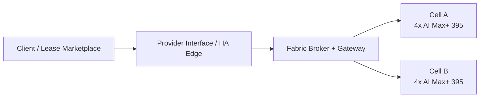

# Fabric Deployment Topology

Status: proposed deployment-topology record for the AMD-first fabric path.

This document describes the target deployment shape for the formal fabric roadmap. It complements [Fabric Control Plane](fabric-control-plane.html): that document defines authority and controller boundaries, while this document defines where those roles live operationally.

It also assumes the backend HA authority model defined in [HA Control Plane Roadmap](high-availability-control-plane.html). The provider-facing edge is not itself the backend control-plane quorum.

## Topology Summary

The near-term deployment shape is:

- a provider-facing HA edge
- a broker and gateway boundary between edge and fabric
- one or more AI Max+ 395 execution cells managed by `k1s`

The edge is responsible for north/south lifecycle and tenancy boundaries. The backend fabric is responsible for authoritative execution, session realization, placement, and later locality-aware optimization.

## Deployment Roles

### Provider-facing HA edge

Responsibilities:

- ingress and API exposure
- lease-facing or marketplace-facing lifecycle
- workload admission into the broker path
- HA control-plane behavior at the front door

The edge is not the authority for internal fabric session state.

### Fabric broker and gateway

Responsibilities:

- reservation accounting
- translation from edge-facing workload intent into fabric intent
- cell selection and binding
- execution gateway into the backend fabric

This is the operational seam between public-facing lifecycle and internal execution control.

### k1s AMD execution cells

Responsibilities:

- authoritative fabric-session realization
- execution placement and restart behavior
- node-side materialization
- controller-owned readiness, rollback, and degradation handling

The first target execution unit is one 4-node AI Max+ 395 cell.

## Traffic Classes

| Traffic class | Path | Purpose |
| --- | --- | --- |
| North/south ingress | client or lease source -> HA edge | public API, ingress, and tenant entry |
| Control handoff | HA edge -> broker/gateway | reservation, binding, and execution handoff |
| East/west fabric | broker/gateway -> `k1s` cells | session realization and execution coordination |
| Later knowledge plane | controller/broker -> advisory services | planning, explanation, and later cognitive optimization |

This split matters because the provider edge and the fabric have different failure modes, security boundaries, and scaling constraints.

## Growth Path

The topology is intended to grow in ordered steps:

- one validated AI Max+ 395 cell
- provider-facing HA edge in front of that cell
- one brokered lease or provider pilot path through the edge
- multiple cells operating as one locality-aware fabric
- later knowledge-bearing services running on the stabilized fabric

The roadmap for those steps is documented in [Distributed Compute Fabric Roadmap](distributed-compute-fabric.html).

## Control Boundaries

The operational boundaries are fixed:

- `k1s` remains authoritative for reconcile, safety, and rollback
- backend HA authority comes from the `etcd`-backed `k1s` control plane, not from the provider-facing edge
- the HA edge owns tenant-facing ingress and lifecycle handoff
- the broker owns reservation and binding
- Hyperon, when introduced, begins as an advisory layer and not as authority

The public documentation keeps the provider interface marketplace-neutral so the fabric can be fronted by more than one external provider-network model without changing internal authority boundaries.
