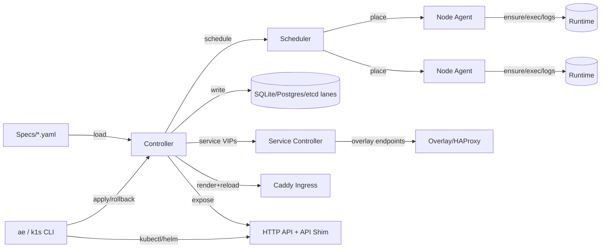

# k1s Overview

k1s is a small, multi‑node application engine with a controller + worker agents, Service VIPs over an overlay network, first-class NATS/JetStream control-plane transport, and a Kubernetes-compatible API shim. You can declare apps in YAML, run them on one or more hosts (Podman preferred; Docker supported), and expose them through Caddy or your own proxy while keeping resource usage low.

Status: k1s is under very active development and has not reached a fully stable release. Do not use it in production without thorough security vetting and testing for your environment.

- Goal: predictable rollouts and Kubernetes‑style ergonomics on 1–4 nodes without a heavyweight control plane.
- Non‑goal: full upstream conformance or cloud‑provider controllers; we target a curated “compatibility” subset instead.

## Current State (Feb 2026)

- Multi‑node: controller manages registered nodes with heartbeats, cordon/drain, and a minimal scheduler that respects `nodeSelector`, taints/tolerations, topology spread, and storage pinning. Agents expose runtime exec/logs/probes over mTLS; Service VIPs ride a WireGuard/VXLAN overlay with HAProxy provider. HostPorts are still supported for single‑node edge cases.
- Control-plane transport: `nats-js` (NATS + JetStream) is the durable hub path for `k1s-core`/`k1s-edge-core`, while `nats-core` remains available for lightweight `work.pull` pairings (`k1s-core-edge`/`k1s-edge`).
- Networking/Ingress: Service CIDR + overlay provider (`AE_SERVICE_PROVIDER=overlay`) with ClusterIP allocation, EndpointSlice projection, and Caddy templates that prefer Service VIPs. Bridge provider remains for single‑node or no‑overlay labs.
- State: SQLite remains the lightweight local default; etcd durable state is supported and is the default backing lane in strict CRI core profiles; Postgres remains supported for shim HA and externalized persistence (`AE_STATE_DSN` / `AE_APISHIM_DSN`).
- Runtime backends: Podman (default), Docker fallback, and CRI/containerd for CRI-native nodes (recommended via `make k1s-core-cri` and related `k1s-*-cri` profile targets).
- API surface: native HTTP API plus the Kubernetes API shim (`AE_APISHIM_ENABLE=1 python -m ae.apishim serve`) covering Deployments/Services/Ingress/HPA/RBAC with SSA/patch support; StatefulSet/DaemonSet/Job/CronJob are accepted but emulated as Deployment-like apps (see `docs/reference/apishim-compatibility-matrix.md`).
- Tooling: `k1s` kubectl‑style wrapper, `ae nodes` for inventory/cordon, `ae plan` for placement hints, `export-k8s` and `k8s-report` for parity/compliance, dashboard at `/dashboard` (direct on `:9108`, or `https://dash.home.arpa:8443/dashboard` in demos), and `/nodes` + enriched `/metrics` for node/service visibility.
- Footprint: recent Feb 2026 idle benchmarks continue to show ~85-90 MiB PSS for controller+API on Podman+crun rootless, and ~170-180 MiB PSS for k1nd (Docker + Caddy). See `docs/benchmarks/memory.md` for the latest numbers.

## Features (High‑Level)

- Declarative specs: `apiVersion: ae.dev/v1alpha1`, `kind: Deployment` (k1s workload).
- Multi‑node scheduler: Ready node filtering, cordon/drain, nodeSelector + tolerations + topology spread, storage pinning, and overlay Service VIPs.
- Rolling deploys and rollback with health gates; pause/resume via `ae rollout`.
- Probes: HTTP/TCP/Exec plus startup probes and lifecycle hooks.
- Ingress via Caddy site fragments + reload; TLS via BYO secrets or k8s‑style secrets; upstreams prefer Service VIPs.
- Configs and Secrets: project keys to env and files (SOPS/age supported); envFrom/file projections honored by exporter and shim.
- Storage: per‑app named volumes (retain/delete) with node affinity; emptyDir support.
- Security: runAsUser/runAsGroup, readOnlyRootFilesystem, cap drop, seccomp/AppArmor.
- Registry auth from `~/.config/ae/registries.yaml`.
- Observability: Prometheus metrics with node/service gauges, events, `/nodes`, `/system`, dashboard.
- CLIs: `ae` (native), `k1s` (kubectl‑like wrapper), `ae nodes` for inventory, `ae plan` for placement, `ae tls` helpers.
- Kubernetes API shim: `ae.apishim serve` with RBAC/SSA/patch, OpenAPI v2/v3, port-forward for pods/services, compatibility matrix.
- K8s helpers: `export-k8s`, `k8s-check`, and `k8s-report` for parity/compliance.

### Architecture at a Glance (Diagram)

## Requirements

- Python 3.11+
- Podman (preferred), Docker, or containerd (for CRI)
- Optional: WireGuard tools for overlay, Postgres for HA shim/multi-node durability
- Optional: Caddy (for ingress), SOPS/age (for secrets), watchdog (for live file watch)

## Install

- Dev install: `python -m pip install -e .[dev]`
- Optional file watching: `python -m pip install -e .[watch]`

## Getting Started

1) Start the controller loop (single-node)

- Polling only: `python -m ae.controller --loop --specs specs/ --metrics-port 9108`
- With file watch (if `watchdog` installed): `python -m ae.controller --loop --watch --specs specs/ --metrics-port 9108`
- Strict CRI profile (containerd): `make k1s-core-cri` (and pair with `make k1s-edge-cri` / `make k1s-edge-core-cri` as needed)

Multi-node lab (two hosts): follow `docs/guides/multinode-lab.md` or run `ops/dev/multinode-lab.sh -h` for flags. Ensure `AE_ENABLE_SERVICE_PROXY=1 AE_SERVICE_PROVIDER=overlay` on the controller and start `ae.node` on each worker with `--ensure-pod-net`.

2) Apply a sample app

- `python -m ae.cli apply -f specs/examples/echo.yaml`

3) Inspect status, events, logs

- `python -m ae.cli status echo --wide --events`
- `python -m ae.cli logs echo --tail 50`

4) Kubectl‑like aliases

- `k1s get apps`
- `k1s get pods`
- `k1s get services`
- `k1s describe app/echo`
- `k1s logs app/echo --follow --tail 100`

5) API and metrics

- JSON and metrics: `curl :9108/status`, `curl :9108/metrics`
- OpenAPI and docs: `curl :9108/openapi.json`, open `http://localhost:9108/docs`
- Nodes: `curl :9108/nodes` (with tokens if configured) for inventory/heartbeat state
- Dashboard: `http://localhost:9108/dashboard` (or `https://dash.home.arpa:8443/dashboard` when Caddy demo stack is running)

## Configuration (Quick Reference)

- AE_STATE_DB: path to SQLite DB (default `state/controller.db`)
- AE_STATE_DSN: Postgres DSN for controller state (overrides SQLite)
- AE_SPECS_DIR: specs directory (default `specs`)
- AE_CADDY_SITES, AE_CADDY_BIN, AE_CADDY_FILE, AE_CADDY_CONTAINER: ingress tuning
- AE_TLS_DIR: TLS material root (default `state/tls`)
- AE_REGISTRY_CONFIG: registry credentials file (default `~/.config/ae/registries.yaml`)
- AE_ALLOW_PLAINTEXT_SECRETS=1: allow bypassing SOPS (dev only)
- AE_LOG_LEVEL: logging level (DEBUG/INFO/…)
- AE_AGENT_API_TOKEN / AE_AGENT_API_PORT: controller → agent auth/port
- AE_ENABLE_SERVICE_PROXY / AE_SERVICE_PROVIDER / AE_OVERLAY_NET / AE_SERVICE_IP_POOL: Service VIP provider + overlay settings
- AE_RUNTIME_BACKEND / AE_PODMAN_NETWORK / AE_DOCKER_NETWORK: runtime selection + shared networks for multi-replica ingress
- AE_APISHIM_ENABLE / AE_APISHIM_TOKEN / AE_APISHIM_DSN: Kubernetes API shim auth + backing store
- AE_API_READ_TOKEN / AE_API_SCALER_TOKEN / AE_API_ADMIN_TOKEN / AE_API_MUTATIONS: HTTP API auth + mutation gate
- AE_CRI_ENDPOINT / AE_CRI_SANDBOX_IMAGE: CRI runtime endpoint + pause image
- CRICTL_BIN: path override for crictl (exec/attach/port-forward on CRI)

## Project Layout

- src/ae/controller: reconcile loop, scheduler, state, health, spec models
- src/ae/runtime: Podman (default), Docker, and CRI adapters, RemoteRuntime client for agents
- src/ae/node: node agent entrypoint wrapping runtime and probes/logs/exec
- src/ae/ingress: Caddy templating + reload
- src/ae/network: Service/VIP providers (overlay/bridge)
- src/ae/cli and src/ae/kctl: CLIs (`ae`, `k1s`)
- src/ae/apishim: Kubernetes API shim (kubectl/helm compatibility)
- src/ae/observability: metrics, HTTP API, logging
- specs/: example manifests and secrets
- docs/: runbook, HTTP/API shim, testing, this overview

## Further Reading

- Runbook: `docs/ops/runbook.md`
- End-to-End Guide: `docs/guides/e2e.md`
- Runtime Profiles: `docs/guides/runtime-profiles.md`
- Multi-node + ingress mode validation: `docs/guides/multinode-lab.md`, `docs/guides/ingress-capability-test-sequence.md`
- HTTP API: `docs/reference/http-api.md`
- Kubernetes API shim + compatibility matrix: `docs/wip/conformance.md`, `docs/reference/apishim-compatibility-matrix.md`
- Architecture (detailed): `docs/reference/architecture.md`
