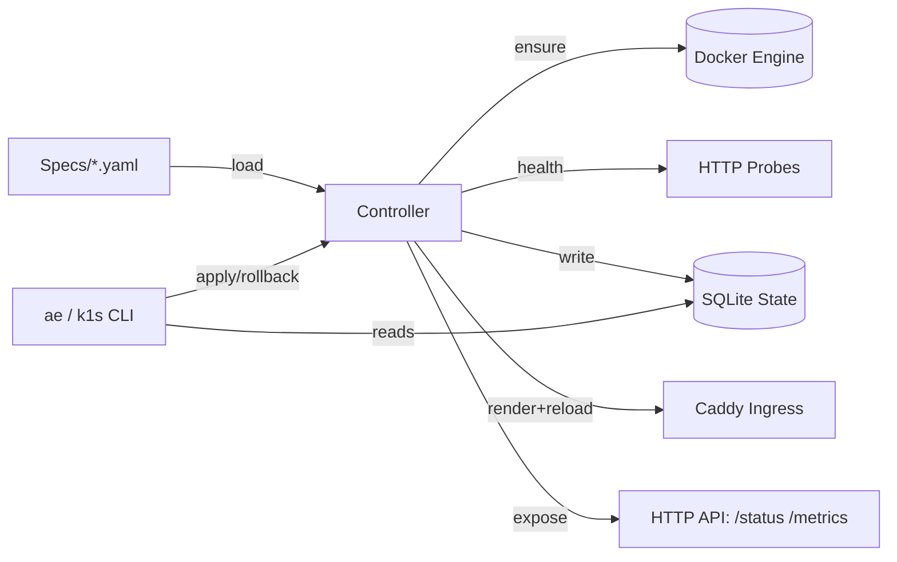

# k1s Overview

k1s is a tiny, single‑node application engine that lets you declare apps in YAML, run them in Docker, and expose them via Caddy. It aims to give you the everyday ergonomics of a small Kubernetes subset without the operational weight.

- Goal: simple, predictable rollouts for 1–3 services on a small VPS.
- Non‑goals: multi‑node scheduling, CRDs, complex RBAC, full Kubernetes API.

## Features (High‑Level)

- Declarative specs: `apiVersion: ae.dev/v1alpha1`, `kind: App`.
- Rolling deploys and rollback with health gates.
- Readiness/Liveness probes (HTTP) with initial delay.
- Ingress via Caddy site fragments + `caddy reload`.
- Secrets via SOPS/age; env injection at apply time.
- Registry auth from `~/.config/ae/registries.yaml`.
- Events and metrics; CLI snapshot and Prometheus text endpoint.
- CLIs: `ae` (native) and `k1s` (kubectl‑like wrapper).
- HTTP API (read‑only): `/metrics`, `/status`, `/status/<app>`, `/events/<app>`, `/openapi.json`, `/docs`.

### Architecture at a Glance (Diagram)

## Requirements

- Python 3.11+
- Docker Engine
- Optional: Caddy (for ingress), SOPS/age (for secrets), watchdog (for live file watch)

## Install

- Dev install: `python -m pip install -e .[dev]`
- Optional file watching: `python -m pip install -e .[watch]`

## Getting Started

1) Start the controller loop

- Polling only: `python -m ae.controller --loop --specs specs/ --metrics-port 9108`
- With file watch (if `watchdog` installed): `python -m ae.controller --loop --watch --specs specs/ --metrics-port 9108`

2) Apply a sample app

- `python -m ae.cli apply -f specs/examples/echo.yaml`

3) Inspect status, events, logs

- `python -m ae.cli status echo --wide --events`
- `python -m ae.cli logs echo --tail 50`

4) Kubectl‑like aliases

- `k1s get apps`
- `k1s describe app/echo`
- `k1s logs app/echo --follow --tail 100`

5) API and metrics

- JSON and metrics: `curl :9108/status`, `curl :9108/metrics`
- OpenAPI and docs: `curl :9108/openapi.json`, open `http://localhost:9108/docs`

## Configuration (Quick Reference)

- AE_STATE_DB: path to SQLite DB (default `state/controller.db`)
- AE_SPECS_DIR: specs directory (default `specs`)
- AE_CADDY_SITES, AE_CADDY_BIN, AE_CADDY_FILE, AE_CADDY_CONTAINER: ingress tuning
- AE_REGISTRY_CONFIG: registry credentials file (default `~/.config/ae/registries.yaml`)
- AE_ALLOW_PLAINTEXT_SECRETS=1: allow bypassing SOPS (dev only)
- AE_LOG_LEVEL: logging level (DEBUG/INFO/…)

## Project Layout

- src/ae/controller: reconcile loop, state, health, spec models
- src/ae/runtime: Docker adapter, registry auth, stub runtime
- src/ae/ingress: Caddy templating + reload
- src/ae/cli and src/ae/kctl: CLIs (`ae`, `k1s`)
- src/ae/observability: metrics, HTTP API, logging
- specs/: example manifests and secrets
- docs/: runbook, HTTP API, testing, this overview

## Further Reading

- Runbook: `docs/runbook.md`
- HTTP API: `docs/http-api.md`
- Architecture (detailed): `docs/architecture.md`
