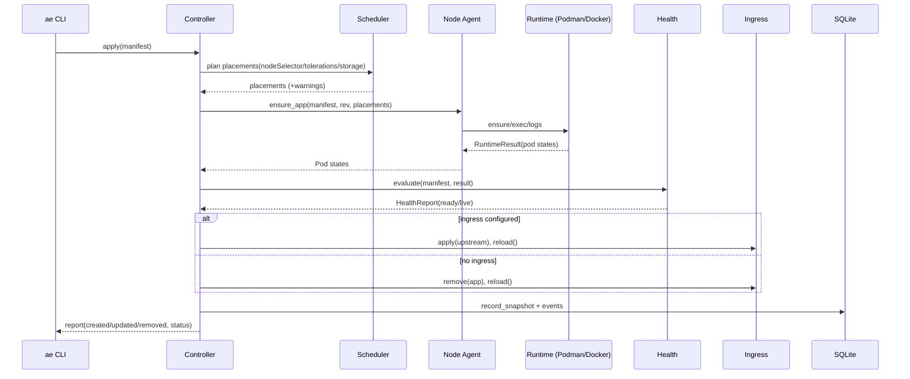

# k1s Architecture and Technical Reference

This document describes k1s in depth: components, data model, reconcile algorithms, interfaces, and operational behavior. It is intentionally verbose.

## Scope and Principles

- Multi-node first. Controller manages one or more nodes via agents; Podman (OCI) is preferred, Docker is the fallback when Podman is unavailable, and CRI/containerd is supported where needed.
- Declarative spec → idempotent reconcile. The controller continuously applies desired state and converges.
- Small surface. Prefer composition over features; leave seams to extend later.
- Fail well. A crash restarts cleanly; reconcile rebuilds reality from Docker + SQLite.

## Components

- Controller (src/ae/controller): orchestrates reconcile, scheduling, service VIPs, state, and events.
- Scheduler (src/ae/controller/scheduler.py): chooses Ready nodes honoring `nodeSelector`, taints/tolerations, topology spread, and storage pinning.
- Node agent (src/ae/node): exposes runtime ensure/logs/exec/probes for the controller over HTTP/mTLS; reports heartbeats.
- Runtime (src/ae/runtime): pluggable adapters; Podman/OCI is default, Docker fallback, CRI/containerd supported; RemoteRuntime client proxies to agents.
- Service/overlay (src/ae/network): allocates Service CIDR VIPs and wires overlay providers (HAProxy overlay or bridge).
- Ingress (src/ae/ingress): writes Caddy site fragments and triggers reloads (prefers Service VIP upstreams).
- Health (src/ae/controller/health.py): readiness/liveness/exec/tcp evaluation (startup probe aware).
- State store (src/ae/controller/state.py): SQLite schema and queries (+ nodes/services/storage tables; Postgres supported).
- Secrets (src/ae/secrets) and Configs (src/ae/config): SOPS/age integration, env and file projection.
- API shim (src/ae/apishim): Kubernetes-compatible API for kubectl/helm with SSA/patch and port-forward.
- Observability (src/ae/observability): metrics snapshot, HTTP API, dashboard, logging helpers.
- CLI (src/ae/cli) + kubectl‑like wrapper (src/ae/kctl).

## State Store Notes

- SQLite schema changes should be documented here alongside the state store design.
- For implementation details, see `src/ae/controller/state.py` and related ADRs.

## Reconcile Loop

Triggers
- Periodic polling (`--interval` seconds)
- Optional file watching (`--watch`) via watchdog; changes are debounced (`--debounce-ms`).
- Manual apply (`ae apply -f ...`), which directly runs a reconcile for the manifest.

Ordering
- Load manifests (YAML → Pydantic models).
- Inject configs/secrets into env; project selected keys into files mounted read‑only.
- Compute revision: hash the spec; reuse the latest revision if hash unchanged; otherwise increment.
- Plan placements: scheduler picks Ready nodes that match selectors/tolerations/topology; storage pinning keeps retained volumes on one node; falls back to local runtime if none are eligible.
- Runtime ensure: create/update/remove containers on each placement (respect rollout policy) via node agent RemoteRuntime.
- Health gate: evaluate readiness/liveness/exec/tcp; decide revision status ready/progressing/degraded/paused.
- Ingress: prefer Service VIP upstreams; optional canary weight/auto progression; remove ingress when omitted.
- Persist: write app status, pods, probe history, canary state, and revision record; emit events.

Idempotency & Diff
- Spec hash drives revisions; reconciler tracks created/updated/removed per pass.
- Docker containers are labeled with app/pod/revision; runtime lists by labels.
- Old revision containers are removed when the new revision becomes live.

Pseudocode (as implemented in src/ae/controller/reconciler.py)
```
for manifest in manifests:
  manifest = apply_configs_and_secrets(manifest)
  projection_root = prepare_file_projections(manifest, rev)
  rev = store.prepare_revision(spec_hash)
  placements, warnings = scheduler.plan(manifest, rev)
  aggregate = []
  for placement in placements:
    res = runtime.ensure_app(
      manifest, rev, keep_old=True,
      limit_create=..., pod_names=placement.pod_names,
      node_id=placement.node.node_id if placement.node else None
    )
    aggregate.append(res)
  result = merge_results(aggregate)
  health = health.evaluate(manifest, result)
  ingress.apply/remove based on health/spec (+ canary weight; prefers Service VIPs)
  store.record_snapshot(manifest, result, health, rev, status, placements, warnings)
  events.emit(ApplyCompleted)
```

Sequence Diagram



## Spec (ae.dev/v1alpha1)

Top‑level
- `apiVersion: ae.dev/v1alpha1`
- `kind: App`
- `metadata: { name }`
- `spec`: see below

Spec fields (src/ae/controller/spec.py)
- `image`, `command`, `args`, `env[]`, `envFrom` (via config/secret refs)
- `replicas: int>=1`; `ports: [{name, containerPort}]`
- `service`: single `port/targetPort` or `ports[]` plus `type` (ClusterIP/NodePort/LoadBalancer), `nodePort`, `externalIPs`, and optional `sessionAffinity`; runtime uses Service VIPs when available.
- `health.readiness|liveness|startup`: HTTP/TCP/Exec probes with thresholds/periods; startup gates other probes.
- `lifecycle`: postStart/preStop handlers (exec/http/tcp).
- `ingress`: `host`, `path` or `paths[]`, `tls`, `tlsSecretName`, `tlsCertPath`, `tlsKeyPath`, `ingressClassName`.
- `secretRefs|configRefs`: env, file projections, and optional `envFrom`; supports SOPS/age.
- `rollout`: strategy ordered|parallel|canary, surge/unavailable, pause, weight, auto canary ramp (`start/step/intervalSeconds/max`).
- `security`: runAsUser/runAsGroup/fsGroup, readOnlyRootFilesystem, dropCapabilities, seccomp/AppArmor.
- `resources`: requests/limits for cpu/memory.
- `volumes`: hostPath bind mounts; `storage`: named volumes with `retention`; `emptyDirs` with medium selection.
- `imagePullPolicy`, `imagePullSecrets[]`.
- Scheduling: `nodeSelector`, `tolerations[]`, `affinity`, `topologySpreadConstraints`, `priorityClassName`.
- Policy/export: `networkPolicy`, `podSecurity`, `dnsPolicy/config`, `hostname`, `subdomain`, `hostAliases`, `enableServiceLinks`, `shareProcessNamespace`, `hostNetwork|PID|IPC`, `setHostnameAsFQDN`.
- `terminationGracePeriodSeconds` (default 10).

Notes
- CPU limits map to Docker `nano_cpus`; memory to `mem_limit` (K/M/G, KiB/MiB/GiB supported).
- Volumes map to bind mounts with ro/rw; retained storage is bound to the node that first creates it.
- Service VIPs are allocated from `AE_SERVICE_IP_POOL` and backed by the overlay provider; hostPorts remain for single-node use or when VIPs are disabled.

Example
```yaml
apiVersion: ae.dev/v1alpha1
kind: App
metadata: { name: echo }
spec:
  image: alpine:3.20
  replicas: 1
  ports: [{ name: http, containerPort: 8080 }]
  health:
    readiness: { httpGet: { path: /, port: 8080 }, initialDelaySeconds: 5 }
  ingress: { host: echo.localtest.me, path: /, tls: false }
  resources: { limits: { cpu: 0.25, memory: 256Mi } }
  volumes: [{ hostPath: /tmp, mountPath: /host-tmp, readOnly: false }]
```

## State Model (SQLite)

Tables (created in src/ae/controller/state.py)
- app_status(app_name PK, desired_replicas, ready_replicas, live_replicas, revision, revision_status, image, created, updated, removed, ingress_host, ingress_path)
- app_registry(app_name PK, spec_hash, spec_json, source, labels, updated_at)
- app_revisions(app_name, revision, spec_hash, spec_json, image, created_at, status) [PK (app_name, revision)]
- app_events(id PK, app_name, revision, event_type, message, created_at)
- pod_status(app_name, pod_name, ready, live, status, readiness_message, liveness_message, exit_code, finished_at) [PK (app_name, pod_name)]
- pod_nodes(app_name, pod_name, node_id, updated_at) [PK (app_name, pod_name)]
- probe_history(id PK, app_name, pod_name, check_time, ready, live, readiness_message, liveness_message) [kept to 50 per pod]
- rollout_canary(app_name PK, weight, next_step_at, step, max, updated_at)
- nodes(node_id PK, name, labels json, taints json, backend, endpoint, pod_cidr, wg_pubkey, cordoned, created_at, updated_at)
- node_heartbeats(node_id PK, status, seen_at)
- services(app_name PK, cluster_ip, ports json, created_at)
- service_endpoints(app_name, port, ip, target_port, ready) [PK (app_name, port, ip)]
- storage_bindings(app_name, volume_name, node_id, retention, created_at) [PK (app_name, volume_name)]
- volume_attachments(app_name, volume_name, node_id, retention, created_at) [PK (app_name, volume_name)]

Query surfaces
- `list_status()`, `get_status(app)`
- `list_pods(app)` (alias: `list_replicas`), `get_probe_history(app, N)`
- `list_revisions(app)`, `get_revision_manifest(app, rev)`
- `list_events(app, limit)`

## Runtime: Container Engine (Podman/Docker/CRI)

The controller talks to local Podman/Docker when no nodes are eligible; in multi-node runs it proxies through RemoteRuntime to each node agent endpoint. Agents enforce auth via `AE_AGENT_API_TOKEN` and optionally mTLS. CRI/containerd nodes are supported via `AE_RUNTIME_BACKEND=cri` and use the CRI gRPC API; exec/attach/port-forward use `crictl` on the node.

Labels
- `ae.app=<name>`
- `ae.pod_name=<name>-rev<rev>-<index>` (alias: `ae.replica_id`)
- `ae.revision=<rev>`

Ensure flow (Docker/Podman runtimes)
- List existing containers by `ae.app` label.
- Partition by current revision vs old; keep old during surge.
- Pull image only when needed; prefer local `localhost/<image>` on Podman when present.
- Create missing pods with labels, env, ports, security, volumes/storage, restart policy.
- Remove old revision containers after readiness thresholds.
- Build `PodState` from inspection (status, startedAt) and endpoints.

Resources/Volumes
- `limits.cpu` → container CLI flag (`--cpus` on Podman/Docker); Docker uses `nano_cpus=int(cpu*1e9)` internally.
- Memory quantities map to bytes (K/M/G, KiB/MiB/GiB supported).
- Volumes: hostPath bind mounts ro/rw; `spec.storage` becomes named engine volumes per app.

Logs
- `read_logs(pod_name, follow, tail, since)` adapts to Docker SDK parameters (replica_id alias supported).

Auth
- `RegistryAuthProvider` reads `~/.config/ae/registries.yaml` and calls `client.login(...)` before pulls.

## Ingress: Caddy

- Each app with `spec.ingress` gets a small site block written to `ops/dev/caddy/sites/<app>.caddy` (or configured root).
- Reloads via `caddy reload --config <file|dir>`, optionally inside a container via `docker|podman exec` (controlled by `AE_CONTAINER_CLI`).
- When Caddy runs in a container, loopback upstreams are rewritten to the host alias: `host.docker.internal` (Docker) or `host.containers.internal` (Podman).
- Optional active health checks can be enabled with `AE_CADDY_ACTIVE_HEALTH=1` when readiness probe is configured.
- With Service VIPs enabled (`AE_SERVICE_PROVIDER=overlay`), site fragments upstream to the ClusterIP; ensure the Caddy host/container is attached to the overlay network or has routes to the Service CIDR.

## Health

- HTTP probe: GET `http://<pod.endpoint><path>`; success is 2xx.
- TCP probe: attempts a TCP connection to the declared port.
- Exec probe: runs a command inside the container and checks exit code 0.
- Initial delay honored using container `StartedAt`.
- Liveness defaults to true when unspecified; readiness defaults to container state when unspecified.
- `HealthReport` aggregates per‑pod `ready/live` and messages.

Revision status
- ready: `ready_replicas >= desired`
- progressing: `live_replicas >= desired` but not all ready
- degraded: otherwise

## Rollouts and Rollback

- spec hash (SHA‑256 of normalized JSON) creates a new revision when changed.
- Rolling replace with `maxUnavailable=0, maxSurge=1` semantics at single‑app scale.
- Pause/resume: `ae rollout pause|resume <app>` toggles rollout without touching runtime.
- Canary: set `rollout.strategy: canary` and `rollout.weight` to bias routing; optional `rollout.auto{start,step,intervalSeconds,max}` for controller‑tracked ramp up.
- `ae rollback <app> [--to <rev>]` fetches stored manifest and reconciles.

## Events

- Types: ApplyStarted, ApplyCompleted, IngressConfigured, IngressRemoved, plus future failure types.
- Indexed by app and descending id; surfaced in CLI and HTTP API.

## Metrics and API

- CLI snapshot: aggregated counts (apps ready/progressing/degraded, replicas).
- HTTP: `/metrics`, `/health`, `/status`, `/status/<app>`, `/events/<app>`, `/logs/<app>`; `/openapi.json` documents the surface; `/docs` lists endpoints; `/dashboard` provides a live UI.

## Secrets

- Decrypts via `sops --decrypt` (external process); falls back to plaintext when `AE_ALLOW_PLAINTEXT_SECRETS=1`.
- Merges referenced keys into env map with stable ordering.
- Errors on missing secret keys referenced by `env` mappings.

## File Watch

- Uses watchdog when `--watch` is set; falls back to interval polling when watchdog is unavailable.
- Debounce controlled by `--debounce-ms` (default 200 ms).

## Backup and Restore

- `ae backup create --output backup.tar.gz` writes `state/controller.db` and `specs/`.
- `ae backup list|verify|restore` list entries, check presence/integrity, and extract safely (guards against absolute paths and `..`).

## Security & Ops Notes

- Local admin tool; not multi‑tenant.
- Store SOPS keys outside the repo; never commit plaintext secrets.
- Prefer TLS via Caddy/ACME for public hosts; development can use `localtest.me` and plain HTTP.
- Keep Docker resource limits conservative to protect the node.

## Extensibility Seams

- RuntimeAdapter protocol: implement `ensure_app` and `read_logs` for alternate engines.
- IngressManager: implement `apply/remove/reload` for nginx or other proxies.
- SecretManager: swap SOPS shell calls with a native decryptor if desired.
- Store: SQLite is default; could be swapped for another lightweight store with the same interface.

## Environment Variables

- AE_STATE_DB (default: `state/controller.db`), AE_STATE_DSN (Postgres DSN), AE_SPECS_DIR (default: `specs`)
- AE_CADDY_SITES, AE_CADDY_BIN, AE_CADDY_FILE, AE_CADDY_CONTAINER, AE_CONTAINER_CLI, AE_CADDY_RELOAD_TIMEOUT
- AE_TLS_DIR (default: `state/tls`)
- AE_REGISTRY_CONFIG (default: `~/.config/ae/registries.yaml`)
- AE_SOPS_BIN, AE_ALLOW_PLAINTEXT_SECRETS
- AE_RUNTIME_BACKEND ("podman" [default], "oci" alias, "docker", "cri|containerd", "stub")
- AE_PODMAN_BIN (default: podman), AE_PODMAN_NETWORK (shared network for multi-replica ingress)
- AE_DOCKER_NETWORK (shared network when using Docker), AE_DOCKER_BIN
- AE_ENABLE_SERVICE_PROXY, AE_SERVICE_PROVIDER, AE_OVERLAY_NET, AE_SERVICE_IP_POOL
- AE_APISHIM_ENABLE, AE_APISHIM_TOKEN, AE_APISHIM_READ_TOKEN, AE_APISHIM_EXEC_TOKEN, AE_APISHIM_PORTFORWARD_TOKEN
- AE_APISHIM_DSN / AE_APISHIM_DB, AE_APISHIM_ALLOW_ANON
- AE_APISHIM_CRI_PORTFORWARD / AE_APISHIM_CRI_PORTFORWARD_FORCE (enable/force CRI port-forward proxy)
- AE_API_READ_TOKEN / AE_API_SCALER_TOKEN / AE_API_ADMIN_TOKEN / AE_API_MUTATIONS
- AE_CRI_ENDPOINT (default: `unix:///run/containerd/containerd.sock`)
- AE_CRI_SANDBOX_IMAGE (default: `registry.k8s.io/pause:3.9`)
- CRICTL_BIN (path override for crictl; used for exec/attach/port-forward on CRI)
- AE_LOG_LEVEL

## Testing Strategy

- Unit tests cover CLI commands, scheduler/health logic, apishim RBAC/patch paths, ingress/runtime adapters, and state store behavior.
- Integration tests run against local Podman/Docker for end‑to‑end and multi‑node agent validation (`pytest tests/integration/ --docker`).
- CRI integration tests run via `scripts/cri_ci_setup.sh` and `tests/integration/test_cri_*` (see `docs/ops/runbook.md`).

## Performance & Footprint

- Controller + API + metrics: ~85–90 MiB PSS in recent Podman+crun rootless idle snapshots (Jan 2026).
- Caddy: ~40–50 MiB PSS in k1nd (Docker + Caddy) idle runs; runtime daemon footprint varies by engine.
- See `docs/benchmarks/memory.md` for updated measurements and charts.
- Suitable for 1–3 small services with sane limits on a 2 GB VPS.

## Future Work

- Full Job/CronJob/DaemonSet/StatefulSet semantics in apishim (completion, one‑per‑node, PVC templates).
- Resource requests/QoS enforcement beyond container limits (cgroup tuning, priorities).
- Advanced ingress routing (header manipulation, rewrites/regex, richer traffic shaping).
- Multi‑controller HA/leader election and broader K8s parity (metrics.k8s.io, admission/policy, CSI/CNI plugins).


### Configs and Secrets → Environment

Apps can project values from config files and sealed secrets into environment variables.
The merge order is: configRefs < secretRefs < spec.env (manifest wins last).

Example:

```
spec:
  configRefs:
    - name: app-config
      path: configs/app-config.yaml   # YAML or JSON
      env:
        - { name: APP_MODE,  key: mode }
        - { name: APP_COLOR, key: color }
  secretRefs:
    - name: demo-secret
      path: specs/demo-secret.sops.yaml
      env:
        - { name: API_TOKEN, key: token }
  env:
    - { name: APP_MODE, value: demo-override }  # overrides config/secret
```
