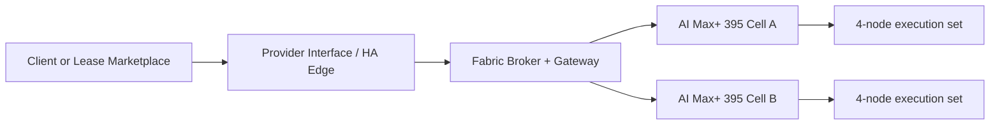

# Distributed Compute Fabric Roadmap

Status: formal development path for the AI Max+ 395 fabric program.

This roadmap defines the public development path for `k1s` as an AMD Ryzen AI Max+ 395-first compute fabric. The near-term objective is not a generic distributed-compute story. It is a substrate-first program: AI Max+ 395 cells, `k1s` as the authoritative execution layer, and a generic provider-facing interface that can later expose the fabric to external provider networks.

This roadmap does not define the backend HA control-plane authority model by itself. That foundation is tracked separately in [HA Control Plane Roadmap](high-availability-control-plane.html), which must land before D1 and later provider-edge milestones can be treated as a true HA story.

## Summary

The repo already contains a real controller-owned fabric precursor through `InferenceCell`, session reservation, and VM/LAN validation workflows. The next stage is to formalize that work into one public program with the substrate as the primary track and provider-network deployment as a secondary packaging track.

For context on a directly compatible provider-network model, see Akash's overview of [providers and leases](https://akash.network/docs/learn/core-concepts/providers-leases/).

The roadmap therefore has two linked tracks:

1. substrate phases that describe what the control plane must learn to do safely
2. deployment milestones that describe how that substrate may later be exposed to provider networks

Those tracks now sit on top of one control-plane prerequisite:

- the backend `k1s` core HA path is `etcd` for authority and NATS/JetStream for transport, as described in [HA Control Plane Roadmap](high-availability-control-plane.html)

## Hardware Baseline

The first public cell is being documented against one exact node baseline:

- Framework Desktop mainboard with AMD Ryzen AI Max+ 395
- Micron 7450 MAX M.2 2280 as the canonical SSD class when one NVMe type is used
- onboard 5GbE for management and fallback access
- Intel E810-XXVDA2 as the canonical RoCE development NIC
- SFP28 DAC as the first lab interconnect medium

The hardware contract and bring-up sequence are documented in [AI Max+ 395 Hardware Baseline](ai-max-395-hardware-baseline.html) and [AI Max+ 395 Cluster Prep](ai-max-395-cluster-prep.html).

The 4-node cell shape follows AMD's published AI Max cluster proof point for local large-model inference.

This does not change the phase order:

- D0 remains the first repeatable execution baseline on standard transport
- F4 remains the first formal acceleration phase

The public story is:

- one `unit` is one AMD Ryzen AI Max+ 395 node
- one `cell` is four cooperating AI Max+ 395 nodes
- one `fabric` is one or more cells managed by `k1s`
- one `provider interface` is the lease- or marketplace-facing boundary that hands execution to the fabric through a provider-facing HA edge

## Target Deployment Shape

The target near-term deployment shape is documented in [Fabric Deployment Topology](fabric-deployment-topology.html).

Operationally, the front edge handles ingress, tenancy boundaries, and lease-facing lifecycle. The backend fabric handles placement, session realization, execution locality, and later knowledge-assisted optimization.

## Current Baseline

Today the repo already includes:

- `InferenceCell` and `InferenceCellSet`
- deterministic stage placement and boundary admission
- session reservation and node-agent session hooks
- controller-persisted fabric sessions, GPU leases, port leases, and node locks
- VM and LAN validation lanes for distributed inference bring-up

What it does not yet include is the full provider-interface topology, typed fabric facts, or the locality substrate needed for later advisory and cognitive layers.

## Substrate Phases

### F0: Fabric hardening and validation

Goal:
- make the current fabric lane operationally trustworthy enough to support D0 and D1

Primary outcomes:

- real readiness semantics for fabric sessions
- controller-visible member status and rollback signals
- repeatable VM and GPU validation artifacts
- reduced dependence on manifest-only telemetry

### F1: Typed facts and telemetry

Goal:
- replace ad hoc labels and manifest hints with typed controller facts

Primary outcomes:

- typed node capability reporting
- typed storage and media reporting, including the baseline NVMe class and any later persistent-memory class
- typed link and topology telemetry
- typed RNIC and RDMA capability reporting, including negotiated PCIe state where relevant
- clear distinction between management, execution, and fabric identities
- structured inputs for later planning engines

### F2: Chunk and cache locality

Goal:
- make movement, residency, and warm locality explicit before optimization work expands

Primary outcomes:

- content-addressed chunk identity
- replica and residency state
- controlled push and pull flows over standard transport
- integrity and epoch semantics for moved data

### F3: Hyperon advisory planning

Goal:
- add explainable symbolic planning without giving up controller authority

Primary outcomes:

- advisory request and response contract
- decision traces and divergence recording
- replay and evaluation support
- bounded planning support for placement, admission, and degraded-mode handling
- the first controller-visible continuity and coherence signals needed for later governance

### F4: Accelerated movement

Goal:
- improve already-correct locality behavior where hardware and transport allow it

Primary outcomes:

- capability negotiation for faster movement paths
- transfer leases and landing-zone safety
- the first formal RoCE development path documented against the E810 hardware baseline
- accelerated movement with clean fallback to standard transport

### F5: DAS cells and knowledge-bearing fabric services

Goal:
- deploy locality-first knowledge services on the stabilized fabric substrate

Primary outcomes:

- per-site DAS cell bundles
- local-first query, warming, and promotion behavior
- controlled cross-site replication instead of WAN-dependent hot paths
- a practical substrate for later cognitive-fabric behavior

## Philosophy and Safeguards

Later cognitive-fabric phases are governed by the project's philosophy docs:

- [Project Philosophy](project-philosophy.html)
- [Cognitive Welfare and Continuity Safeguards](cognitive-welfare-and-continuity.html)

Those docs do not change the current authority model. They do change the bar for later work:

- continuity, coherence, legibility, and bounded distress become first-class engineering concerns
- capability work should not rely on preventable internal harm, continuity destruction, or opaque coercive control surfaces
- later cognitive-substrate work should add continuity logging, coherence and overload visibility, and review gates for major continuity-changing operations

## Dependency Model

The substrate phases remain the primary dependency chain:

| Phase | Depends on | Why |
| --- | --- | --- |
| F1 | F0 | Typed facts are only useful after the base lifecycle is real. |
| F2 | F1 | Locality policy needs trustworthy facts and telemetry. |
| F3 | F1, F2 | Hyperon advisory logic only makes sense with typed facts and explicit locality state. |
| F4 | F2, F3 | Acceleration is only safe after correctness and policy guardrails exist. |
| F5 | F2, F3 | Knowledge cells depend on locality semantics and bounded policy behavior. |

The deployment milestones are secondary and deliberately coupled to the substrate:

| Milestone | Depends on | Why |
| --- | --- | --- |
| D0 | F0 | One cell is only meaningful if readiness and validation are real. |
| D1 | D0, F0, H3 | The edge and broker cannot be trusted until the execution cell is trusted and the backend authority model is a real HA control plane. |
| D2 | D1, F1, H4b2c-csi | A lease path needs typed capability and status facts, plus one fully converged HA authority model for controller and shim/API surfaces. |
| D3 | D2, F1, F2, H5b2c-edge-transport-upgrades | Multi-cell service requires explicit locality and cross-cell cost awareness plus repeatable HA recovery and upgrade patterns. |
| D4 | D3, F3, H5b2c-edge-transport-upgrades | Domain-scale partner operation needs explainable decisions, stable evidence, and operator-readable HA recovery posture. |

## Hyperon Trajectory

Hyperon is part of the roadmap, but not the v1 authority model.

- In v1 and early pilots, Hyperon is advisory only: it ranks, explains, and records divergence against the deterministic baseline.
- After the locality substrate matures, Hyperon can move into bounded automation for placement, degradation, and learning loops.
- The later-stage objective is a self-optimizing cognitive substrate at the control-plane and fabric layer, but that is a later phase, not a current capability claim.

## Deployment Milestones

These milestones are secondary to the substrate phases above. They track how the fabric may later be packaged behind a provider interface once the substrate is trustworthy enough to expose externally.

### D0: Single-cell execution baseline

Goal:
- prove one AI Max+ 395 cell as a repeatable execution unit on the documented node baseline

Primary outcomes:

- repeatable node preparation on the documented public baseline
- repeatable 4-node cell bring-up
- controller-visible fabric readiness and restart behavior
- usable LAN and VM validation evidence
- current `InferenceCell` lane mapped cleanly onto the future cell contract

### D1: HA edge (k1s or k3s) and fabric broker

Goal:
- front the AMD cell with a stable HA edge (k1s or k3s) and a broker boundary

This milestone assumes the backend `k1s` core is already following the HA authority model defined in [HA Control Plane Roadmap](high-availability-control-plane.html). The edge does not substitute for backend controller fencing, shared desired-state authority, or `etcd`-backed leadership.

Primary outcomes:

- HA edge for ingress and lease-facing control
- explicit broker and gateway role between edge and fabric
- north/south ingress separated from east/west fabric traffic
- operational trust boundaries suitable for pilot deployments

### D2: Provider-backed lease pilot

Goal:
- drive the AMD fabric through a provider-facing lease path via the HA edge (k1s or k3s) without collapsing authority into the edge

Primary outcomes:

- lease intake translated into fabric reservations
- edge-to-broker-to-cell lifecycle proof
- provider-facing status, teardown, and failure reporting
- pilot evidence for a first marketplace-backed deployment path

### D3: Multi-cell locality service

Goal:
- operate more than one cell as one locality-aware fabric

Primary outcomes:

- multi-cell capacity accounting
- locality-aware placement and degradation choices
- explicit distinction between cell-local and cross-cell execution
- repeatable service behavior under growth and impairment

### D4: Domain operations and partner readiness

Goal:
- package the fabric as a fundable and partner-readable operating model

Primary outcomes:

- repeatable domain deployment shape
- grant-ready milestone evidence and pilot reports
- clear separation between public tiers, reserved capacity, and domain-level operations
- a stable story for execution today and intelligence later

## Public Positioning

The public position for this roadmap is intentionally concrete:

- the near-term hardware target is the AMD Ryzen AI Max+ 395
- the near-term execution unit is the 4-node cell
- the near-term deployment shape uses a provider-facing HA edge in front of the `k1s` AMD fabric
- `k1s` remains authoritative for reconcile, safety, and rollback
- Hyperon is advisory first and becomes more autonomous only in later phases
- later cognitive-fabric work is explicitly constrained by continuity and welfare safeguards rather than capability goals alone

This keeps the grant and partner story specific enough to be credible without claiming maturity that the repo does not yet have.

## Tracking

The [roadmap status page](roadmap-status.html) is the canonical progress surface for this roadmap. Use it to track both substrate phases and deployment milestones, along with their evidence, dependencies, and primary code areas.
