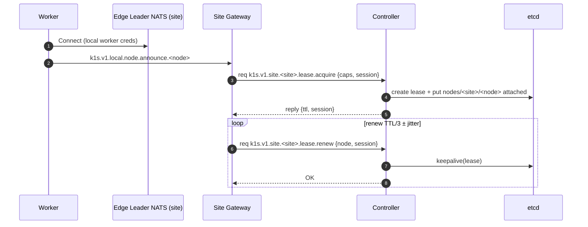
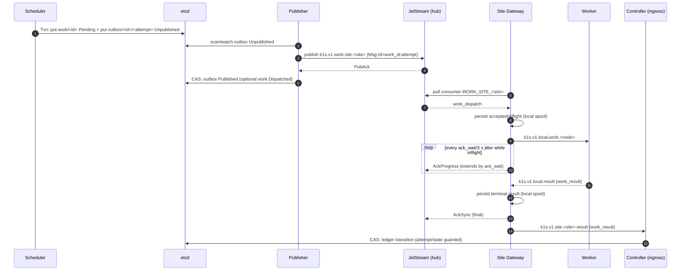

# NATS + etcd (Mode A) plan
> **Mode A:** single NATS account (single-tenant fabric), **etcd as SoT**, **JetStream in the hub only**, **leaf-node remotes**, and an **edge leader** (site NATS) + **site gateway** pattern.
>
> **Mode B (future):** per-site accounts (hard isolation) with per-site streams and multi-account controller publishing.

This document is a concrete implementation plan for building a k8s-like multi-site compute fabric where:

- **Core** remains authoritative and fully functional (at least degraded) when all edges are offline.
- **Edges** attach over NAT-friendly outbound connections (leaf nodes).
- **Truth** lives in the core only: **etcd + JetStream (hub)**.
- **Edge workers** are kept simple: **Core NATS clients only** (no `$JS.API.*` access).

We assume the current node↔controller path is HTTP-based (per the README examples) and that this becomes an alternate transport/backend that is feature-flagged. ([GitHub][1])

---

## Key terms and acronyms (locked)

- **AckProgress**: JetStream progress ack that extends `ack_wait` for an inflight message.
- **AckSync**: Final JetStream ack used to mark a message complete. In Mode A Option A, sent **after** the gateway durably commits the terminal result locally (not after controller acceptance).
- **CAS**: Compare-and-swap guard used in etcd to enforce state/attempt invariants.
- **Core NATS**: Non-durable messaging (best-effort).
- **Dupe window**: JetStream de-duplication window for `Nats-Msg-Id`.
- **Edge Leader**: Site-local NATS server (or small cluster) that hosts local clients and uplinks to hub via leaf.
- **Gateway (Site Gateway)**: The only site component that may use `$JS.API.*` and hub-facing subjects.
- **Hub**: Cloud control plane site hosting etcd and JetStream.
- **JS**: JetStream.
- **Outbox**: etcd keyspace that buffers publish intent per `(work_id, attempt)`.
- **SoT**: Source of Truth (etcd).
- **WAL**: Write-ahead log (SQLite journaling mode).

## 1. Goals and non-goals

### Goals
1. **Single-tenant distributed cluster** (Mode A): one tenant owns core + all edge sites.
2. **Multi-zone/region/cloud compute fabric**: edge sites attach to a core in another region/cloud.
3. **Policy-driven placement**: edges advertise capabilities/limits; core schedules according to policy.
4. **Core SoT**: etcd stores desired/current control-plane state; JetStream in hub provides durable dispatch.
5. **Edge resiliency**: edge sites can operate locally (NATS fabric) even when WAN is down; core degrades gracefully.

### Non-goals (for Mode A MVP)
- Multi-tenant isolation between sites enforced by account boundaries (that’s Mode B).
- Running etcd or JetStream in edge sites.
- Cross-account JetStream stream imports/exports (Mode B+).

---

## 2. Modes (A now, B later)

### Mode A (this plan): single NATS account, strict subject permissions
- One NATS account for the whole tenant.
- Per-site isolation is achieved via **subject-scoped permissions** and leaf-local auth boundaries.
- A single shared work stream is viable in this mode.

**Tradeoff:** isolation depends on correct permissions configuration (not hard tenancy). See security section.

### Mode B (future work): per-site accounts
- Each site gets its own NATS account (hard isolation).
- JetStream streams are per-account, so work dispatch becomes **per-site stream** (or requires exports/imports).
- Controller becomes multi-account aware (publishing to each site’s account).

> Mode B is recommended if you need “compromised site cannot spoof another site under any config mistake.”

## 2.1 Runtime profiles (locked)

We separate the **state backend (SoT)** from the **transport/dispatch backend** so dev and lab loops can stay lightweight while production uses the full fabric.

**Profiles**

| Profile | State (SoT) | Transport | Work dispatch | Notes |
| --- | --- | --- | --- | --- |
| `dev-min` | SQLite | HTTP | direct/local | Fast local loop; no NATS. |
| `dev-fidelity` | etcd | HTTP | direct/local | k8s-shaped SoT without edge protocol. |
| `lab-edge` | etcd (or SQLite/Postgres) | NATS Core | `work.pull` (req/reply) | Exercises leaf/gateway without JetStream durability. |
| `prod-edge` | etcd | NATS + JetStream | JetStream work queue | Mode A Option A semantics. |

Notes:
- Postgres remains viable for non-edge or hybrid deployments; etcd is the preferred SoT for the edge fabric.
- If JetStream is omitted, use a `work.pull` API rather than best-effort publish to avoid “lost work” confusion.

---

## 3. Target architecture (Mode A)

### 3.1 Hub (cloud control plane)
- **etcd cluster (SoT)**
  - Canonical objects (spec + selected status + bookkeeping)
  - Work ledger + outbox entries
  - Node/site capability records and policy objects
  - Keep etcd intra-region / low-latency; consensus stores are sensitive to RTT and leader churn. ([docs.okd.io][2])

- **Controller services**
  - API shim / CLI API / scheduler / reconcilers
  - **NATS control-plane interface** (embedded or sidecar)
    - consumes site results/status/leases
    - updates etcd (SoT)
  - **Publisher loop**
    - drains etcd outbox → publishes durable work to JetStream (hub)
    - uses message de-dupe with a stable message id per attempt

- **NATS cluster with JetStream enabled (hub)**
  - Core NATS for ephemeral signals, request/reply, and telemetry
  - JetStream streams only for “must-not-lose” work dispatch (and optional audit) ([NATS Docs][3])

### 3.2 Remote site (edge)
- **Edge Leader NATS server** (a site-local NATS server)
  - runs Core NATS only (no JetStream)
  - connects outbound to hub via **leaf node** configuration (NAT-friendly) ([NATS Docs][4])
  - provides a local fabric so site members can communicate even during WAN outages

- **Site Gateway** (per site)
  - a small process/service that connects to the **local Edge Leader NATS**
  - is the only component at the site allowed to:
    - pull work from JetStream (through the leaf connection)
    - forward work to local workers
    - send `work_result`, leases, and aggregated site telemetry upstream
  - isolates workers from `$JS.API.*` and from hub-facing subjects

- **Workers** (site members)
  - connect to **Edge Leader NATS locally**
  - Core NATS only; publish local status/logs/results to the Site Gateway
  - never access `$JS.API.*`

---

## 4. Edge topology: replacing “edge cluster leader election”

Instead of electing a “NATS core leader” among workers, use one of these explicit site topologies:

### Topology A (MVP): single Edge Leader NATS per site
- One edge leader NATS server handles all local clients and provides the leaf uplink.
- Simple, minimal moving parts, but is a single point of failure for WAN connectivity at that site.

### Topology B (HA site): small NATS cluster at the site (Core NATS only)
- Run a 3-node NATS cluster in the site for local availability.
- **Uplink patterns:**
  - **B1 (single uplink):** only one cluster member configures a leaf uplink → minimal hub connections, but uplink SPoF.
  - **B2 (redundant uplink):** multiple cluster members have leaf uplinks → more hub connections, but no single uplink SPoF.

> Recommendation: start with Topology A; add Topology B as a deployment option once the protocol and control loops are stable.

---

## 5. Core state model (etcd SoT)

### 5.1 Site objects
Core stores site configuration and policy, e.g.:
- `sites/<site_id>`: site metadata (region, link budget, storage classes)
- `sites/<site_id>/policy`: what can/can’t run (privileged, hostPath, ingress, etc.)
- `sites/<site_id>/limits`: max pods/workloads, max CPU/mem allocation, etc.

### 5.2 Node capability and liveness
- Node records are **lease-backed** in etcd (TTL).
- Nodes are considered NotReady when their lease expires.
- Nodes advertise capabilities during registration and update as needed.

### 5.3 Work ledger + outbox
- Work ledger is authoritative (`work/<work_id>`).
- Outbox provides crash-safe boundary between etcd and JetStream publishes.
- Outbox entries are keyed by attempt to avoid overwrite and to support replay/audit.

---

## 6. Messaging: minimal protocol surface (Mode A)

### 6.1 Subject namespaces
We separate subjects by trust boundary:

**A) Site-local (Worker ↔ Site Gateway)**
- `k1s.v1.local.work.<node_id>` — gateway → worker (command/work)
- `k1s.v1.local.result` — worker → gateway (application completion)
- `k1s.v1.local.status.<node_id>` — worker → gateway (best-effort)
- `k1s.v1.local.logs.<node_id>` — worker → gateway (best-effort)
- `k1s.v1.local.node.announce.<node_id>` — worker → gateway (capabilities snapshot)

**B) Hub-facing (Site Gateway ↔ Controller)**
- `k1s.v1.site.<site_id>.lease.acquire` — req/reply (registration)
- `k1s.v1.site.<site_id>.lease.renew` — req/reply (keepalive)
- `k1s.v1.site.<site_id>.result` — pub (work_result)
- `k1s.v1.site.<site_id>.status` — pub (optional aggregated status)
- `k1s.v1.site.<site_id>.logs` — pub (optional aggregated logs)
- `k1s.v1.site.<site_id>.caps` — pub (optional site/node caps summary)

**C) JetStream (hub stream subjects only)**
- `k1s.v1.work.site.<site_id>` — durable work dispatch (work queue stream)

> Workers never publish/subscribe to hub-facing or JetStream subjects. Only the Site Gateway does.

### 6.2 QoS mapping: JetStream vs Core NATS
- **JetStream (durable)**
  - work dispatch: `k1s.v1.work.site.<site_id>`
  - optional: audit streams (future)

- **Core NATS (best-effort / at-most-once)**
  - status/logs streaming
  - lease request/reply (can tolerate retries and idempotency)
  - work_result delivery (idempotent; can be retried by gateway if needed)

Core NATS is best-effort; if subscriber is offline, messages can be lost. ([NATS Docs][5]) JetStream adds persistence, replay, ack/redelivery, and queue semantics. ([NATS Docs][3])

---

## 7. Heartbeat + lease semantics (worker-driven via Site Gateway)

### 7.1 Model (recommended)
- Workers prove liveness; the Site Gateway renews leases on their behalf.
- Controller writes lease-backed node keys in etcd.
- TTL should be conservative for WAN (e.g., 60s); renew at TTL/3 with jitter.

### 7.2 Flow
1. Worker starts and announces capabilities locally:
   - `k1s.v1.local.node.announce.<node_id>`
2. Site Gateway requests a lease from the controller:
   - req: `k1s.v1.site.<site_id>.lease.acquire` with node caps + session id
3. Controller:
   - creates an etcd lease (TTL)
   - attaches node key(s) to lease
4. Site Gateway renews periodically:
   - req: `k1s.v1.site.<site_id>.lease.renew`
5. If renew stops:
   - etcd lease expires → node key disappears → controller reschedules site-local work.

### 7.3 Restart and thundering-herd mitigation
- Renew interval: `TTL/3 ± 10–20% jitter`
- On controller restart:
  - continue accepting renewals immediately
  - force re-register if lease already expired
- Site Gateway staggers initial renewals and rate-limits re-register bursts.

### 7.4 Lease request/response schema (locked)

`lease.acquire` subject: `k1s.v1.site.<site_id>.lease.acquire`

Request:
```json
{
  "site_id": "sfo-edge-01",
  "node_id": "node-07",
  "session_id": "uuid",
  "caps": {},
  "labels": {},
  "limits": {},
  "agent_version": "x.y.z",
  "timestamp": "ts"
}
```

Response:
```json
{
  "accepted": true,
  "controller_epoch": 12,
  "lease_id": "etcd-lease-id-or-opaque",
  "lease_ttl_ms": 60000,
  "renew_after_ms": 20000,
  "reason": null
}
```

`lease.renew` subject: `k1s.v1.site.<site_id>.lease.renew`

Request:
```json
{
  "site_id": "sfo-edge-01",
  "node_id": "node-07",
  "session_id": "uuid",
  "lease_id": "opaque",
  "timestamp": "ts"
}
```

Response:
```json
{
  "accepted": true,
  "controller_epoch": 12,
  "lease_ttl_ms": 60000,
  "renew_after_ms": 20000,
  "reason": null
}
```

Failure behavior:
- `policy_denied` / `over_capacity` / `invalid_session` → stop renew, surface error.
- `controller_busy` → retry with jitter/backoff.
- `unknown_lease` or `expired` → re-register via `lease.acquire` (especially if `controller_epoch` advanced).

---

## 8. Durable work dispatch model (JetStream + etcd outbox)

### 8.1 Work scope: site-scoped dispatch
- The core scheduler assigns work to a **site**.
- The Site Gateway assigns to a **node within the site** based on local leases/capacity.
- Node targeting from core is optional (hint only).

### 8.2 Work lifecycle (ledger)
Typical states:
- `Pending → Dispatched → Running → Succeeded|Failed`
- Reschedule increments `attempt` and returns to `Pending`.

### 8.3 Crash-safe publication boundary (outbox + de-dupe)
We cannot atomically transact across etcd and JetStream. We guarantee correctness via:
- etcd txn for ledger+outbox
- JetStream publish de-dupe
- idempotent ledger transitions on `work_result`

**Important correction:** message de-dupe id must include attempt, otherwise retries within the de-dupe window are dropped.

**Message id**
- `Nats-Msg-Id = "<work_id>:<attempt>"` (recommended)

### 8.4 Outbox publish invariants (locked)

- etcd txn creates:
  - `work/<work_id>` with `state=Pending`, `attempt=N`
  - `outbox/work/<work_id>/<attempt>` with `state=Unpublished`
- Publisher publishes with `Nats-Msg-Id = work_id:attempt`.
- On PubAck:
  - outbox entry → `Published`
  - work ledger → `Dispatched` (CAS guard: only if still `Pending` and attempt matches)
  - `Dispatched` means “durably queued in JetStream,” not “received by gateway”

Lost PubAck handling:
- Republish with the same Msg-Id (`work_id:attempt`) until PubAck is observed.
- JetStream de-dupe makes repeated publishes safe within the dupe window.

Idempotent replay:
- Publishing the same outbox entry multiple times is safe (Msg-Id stable).
- The publisher can be at-least-once; correctness is preserved via de-dupe + ledger CAS.

### 8.5 Retry semantics: delivery vs execution
Two different retry classes:

1) **Delivery retry** (gateway didn’t ack the JetStream message)
   - JetStream redelivers the *same* message
   - no new publish, no attempt increment

2) **Execution retry / reschedule** (node died, work failed, policy reschedule)
   - controller increments attempt
   - creates a new outbox entry for that attempt
   - publishes a **new** JetStream message with msg-id `<work_id>:<attempt>`

### 8.6 Ack policy: completion + progress
- **JetStream ack**: transport-level ack of a work message (gateway ↔ JetStream)
- **work_result**: application-level completion message (worker → gateway → controller)
  - drives ledger state transitions in etcd (CAS-guarded)
- **Policy**:
  - Gateway uses progress acks while work is inflight (extends the `ack_wait` deadline).
  - Progress acks are sent per in-flight message on an interval of ~`ack_wait / 3` with ±15% jitter.
  - Gateway sends a final ack (AckSync) only after it has a terminal `work_result` **and** has durably recorded it locally (Option A).
  - If local dispatch fails immediately, gateway NAKs (or does not ack) to trigger redelivery.
  - Redeliveries of the same `work_id:attempt` must not be re-dispatched; continue tracking and progress-acking until terminal.

### 8.7 AckSync semantics (Option A: gateway durable commit, locked)
**Meaning:** a JetStream message is “done” once the site has durably recorded the terminal outcome.

**Gateway requirements:**
- Maintain a small **durable local spool** (SQLite, WAL mode) for:
  - accepted/inflight work (`work_id:attempt`)
  - dispatch state (node assignment, start time)
  - terminal result before final AckSync
  - controller acceptance is **eventual** and does not gate AckSync

**Flow (summary):**
1. Pull message → persist “accepted/inflight”
2. Dispatch to worker
3. Send AckProgress periodically while inflight
4. On terminal result: persist result locally
5. Send AckSync (final)
6. Asynchronously forward result to controller; retry until accepted

This keeps JetStream durability scoped to “delivered and durably recorded at site,” while etcd remains the SoT for the global state.

### 8.8 Ledger CAS rules for `work_result` (locked)

Canonical idempotency key: `(work_id, attempt)`.

Acceptance rules for a `work_result` are **all** of:
1. `attempt == ledger.attempt`
2. `ledger.state` is not terminal (`Succeeded`, `Failed`, `Canceled`)
3. `observed_generation >= ledger.desired_generation` (default; lower is rejected unless the op is explicitly best-effort)
4. `status` transition is valid:
   - `Running` allowed when ledger state is `Dispatched` or `Running`
   - `Succeeded` or `Failed` allowed when ledger state is `Dispatched` or `Running`

Duplicate handling:
- If ledger is terminal and incoming status matches terminal status, treat as idempotent OK (no-op).
- If ledger is terminal and incoming status conflicts, ignore and log anomaly.

Node id handling:
- If `assigned_node_id` is set and differs from incoming `node_id`, reject unless `assigned_node_id` is empty.

Stale/future attempts:
- `attempt < ledger.attempt` → ignore (stale)
- `attempt > ledger.attempt` → ignore (invalid/future) and log anomaly

Implementation note: enforce with an etcd txn (CAS) and return `ignored_reason` on no-op.

### 8.9 Site-local scheduling policy (gateway, locked)

Inputs:
- live node leases
- node caps/labels
- gateway-local inflight counts
- optional `max_inflight` per node (derived from caps or config)

Selection algorithm (MVP):
1. If `preferred_node` is set and passes filters/capacity, pick it.
2. Filter nodes by `node_selector` (labels/caps) if present.
3. Exclude nodes without active lease or with `inflight >= max_inflight`.
4. Pick the node with the lowest inflight count; tie-break by `hash(work_id) mod N` for stability.
5. If none available, leave the message unacked (or NAK with delay) and publish a site status of “no capacity”.

This keeps scheduling deterministic, observable, and cheap, while respecting basic constraints.

---

## 9. Work and capability message schemas (minimal)

### 9.1 Work dispatch payload (JetStream → Site Gateway → Worker)
```json
{
  "work_id": "uuid",
  "attempt": 1,
  "site_id": "sfo-edge-01",
  "op": "ensure_pod|stop_pod|pull_image|apply_config",
  "target": { "ns": "default", "kind": "Pod", "name": "nginx-7c9b" },
  "desired_generation": 12,
  "preferred_node": "node-07",
  "node_selector": { "arch": "amd64" },
  "created_at": "ts"
}
```

### 9.2 Work result payload (Worker → Gateway → Controller)

```json
{
  "work_id": "uuid",
  "attempt": 1,
  "site_id": "sfo-edge-01",
  "node_id": "node-07",
  "status": "running|succeeded|failed",
  "reason": "string",
  "observed_generation": 12,
  "started_at": "ts",
  "finished_at": "ts",
  "outputs": {}
}
```

### 9.3 Node capabilities (Worker → Gateway; optionally Gateway → Controller)

```json
{
  "site_id": "sfo-edge-01",
  "node_id": "node-07",
  "session_id": "uuid",
  "caps": { "arch": "amd64", "os": "debian", "cpu": 8, "mem_mb": 32768 },
  "labels": { "pool": "default", "zone": "rack-a" },
  "limits": { "max_pods": 50, "egress_only": true }
}
```

---

## 10. JetStream streams and consumers (hub, Mode A)

### 10.1 `K1S_WORK` stream (shared, Mode A)

* Subjects: `k1s.v1.work.site.>`
* Retention: work-queue pattern (remove on ack) ([NATS Docs][7])
* Consumers: per site pull consumer, e.g. `WORK_SITE_<site_id>`

  * pulled by Site Gateway (through leaf)
  * supports backpressure and site capacity limits

Key settings:

* `max_ack_pending`: set to the **gateway concurrency limit** (default **32**) to avoid pulling more than can be progress-acked
* `ack_wait`: **30s** default; treat as **failover/redelivery target**, not execution time
* `progress interval`: **10s** default (≈ `ack_wait / 3`)
* `progress jitter`: **±15%** to avoid synchronized bursts across sites
* `max_deliver`: **20** default, bounded redelivery + operator visibility
* `max_waiting` (pull): cap to avoid memory blowups (e.g., **512**)
* optional DLQ pattern: publish a terminal failure record in etcd and/or mirror to audit stream

Backoff: use consumer backoff if standardized; otherwise apply an exponential-ish delay in the gateway between pulls.

Tuning guidance:
- If you expect frequent 10–20s stalls, consider `ack_wait=60s` with `progress=20s`.
- If you want faster failover, consider `ack_wait=15s` with `progress=5s`.
- Progress acks are per in-flight message; if that is too chatty, cap concurrency and/or increase intervals.

Example config (site gateway): `ops/dev/site-gateway.env.sample`

> Note: Pull consumers require the gateway to use `$JS.API.*` and `$JS.ACK.*` subjects. Workers never do.

### 10.2 Optional `K1S_AUDIT` stream (future)

* Mirror `work` and `result` for replay/debugging
* time/size retention

---

## 11. Security (Mode A): subject permission matrix

Mode A assumes **single tenant**. We still enforce least privilege with:

* hub-level subject permissions per credential
* leaf-local users with strict publish/subscribe limits

### 11.1 Identities

* **Hub Controller**: publishes work, manages consumers, consumes site telemetry/results.
* **Site Uplink (leaf connection)**: the Edge Leader NATS server’s upstream identity to hub.
* **Site Gateway (local user)**: privileged local client on Edge Leader NATS.
* **Worker (local user)**: unprivileged local client on Edge Leader NATS.

> In leaf-node deployments, hub authorization applies to the leaf connection identity. Therefore, leaf-local authorization must prevent workers from publishing hub-facing or JS API subjects.

Reserved for future: `k1s.v1.ctrl.site.<site_id>` is **not** part of the Mode A contract.

### 11.2 Hub NATS permissions (single account)

| Identity                  | Publish                                                                                                 | Subscribe                                            | Notes                                                                                   |
| ------------------------- | ------------------------------------------------------------------------------------------------------- | ---------------------------------------------------- | --------------------------------------------------------------------------------------- |
| **hub-controller**        | `k1s.v1.work.site.>` `$JS.API.STREAM.>` `$JS.API.CONSUMER.>`                                            | `k1s.v1.site.>` `_INBOX.>`                           | Controller can create/update streams/consumers and dispatch work                        |
| **site.<site_id>.uplink** | `k1s.v1.site.<site_id>.>` `$JS.API.CONSUMER.MSG.NEXT.K1S_WORK.WORK_SITE_<site_id>` `$JS.ACK.K1S_WORK.>` | `_INBOX.>`                                           | Uplink needs pull+ack for its consumer; restrict API to MSG.NEXT for that consumer only |

> The exact `$JS.API.*` subject for MSG.NEXT depends on stream+consumer naming; keep it as narrowly scoped as possible. ([NATS Docs][7])

### 11.3 Edge Leader local permissions (site-local NATS)

| Local User  | Publish                                                                                                                       | Subscribe                                                                      | Notes                                                                              |
| ----------- | ----------------------------------------------------------------------------------------------------------------------------- | ------------------------------------------------------------------------------ | ---------------------------------------------------------------------------------- |
| **worker**  | `k1s.v1.local.result` `k1s.v1.local.status.<node_id>` `k1s.v1.local.logs.<node_id>` `k1s.v1.local.node.announce.<node_id>`    | `k1s.v1.local.work.<node_id>`                                                  | Workers cannot publish to `k1s.v1.site.*` or any `$JS.*` subjects                  |
| **gateway** | `k1s.v1.local.work.>` `k1s.v1.site.<site_id>.>` `$JS.API.CONSUMER.MSG.NEXT.K1S_WORK.WORK_SITE_<site_id>` `$JS.ACK.K1S_WORK.>` | `k1s.v1.local.result` `k1s.v1.local.status.>` `k1s.v1.local.logs.>` `_INBOX.>` | Gateway is the only site component that can interact with hub-facing + JS subjects |

### 11.4 Mode A security caveat (explicit)

Mode A is “single-tenant by policy.” If you need hard tenant isolation between sites, move to Mode B (per-site accounts + per-site streams).

### 11.5 Credentials and rotation (locked)

Distinct identities:
- `leaf_uplink`: Edge Leader → hub (publish `k1s.v1.site.<site_id>.>`, pull/ack its JS consumer only).
- `gateway_local`: Site Gateway → Edge Leader local NATS (local subjects + hub-facing subjects + JS pull/ack).
- `worker_local`: Worker → Edge Leader local NATS (local subjects only).

Rotation approach:
- Issue new creds alongside old, reload Edge Leader + gateway, then revoke old after a grace period.
- Mode A still benefits from operator/jwt tooling for targeted revocation.

Phase 1 templates must include:
- Hub account/jwt config.
- Per-site uplink creds.
- Site-local gateway/worker creds.
- Documented reload procedure.

---

## 12. Implementation plan (phased)

### Phase 0 — Architecture lock-in + contracts

* Lock Mode A decisions:

  * single account
  * Edge Leader + Site Gateway pattern (no worker JS API)
  * site-scoped work dispatch
  * outbox per attempt and msg-id `<work_id>:<attempt>`
* Deliverables:

  * ADR: transport model + trust boundaries
  * Subject map + message schemas
  * etcd key layout + ledger state machine + CAS rules
  * Mode A permission matrix

**Exit:** controller/runtime owners sign off

### Locked operational defaults (Mode A Option A)

- Gateway durability: **SQLite spool (WAL)** with `synchronous=NORMAL` and `busy_timeout` set.
- Ack semantics: **AckProgress** while inflight; **AckSync** after terminal result is durably committed locally.
- `ack_wait=30s`, `progress=10s`, `max_ack_pending=32`, `max_deliver=20`, `progress_jitter=±15%`, `max_waiting=512`.
- Work publish: `Nats-Msg-Id = work_id:attempt`.
- Outbox: `outbox/work/<work_id>/<attempt>`, ledger → `Dispatched` on PubAck.
- Lease API: req/reply schemas in §7.4.
- Edge scheduling: filter by selector/caps, pick lowest inflight, tie-break by stable hash.
- Credentials: separate `leaf_uplink` / `gateway_local` / `worker_local`, rotate via replace+reload.

### Phase 1 — Infra scaffolding (hub + site templates)

* Hub: NATS cluster w/ JetStream + etcd deployment configs (`ops/`)
* Site: Edge Leader NATS config template + Site Gateway template (`ops/`)
* Add feature flags and config wiring (`src/ae/config`)

**Exit:** dev environment boots hub + site leader + gateway; verifies connectivity

### Phase 2 — Transport abstraction + Site Gateway skeleton

* Implement NATS transport layer for controller and runtime
* Implement Site Gateway:

  * local subscriptions (workers)
  * upstream request/reply for leases/results
  * observability hooks

**Exit:** controller ↔ gateway ↔ worker messaging over Core NATS with metrics

### Phase 3 — Identity + lease lifecycle (etcd lease-backed)

* Implement node registration + lease acquire/renew via gateway
* etcd lease attachment for node keys
* jitter/backoff + controller restart recovery
* tests: expiry/reschedule + rejoin

**Exit:** deterministic lease behavior under controller restart + site disconnect

### Phase 4 — Durable work queue (JetStream + outbox/dedupe)

* Create `K1S_WORK` stream and per-site consumers
* Implement outbox publisher loop (msg-id includes attempt)
* Implement gateway pull/ack + local forwarding
* Implement result handling + CAS ledger transitions
* crash tests:

  * crash between etcd txn and publish
  * crash after publish before outbox mark
  * duplicate delivery / duplicate results

**Exit:** deterministic behavior under duplicates and crash tests

### Phase 5 — Status + logs ingestion

* Core NATS status/logs subjects
* sampling/rate limiting
* ensure work path isn’t starved

**Exit:** stable throughput under load tests

### Phase 6 — Operability + drills

* monitoring/alerts:

  * leaf disconnects
  * consumer lag / ack pending
  * stream disk utilization
* runbooks + drills:

  * hub NATS restart
  * site disconnect/reconnect
  * worker crash mid-work
  * etcd leader change

**Exit:** drills pass + runbooks updated

### Phase 7 — Migration + rollout

* ship feature-flagged selection (HTTP fallback)
* canary one site, validate rollback

**Exit:** successful canary + documented rollout

---

## 13. Appendix A — etcd key layout (examples)

### Prefix overview

* `k1s/v1/work/<work_id>` — authoritative work ledger record
* `k1s/v1/outbox/work/<work_id>/<attempt>` — outbox entry per attempt
* `k1s/v1/nodes/<site>/<node>` — lease-backed node record
* `k1s/v1/sites/<site>` — site metadata and policy

### Work ledger example

Key: `k1s/v1/work/7d2f...`

```json
{
  "work_id": "7d2f...",
  "site_id": "sfo-edge-01",
  "state": "Pending",
  "attempt": 1,
  "op": "ensure_pod",
  "target": { "ns": "default", "kind": "Pod", "name": "nginx-7c9b" },
  "desired_generation": 12,
  "assigned_node_id": null,
  "created_at": "ts",
  "updated_at": "ts",
  "last_error": null,
  "result": null
}
```

### Outbox per attempt example

Key: `k1s/v1/outbox/work/7d2f.../1`

```json
{
  "work_id": "7d2f...",
  "attempt": 1,
  "site_id": "sfo-edge-01",
  "state": "Unpublished",
  "payload_hash": "sha256:...",
  "created_at": "ts",
  "last_publish_at": null,
  "publish_attempts": 0
}
```

### Node record (lease-backed)

Key: `k1s/v1/nodes/sfo-edge-01/node-07` (attached to etcd lease TTL)

```json
{
  "site_id": "sfo-edge-01",
  "node_id": "node-07",
  "session_id": "uuid",
  "caps": { "arch": "amd64", "os": "debian", "cpu": 8, "mem_mb": 32768 },
  "labels": { "pool": "default" },
  "last_seen_at": "ts"
}
```

---

## 14. Appendix B — sequence diagrams (Mermaid)

### B.1 Lease acquire + renew



### B.2 Dispatch: etcd outbox → JetStream → gateway → worker → result → ledger CAS



---

## 15. Appendix C — Site Gateway durable spool (Option A)

Goal: survive gateway restarts without losing completion information after AckSync.

### C.1 Minimal sqlite schema (locked)

```sql
CREATE TABLE inflight (
  work_id TEXT NOT NULL,
  attempt INTEGER NOT NULL,
  js_stream TEXT NOT NULL,
  js_consumer TEXT NOT NULL,
  js_seq INTEGER NOT NULL,
  received_at TEXT NOT NULL,
  node_id TEXT,
  state TEXT NOT NULL, -- accepted|running|terminal
  last_progress_at TEXT,
  PRIMARY KEY (work_id, attempt)
);

CREATE TABLE results (
  work_id TEXT NOT NULL,
  attempt INTEGER NOT NULL,
  status TEXT NOT NULL,
  payload_json TEXT NOT NULL,
  committed_at TEXT NOT NULL,
  delivered_to_controller_at TEXT,
  PRIMARY KEY (work_id, attempt)
);

CREATE TABLE leases (
  node_id TEXT PRIMARY KEY,
  session_id TEXT NOT NULL,
  lease_ttl_ms INTEGER NOT NULL,
  renew_after_ms INTEGER NOT NULL,
  last_renew_at TEXT,
  controller_epoch INTEGER NOT NULL
);

CREATE INDEX inflight_state_idx ON inflight(state);
CREATE INDEX results_delivered_idx ON results(delivered_to_controller_at);
```

Notes:
- SQLite settings: `journal_mode=WAL`, `synchronous=NORMAL` (or `FULL` for max durability), `busy_timeout` set.
- Persist on pull (`accepted`), update on dispatch (`running`), and insert terminal result before AckSync.
- Resend `work_result` to controller until accepted (track with `delivered_to_controller_at`).
- Deduplicate redeliveries by `(work_id, attempt)`; do not re-dispatch if already inflight.

### C.2 Append-log alternative (future, not Mode A default)

If you prefer an append-only log:
- Write JSON lines for `accepted`, `running`, and `terminal`.
- On startup, replay the log to reconstruct in-flight work.
- Periodically compact into a snapshot file plus log rotation.

---

## 16. Pros / cons (Mode A)

### Pros

* etcd remains in its comfort zone (core only; low-latency SoT). ([docs.okd.io][2])
* Remotes scale across NAT via leaf nodes (outbound-only). ([NATS Docs][4])
* JetStream footprint stays in hub while providing durable dispatch. ([NATS Docs][3])
* Workers stay simple (Core NATS only) and never touch `$JS.API.*`.

### Cons / tradeoffs

* Two critical distributed systems in the core: etcd + NATS/JetStream.
* Mode A isolation is configuration-driven (single account); a permissions mistake can widen blast radius.
* Site needs an additional component (Site Gateway) for safe JetStream consumption and protocol bridging.
* Site Gateway must persist a small local spool to honor AckSync semantics (required for Option A).

---

## 17. Mode B (future work) notes (per-site accounts)

If/when you move to per-site accounts:

* each site account gets its own `K1S_WORK` stream
* controller must publish into each site account (multi-account connections) or adopt exports/imports
* permission complexity decreases (hard boundaries), but operational complexity increases

---

[1]: https://github.com/the-cm-collective/k1s/tree/dev "GitHub - the-cm-collective/k1s at dev"
[2]: https://docs.okd.io/4.20/etcd/etcd-practices.html "Recommended etcd practices | etcd | OKD 4.20"
[3]: https://docs.nats.io/nats-concepts/jetstream "JetStream - NATS Docs"
[4]: https://docs.nats.io/running-a-nats-service/configuration/leafnodes "Leaf Nodes | NATS Docs"
[5]: https://docs.nats.io/nats-concepts/core-nats "Core NATS - NATS Docs - NATS.io"
[7]: https://docs.nats.io/using-nats/developer/develop_jetstream/model_deep_dive "JetStream Model Deep Dive - NATS Docs"
